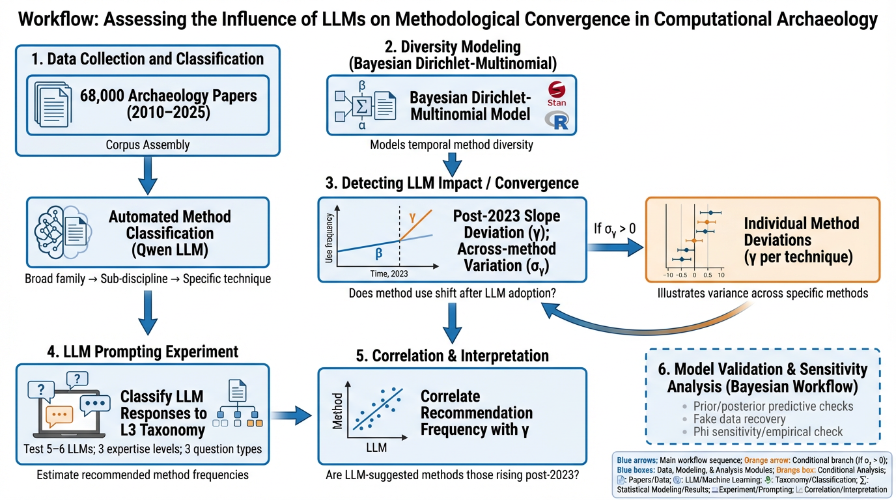

## Did LLMs cause convergence in computational archaeology methods?



Imagine that every graduate student in a department suddenly started asking the same AI assistant for methodological advice. The assistant, trained on the same corpus, would naturally recommend the same handful of techniques — not because those techniques are best, but because they are most represented in its training data. Over time, the department's research would start to look eerily similar. This paper asks whether something like that is happening across computational archaeology.

We assembled roughly 68,000 archaeology papers published between 2010 and 2025 and classified each one's methodology into a three-level taxonomy: broad families (L1), sub-disciplines (L2), and specific techniques (L3). The taxonomy was built with Qwen, a large language model, applied consistently to all abstracts. This gives us a record of how the methodological menu of the discipline has changed, year by year, at fine granularity.

The core question is whether that menu got more generic after 2023, the year ChatGPT entered serious academic use. Think of it like watching a restaurant's menu evolve over a decade, and then asking whether the dishes got blander — more convergent on a safe average — once the chef started relying on recipe apps rather than creative intuition.

We measure diversity within each L2 sub-discipline using the Inverse Simpson index, which counts the effective number of distinct L3 methods in use. A score of 1 means one technique dominates completely; higher scores mean methods are more evenly spread. We model how this effective count changes over time using a Bayesian Dirichlet-Multinomial regression fit with Stan.

The model has a two-slope structure. The first slope, beta, captures each method's underlying linear trajectory from 2010 to 2025: some techniques were already rising or falling before LLMs existed. The second slope, gamma, captures any additional deviation that began in 2023 and thereafter. By separating these two components, we can ask not just whether methods changed after 2023, but whether that change was over and above what the pre-existing trend would have predicted. The key estimand is sigma_gamma, the global scale of across-method variation in the post-2023 slope. If sigma_gamma is credibly above zero, there is real post-LLM heterogeneity in methodological trajectories — some methods accelerating, others declining — consistent with AI-driven recommendation effects.

We run this analysis twice. The primary analysis operates at the L2-to-L3 level: within each sub-discipline, we watch the fine-grained technique mix evolve. A complementary sensitivity analysis operates at the L1-to-L2 level: within each broad family, we watch the sub-discipline mix. If both levels tell a consistent story, the finding is robust.

The bibliometric analysis is paired with a planned prompting experiment. We will systematically query five or six major LLMs — at three simulated expertise levels and with three types of methodological question — and classify each response into the same L3 taxonomy using Qwen. This gives us a direct estimate of what methods LLMs currently recommend. We then correlate recommendation frequency with the posterior mean gamma for each method. If LLMs are driving convergence, the methods they recommend most often should be the ones whose post-2023 share increased most in the published literature.

The model is validated through a four-stage Bayesian workflow following Gelman et al. (2020): prior predictive checks confirm the priors generate plausible diversity values; posterior predictive checks show 44 of 48 method groups are well-calibrated; fake-data simulation confirms sigma_gamma is identifiable through hierarchical aggregation across groups; and a phi sensitivity analysis tests whether the fixed concentration parameter drives the conclusions. An empirical phi exploration in `00b_phi_exploration.R` shows that phi varies substantially across groups, with most groups having empirical phi well above 10 — suggesting our primary analysis is conservative.

## Preliminary Results

> **Note:** These are preliminary results. The bibliometric analysis (Steps 1 and 2) is complete; the prompting experiment (Step 3) is in progress. The full causal argument requires all three steps.

The analysis proceeds in three steps:

**Step 1 — Is there anomalous post-2023 methodological reshuffling?**

Yes. The global scale of post-2023 method-level change (sigma_gamma) is credibly above zero across all model specifications:

| Model | sigma_gamma mean | 90% CI | phi |
|---|---|---|---|
| Conservative baseline | 0.054 | [0.004, 0.132] | 10 (fixed) |
| Higher regularisation | 0.095 | [0.007, 0.229] | 50 (fixed) |
| phi estimated from data | 0.250 | [0.125, 0.365] | 604 (estimated) |

The empirical phi exploration (R/00b_phi_exploration.R) shows that most L2 groups have phi well above 10 — many above 100 — meaning the data are compositionally regular: observed proportions track the structural trend closely year to year. This makes phi=604 plausible and suggests the primary analysis (phi=10) substantially underestimates the signal.

All fits converged cleanly (Rhat < 1.002, ESS > 1800). In the model where phi is estimated from data, sigma_gamma ≈ sigma_beta (0.250 vs 0.215): the post-LLM reshuffling in 2–3 years is as large as the variation accumulated over 13 years of gradual evolution.

Note: sigma_gamma measures the *magnitude* of reshuffling, not its direction. A large sigma_gamma is necessary but not sufficient evidence for convergence toward generic methods.

**Step 2 — Is the reshuffling directionally consistent with LLM-driven convergence?**

Preliminary yes. Individual gamma estimates show a consistent directional pattern:

Methods gaining share post-2023 (positive gamma, 90% CI excludes zero):
- L3-021: Spatial Pattern & Suitability Analysis (+0.33)
- L3-067: Visual Perception & Saliency (+0.31)
- L3-059: Generative Image Restoration (+0.29)
- L3-066: Attention Mechanism Architectures (+0.27)
- L3-064: Multimodal Fusion and Alignment (+0.23)

These are predominantly generic, widely-documented techniques that appear frequently in LLM training data and tutorials. A researcher asking an LLM 'how should I analyse archaeological images?' would likely receive recommendations for attention mechanisms, image segmentation, or spatial pattern analysis.

Methods losing share post-2023 (negative gamma):
- L3-178: Computational Analytical Methods (-0.47)
- L3-107: Deep Learning Architectural Patterns (-0.22)
- L3-044: Bootstrap and Jackknife Methods (-0.22)
- L3-149: Principal Component Analysis (-0.19)

These are domain-specialised or statistically rigorous techniques that require methodological understanding to apply correctly — exactly the methods a vibe coder would bypass in favour of more generic alternatives.

A note on uncertainty: when phi is estimated from data (phi ≈ 604), individual gamma estimates have wider credible intervals — only one method (L3-178: Computational Analytical Methods, gamma = −0.47) has a 90% CI that fully excludes zero. This is scientifically honest: with phi free, the model attributes more variation to the structural parameters but is also more uncertain about individual estimates. The directional pattern (generic methods gaining, specialised losing) is consistent across the top-ranked methods regardless of CI width, and is interpretable as a coherent signal rather than noise.

Note: the ranking of individual gamma estimates is moderately sensitive to the phi assumption — the ordinal agreement between posterior mean gammas under phi=10 and phi=50 is rho=0.565, meaning the specific methods identified as gaining or losing share change when phi changes. This is not a significance test but a consistency check: a value near 1 would mean the two models tell the same ordinal story; 0.565 means they agree only partially. The directional pattern (generic methods gaining, specialised methods losing) is consistent across specifications but requires corroboration from Step 3 before causal claims can be made.

**Step 3 — Are the gaining methods the ones LLMs actually recommend? (in progress)**

The prompting experiment will query 5–6 LLMs at 3 expertise levels with 3 question types, classify each response into the L3 taxonomy via Qwen, and correlate recommendation frequencies with posterior mean gamma per method. A positive correlation closes the causal argument. See `experiment/` for the planned design.

**What the results mean in plain terms**

In the 2–3 years since LLMs entered academic use, computational archaeology has seen a measurable redistribution of methods. Generic, widely-documented techniques — spatial pattern analysis, attention mechanisms, multimodal fusion, generative image restoration — have gained relative share. Specialised, domain-specific techniques — computational analytical methods, advanced deep learning architectures, classical resampling methods like bootstrap and jackknife, PCA — have lost relative share. This is consistent with researchers increasingly relying on LLM recommendations, which tend to suggest well-documented generic methods rather than domain-appropriate specialised ones. The magnitude of this reshuffling, measured by sigma_gamma, is comparable to 13 years of gradual methodological evolution — compressed into 2–3 years.

## Analysis outputs

| Analysis | Description | Results |
|---|---|---|
| L2→L3 primary | Within each sub-discipline, specific technique shares over time | [View](docs/l2_l3_results.md) |
| L1→L2 sensitivity | Within each broad family, sub-discipline shares over time | [View](docs/l1_l2_results.md) |
| Bayesian workflow | Prior predictive, PPC, fake data recovery, phi sensitivity | [View](docs/workflow_results.md) |

## Repository structure

```
├── R/
│   ├── 00_data_prep.R
│   ├── 00b_phi_exploration.R
│   ├── 01_fit_model.R
│   ├── 01b_fit_phi_free.R
│   ├── 02_extract_plot.R
│   ├── 03_l2_analysis.R
│   └── 04_workflow_checks.R
├── stan/
│   ├── diversity_model.stan
│   └── diversity_model_phi_free.stan
├── data/output/
│   ├── l3/
│   ├── l2/
│   ├── phi_free/
│   └── workflow/
├── docs/
│   ├── l2_l3_results.md
│   ├── l1_l2_results.md
│   ├── workflow_results.md
│   └── archive/
└── experiment/
    ├── prompts/
    ├── responses/
    └── analysis/
```
