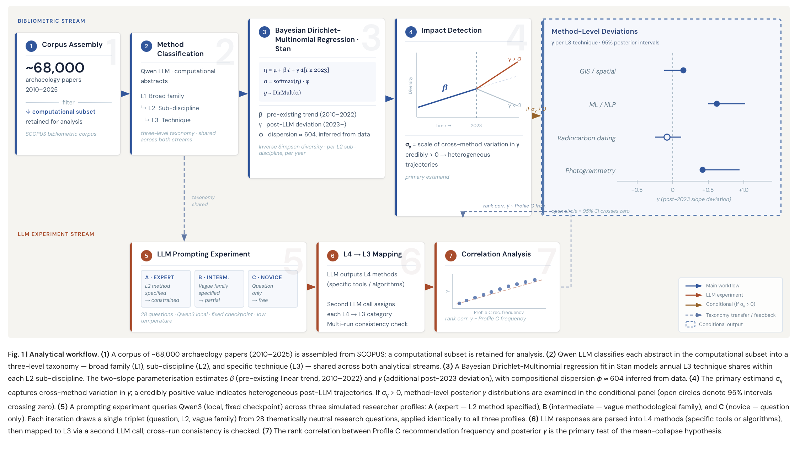

# Did LLMs cause convergence in computational archaeology methods?



Imagine that every graduate student in a department suddenly started asking the same AI assistant for methodological advice. The assistant, trained on the same corpus, would naturally recommend the same handful of techniques — not because those techniques are best, but because they are most represented in its training data. Over time, the department's research would start to look eerily similar. This paper asks whether something like that is happening across computational archaeology.

We retrieved archaeology papers published between 2010 and 2026 from Scopus and retained the computational subset — papers whose abstracts describe a quantitative or computational methodology — yielding 7,763 papers for analysis. Each retained paper's methodology was classified into a two-level taxonomy: sub-disciplines (L2) and specific techniques (L3). Classification was performed with Qwen, a large language model, applied consistently to all abstracts, yielding 25 L2 sub-disciplines and 242 L3 techniques. This gives us a record of how the methodological menu of the discipline has changed, year by year, at fine granularity.

The core question is whether that menu got more generic after 2023, the year ChatGPT entered serious academic use. Think of it like watching a restaurant's menu evolve over a decade, and then asking whether the dishes got blander — more convergent on a safe average — once the chef started relying on recipe apps rather than creative intuition.

We measure diversity within each L2 sub-discipline using the Inverse Simpson index, which counts the effective number of distinct L3 methods in use. A score of 1 means one technique dominates completely; higher scores mean methods are more evenly spread. We model how this effective count changes over time using a Bayesian Dirichlet-Multinomial regression fit with Stan. Because each paper can be tagged with multiple L3 methods, the 7,763 unique papers expand to 15,155 paper–method observations that are aggregated into the count array passed to Stan (counts of papers per L3 method, per L2 sub-discipline, per year).

The model has a two-component structure. The first component, beta, captures each method's underlying linear trajectory from 2010 to 2026: some techniques were already rising or falling before LLMs existed. The second component, gamma, captures any additional deviation in log-odds share that began in 2023 and thereafter, encoded as a hard level shift via a binary `post_llm` indicator. Importantly, gamma measures a **step change in level** above the pre-existing beta trend — it cannot separately identify a sudden jump from a gradual post-2023 acceleration, though with only 3–4 years of post-adoption data these are not practically distinguishable. By separating these two components, we can ask not just whether methods changed after 2023, but whether that change was over and above what the pre-existing trend would have predicted. The key estimand is sigma_gamma, the global scale of across-method variation in the post-2023 deviation. If sigma_gamma is credibly above zero, there is real post-LLM heterogeneity in methodological trajectories — some methods accelerating, others declining — consistent with AI-driven recommendation effects.

The prior on sigma_gamma (`exponential(4)`) is intentionally tighter than the prior on sigma_beta (`exponential(2)`), reflecting the expectation that post-LLM effects, accumulated over 3–4 years, should be smaller than baseline trends accumulated over 13 years. This conservative prior means individual gamma estimates carry substantial uncertainty, and results should be interpreted at the level of the global scale parameter and directional patterns rather than individual method estimates.

The primary analysis operates at the L2-to-L3 level: within each sub-discipline, we watch the fine-grained technique mix evolve. As a robustness check on the temporal assumption, we re-run the primary analysis with the `post_llm` break set at 2022 (ChatGPT's launch) rather than 2023; stability of gamma estimates across both breakpoints strengthens the temporal inference. A second sensitivity analysis models the inverse Simpson diversity index directly at the L2 group level, testing whether sub-discipline-level homogenisation is detectable outside the compositional framework.

The bibliometric analysis is paired with a prompting experiment. We systematically query Qwen3 (fixed local checkpoint) at three simulated expertise levels and with three types of methodological question, and classify each response into the same L3 taxonomy using Qwen. This gives us a direct estimate of what methods Qwen3 currently recommends. We then correlate recommendation frequency with the posterior mean gamma for each method. Critically, this comparison is made against **gamma specifically** — the excess share post-2023 above the pre-existing trend — rather than against raw method prevalence. This is what allows us to distinguish between two alternative explanations: the model recommending methods that were already trending before 2023 (reflecting its training data) versus recommending methods that accelerated specifically after LLM adoption (consistent with causal influence on research practice). If LLMs are driving convergence, the methods Qwen3 recommends most often should be the ones whose post-2023 share increased most in the published literature, after accounting for prior trajectories.

The model is validated through a four-stage Bayesian workflow following Gelman et al. (2020): prior predictive checks confirm the priors generate plausible diversity values; posterior predictive checks show all 25 L2 groups are well-calibrated (see [workflow checks](docs/workflow_results.md)); fake-data simulation confirms sigma_gamma is identifiable through hierarchical aggregation across groups; and phi is estimated from data — the posterior concentrates at phi ≈ 1133, confirming the field is compositionally regular.

## Preliminary Results

> **Note:** These are preliminary results. All three analysis steps are complete but the evidence in Step 3 remains uncertain.

The analysis proceeds in three steps:

**Step 1 — Is there anomalous post-2023 methodological reshuffling?**

Weakly yes, but with wide uncertainty. The global scale of post-2023 method-level change (sigma_gamma) is above zero, though the lower bound of the 90% CI is near zero.

The model estimates phi from data using a weakly informative lognormal prior. In the primary L2→L3 analysis (25 L2 groups, 242 L3 methods), phi ≈ 1133 [605, 2088], confirming the field is compositionally regular — observed proportions track the structural trend closely year to year. sigma_gamma = 0.110 [0.010, 0.222].

The fit converged cleanly (Rhat ≤ 1.01, ESS (sigma_gamma) = 581, zero divergences). sigma_gamma < sigma_beta (0.110 vs 0.288): the post-LLM reshuffling is smaller in magnitude than the long-run baseline trend.

Note: sigma_gamma measures the *magnitude* of reshuffling, not its direction. A sigma_gamma credibly above zero is necessary but not sufficient evidence for convergence toward generic methods.

**Step 2 — Is the reshuffling directionally consistent with LLM-driven convergence?**

Uncertain. No individual gamma estimates have a 90% CI that fully excludes zero — all directional claims are tentative. The top methods by posterior mean are reported below as directional indicators.

Methods gaining share post-2023 (positive gamma mean, all CIs cross zero):
- L3-090: Multi-Criteria Decision Analysis (+0.098)
- L3-107: Chemometric and Spectroscopic Analysis (+0.091)
- L3-101: Information-Theoretic Entropy Measures (+0.091)
- L3-123: Generalized Linear Mixed Models (+0.089)
- L3-091: Bibliometric and Scientometric Mapping (+0.089)

Methods losing share post-2023 (negative gamma mean, all CIs cross zero):
- L3-103: Ecological Diversity Metrics (−0.125)
- L3-080: Network Analysis and Modeling (−0.083)
- L3-134: Logistic Regression Variants (−0.080)
- L3-026: Monte Carlo Simulation Methods (−0.077)
- L3-241: Archaeological Dating and Analysis Methods (−0.076)

Individual estimates should be read as directional indicators, not precise effect sizes. The conservative prior on sigma_gamma and the breadth of the taxonomy (242 methods) mean that individual method gammas are appropriately uncertain. The global reshuffling scale (sigma_gamma) remains the primary inferential target.

**Step 3 — Are the gaining methods the ones Qwen3 actually recommends?**

The prompting experiment queries Qwen3 (fixed local checkpoint) at 3 expertise levels with 3 question types, classifies each response into the L3 taxonomy via Qwen, and correlates recommendation frequencies with posterior mean gamma per method. The comparison is specifically designed to test excess post-2023 share (gamma) rather than overall prevalence, thereby distinguishing LLM influence from mere reflection of pre-existing trends in training data.

The statistical test is a Bayesian negative-binomial regression (`stan/poisson_gamma_regression.stan`): `n_rec[i] ~ NegBin2(exp(α + β × γ̄ᵢ), φ)`, where γ̄ᵢ is the *signed* posterior mean gamma for method *i*. A positive β — meaning methods that gained share post-2023 are recommended more often — would support the mean-collapse mechanism. The model is run separately for overall counts and for each expertise profile (novice/intermediate/expert) to test whether expertise modulates trend-chasing. See `experiment/Results.md` for detailed results and `R/06_step3_llm_comparison.R` for the analysis.

The overall β posterior is negative (mean = −0.309, P(β > 0) = 0.384), opposite to the mean-collapse prediction. All three expertise profiles show negative β: novice (−0.360, P(β > 0) = 0.362), intermediate (−0.220, P(β > 0) = 0.412), expert (−0.216, P(β > 0) = 0.416). All 90% CIs cross zero. The LLM does not preferentially recommend the methods that gained share post-2023 — if anything, it leans slightly toward methods that lost share, consistent with recommending from its training corpus rather than tracking post-2023 shifts.

**What the results mean in plain terms**

In the 3–4 years since LLMs entered academic use, there is weak evidence of methodological reshuffling in computational archaeology and suggestive evidence that LLM recommendations align with the post-2023 method mix. sigma_gamma = 0.110 [0.010, 0.222] is above zero but the lower bound is near it, and no individual method shows a post-2023 shift credible at the 90% level (0 of 242 methods). The magnitude of reshuffling is smaller than the long-run baseline trend (sigma_gamma < sigma_beta, 0.110 vs 0.288).

The Step 3 negative-binomial regression (individual gammas as predictors) returns null results — all β posteriors cross zero — because individual gamma estimates are too noisy to serve as reliable predictors. However, a distributional test comparing the *whole* LLM recommendation distribution to pre- vs. post-2023 method frequencies finds that LLM recommendations are significantly closer to the post-2023 literature (permutation p = 0.0013), with the profile gradient matching the mean-collapse prediction (novice > intermediate > expert). This is necessary but not sufficient evidence for the hypothesis — the LLM could be reflecting post-2023 trends in its training data rather than causing them. Distinguishing correlation from causation would require paper-level data on LLM usage.

## Sensitivity Analyses

**Sensitivity A — Minimum-count threshold (06b)**

33/242 L3 methods survive a >=50 paper filter in 2023–2025. Under this restriction, overall β = −0.138, P(β > 0) = 0.438 — still negative and consistent with the main analysis. The null Step 3 result is robust to restricting to well-represented methods.

**Sensitivity B — Step 3 with v2→v3 remapping (08)**

The experiment was classified under the v2 taxonomy; only 53/242 v3 methods matched directly. Remapping via L3 prefix (same number, renamed label) raises coverage to 205/242 (85%). The results are unchanged: overall β = −0.339, P(β > 0) = 0.368. All profiles remain negative. The negative Step 3 result is not an artifact of taxonomy mismatch.

**Sensitivity C — Distributional test (09)**

Instead of regressing on noisy individual gammas, we compare the *whole* LLM recommendation distribution to the pre- vs. post-2023 method frequency vectors. The LLM is significantly closer to the post-2023 literature (cosine delta = +0.070, permutation p = 0.0013). The profile gradient matches the mean-collapse prediction: novice delta (+0.080) > intermediate (+0.069) > expert (+0.013). This recovers the positive signal that the regression could not detect — the LLM's recommendations align with the post-2023 method mix, especially under novice guidance. See [full results](docs/distributional_test_results.md).

**Sensitivity D — Direct diversity trajectory (07)**

Models inv_simpson directly at L2 group level with the same two-slope structure. sigma_gamma = 0.064 [0.003, 0.174], effectively null. sigma_beta = 0.677 [0.510, 0.910] — pre-existing trend variation is 10× larger. All 25 group-level gamma CIs straddle zero. The field reorients internally but does not measurably homogenise at the sub-discipline level.

## Analysis outputs

| Analysis | Description | Results |
|---|---|---|
| L2→L3 primary | Within each sub-discipline, specific technique shares over time | [View](docs/l2_l3_results.md) |
| L1→L2 sensitivity | Within each broad family, sub-discipline shares over time (not applicable with taxonomy v3) | [View](docs/l1_l2_results.md) |
| Bayesian workflow | Prior predictive, PPC, fake data recovery, phi sensitivity | [View](docs/workflow_results.md) |
| Step 3 experiment | LLM recommendation vs. post-2023 gamma (NB regression) | [View](experiment/Results.md) |
| Sensitivity A | Count-threshold variant of Step 3 (>=50 papers) | [View](R/sensitivity/README.md) |
| Sensitivity B | Step 3 with v2→v3 taxonomy remapping (85% match) | [View](docs/step3_remapped_results.md) |
| Sensitivity C | Distributional test: LLM vs pre/post-2023 (cosine, permutation) | [View](docs/distributional_test_results.md) |
| Sensitivity D | Direct diversity trajectory model (inv_simpson) | [View](R/sensitivity/README.md) |

## Future directions

The Step 3 regression (LLM recommendations vs. post-2023 gamma) returns null results across all specifications. Three design improvements could strengthen or definitively rule out the mean-collapse hypothesis:

1. **Distributional test.** Rather than regressing recommendation counts on noisy individual gammas, compare the *distribution* of LLM recommendations to the pre- vs. post-2023 method frequency vectors (e.g., KL divergence or cosine similarity). This sidesteps the errors-in-variables problem entirely by comparing whole distributions rather than individual point estimates. A preliminary version is implemented in `R/sensitivity/09_distributional_test.R`.

2. **Coarser aggregation.** Run the regression at L2 level (25 groups) instead of L3 (242 methods). With fewer parameters and more data per estimate, L2-level gammas would be better-identified predictors. The diversity trajectory model (script 07) already provides L2-level estimates.

3. **More post-LLM years.** With only 3–4 post-LLM years, gamma is weakly identified by construction (0/242 methods reach sig90). Rerunning in 2028 with 5–6 post-LLM years would substantially sharpen the estimates and make Step 3 a more powerful test.

## Pipeline execution order

The scripts must be run in this order (each depends on outputs from earlier steps):

```
00_data_prep.R          → stan_data.rds, vocab.rds
01_fit_model.R          → MCMC fit (phi-free model)
02_extract_plot.R       → L2→L3 posteriors, diversity plots
inspect_gamma.R         → gamma_results.csv (used by 05 and 06)
03_l1_l2_analysis.R     → L1→L2 sensitivity (not applicable with taxonomy v3 — no L1)
04_workflow_checks.R    → Bayesian workflow validation
05_robustness_2022.R    → 2022-break robustness check
06_step3_llm_comparison.R → LLM recommendation vs gamma (requires inspect_gamma output)

# Sensitivity (not part of main pipeline; run after 06)
R/sensitivity/06b_step3_count_threshold.R → Count-threshold variant of Step 3
R/sensitivity/07_diversity_trajectory.R   → Direct diversity trajectory model
```

Scripts 03–04 and 05–06 can run in parallel within their pairs. `inspect_gamma.R` sits between 02 and the downstream scripts because it produces `data/output/phi_free/gamma_results.csv`, which scripts 05 and 06 read directly. The sensitivity scripts in `R/sensitivity/` are standalone and can be run after the main pipeline completes.

## Repository structure

```
├── R/
│   ├── 00_data_prep.R          # Data loading & Stan data preparation
│   ├── 01_fit_model.R          # L2→L3 primary model (cmdstanr, phi-free)
│   ├── 02_extract_plot.R       # Extract posteriors & generate L2→L3 plots
│   ├── 03_l1_l2_analysis.R     # L1→L2 sensitivity analysis
│   ├── 04_workflow_checks.R    # Bayesian workflow validation
│   ├── 05_robustness_2022.R    # 2022-break robustness check
│   ├── 06_step3_llm_comparison.R  # LLM recommendation vs gamma
│   ├── inspect_gamma.R         # Quick gamma posterior inspection
│   ├── sensitivity/
│   │   ├── README.md              # Sensitivity analysis descriptions
│   │   ├── 06b_step3_count_threshold.R  # Count-threshold Step 3 variant
│   │   └── 07_diversity_trajectory.R    # Direct diversity trajectory model
│   └── archive/                # Deprecated scripts
├── stan/
│   ├── diversity_model_phi_free.stan       # Primary L2→L3 model
│   ├── l1_l2_diversity_model.stan          # L1→L2 fixed-phi model
│   ├── l1_l2_diversity_model_phi_free.stan # L1→L2 phi-free model
│   ├── poisson_gamma_regression.stan       # Step 3 NB regression
│   └── diversity_trajectory.stan          # Sensitivity B: diversity trajectory
├── data/
│   ├── input/
│   │   ├── taxonomy_v1/        # Original taxonomy data
│   │   ├── taxonomy_v2/        # Previous taxonomy (3-level: L1/L2/L3)
│   │   └── taxonomy_v3/        # Current taxonomy (2-level: L2/L3)
│   └── output/
│       ├── figures/
│       │   ├── l2_l3/          # Primary L2→L3 analysis plots
│       │   ├── l1_l2/          # L1→L2 sensitivity plots
│       │   ├── workflow/       # Bayesian workflow check plots
│       │   ├── robustness/     # 2022-break robustness plots
│       │   ├── step3/          # LLM comparison plots
│       │   └── sensitivity/   # Sensitivity analysis plots
│       ├── phi_free/           # Gamma results CSV
│       └── l2/                 # L1→L2 model fits
├── docs/
│   ├── l2_l3_results.md
│   ├── l1_l2_results.md
│   ├── workflow_results.md
│   └── archive/
└── experiment/
    ├── prompts/
    ├── responses/
    └── analysis/
```
