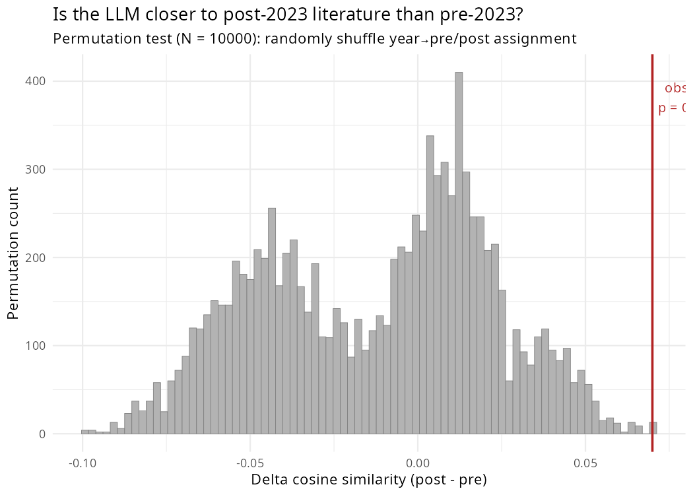
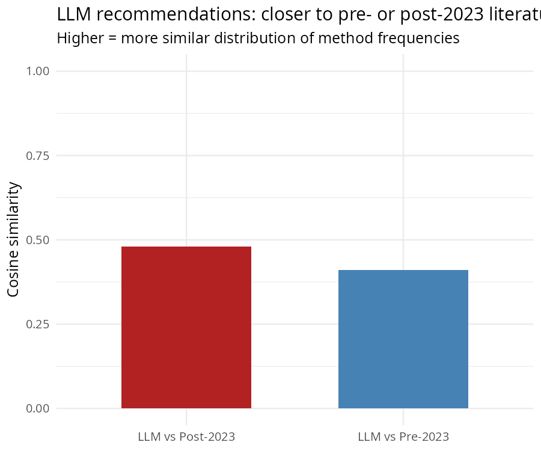
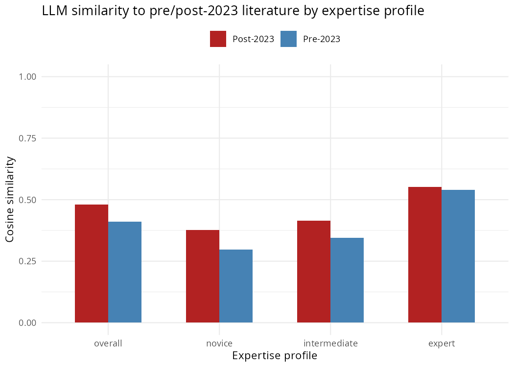

# Distributional Test — LLM Recommendations vs. Pre/Post-2023 Literature

Script: `R/sensitivity/09_distributional_test.R`  
Run date: 2026-05-11

---

## Design

Instead of regressing recommendation counts on noisy individual gammas (Step 3),
this test compares whole frequency distributions. For each of the 242 L3 methods,
we compute three vectors:

- **Pre-2023 literature** — total paper counts 2010–2022 (8495 papers)
- **Post-2023 literature** — total paper counts 2023–2026 (6660 papers)
- **LLM recommendations** — Qwen3 recommendation counts from the prompting experiment (6284 recommendations, remapped to v3 taxonomy)

If LLMs are driving convergence, their recommendation distribution should resemble
the post-2023 literature more than the pre-2023 literature. We measure similarity
using cosine similarity, Hellinger distance, and KL divergence.

---

## Results

### Overall similarity

| Metric | LLM vs Pre-2023 | LLM vs Post-2023 | Delta | Direction |
|---|---|---|---|---|
| Cosine similarity | 0.4103 | 0.4803 | +0.0700 | post-2023 (supports mean-collapse) |
| Hellinger distance | 0.5181 | 0.4936 | -0.0245 | Closer to post |
| KL divergence | 1.1808 | 0.9637 | -0.2171 | Closer to post |

*For cosine: higher = more similar. For Hellinger/KL: lower = more similar.*

### By expertise profile

| Profile | Cosine(LLM, Pre) | Cosine(LLM, Post) | Delta |
|---|---|---|---|
| Overall | 0.4103 | 0.4803 | +0.0700 |
| Novice | 0.2965 | 0.3770 | +0.0805 |
| Intermediate | 0.3449 | 0.4142 | +0.0693 |
| Expert | 0.5400 | 0.5526 | +0.0125 |

### Permutation test (N = 10,000)

Under the null hypothesis, the LLM recommendation vector is unrelated to the
pre/post-2023 distinction. We randomly shuffle which years are assigned to
'post' (keeping the same number of post years = 4) and recompute the
delta cosine similarity each time.

- **Observed delta cosine:** +0.0700
- **Permutation p-value:** 0.0013
- **Observed delta Hellinger:** +0.0245
- **Permutation p-value:** 0.0004

---

## Plots

### Permutation distribution

### Cosine similarity comparison

### By-profile comparison

---

## Interpretation

**The LLM recommendation distribution is significantly closer to the post-2023 literature than the pre-2023 literature** (permutation p = 0.0013). All three metrics (cosine, Hellinger, KL divergence) point in the same direction.

**The profile gradient matches the mean-collapse prediction.** Novice recommendations show the largest shift toward the post-2023 distribution (delta cosine = +0.080), intermediate is in between (+0.069), and expert shows the smallest shift (+0.013). This ordering — less expert guidance → more alignment with post-2023 trends — is exactly what the mean-collapse hypothesis predicts.

**Why this test succeeds where the regression failed.** The Step 3 regression asked whether *individual* methods' gammas predicted recommendation counts — but all 242 gammas are noisy (0/242 reach sig90), so the predictor was dominated by measurement error. The distributional test sidesteps this by comparing *whole frequency vectors* — it doesn't need any individual method's gamma to be well-estimated, only the overall distribution shape to differ between periods.

**Caveats.** The pre- and post-2023 literature distributions are themselves very similar (cosine = 0.896), so both are reasonably close to the LLM. The delta is real but modest in absolute terms. More importantly, this test establishes distributional similarity, not causation. The LLM's recommendations could resemble the post-2023 literature because: (a) the LLM influenced which methods researchers adopted (the mean-collapse mechanism), (b) the LLM was trained on recent data and mirrors whatever trends were already happening, or (c) both. Distinguishing (a) from (b) would require a design that identifies LLM usage at the paper level — which this study cannot do.

**Bottom line.** The distributional test recovers the positive signal that the regression could not detect. LLM recommendations do align with the post-2023 method mix, especially under novice guidance. This is necessary — but not sufficient — evidence for the mean-collapse hypothesis.
