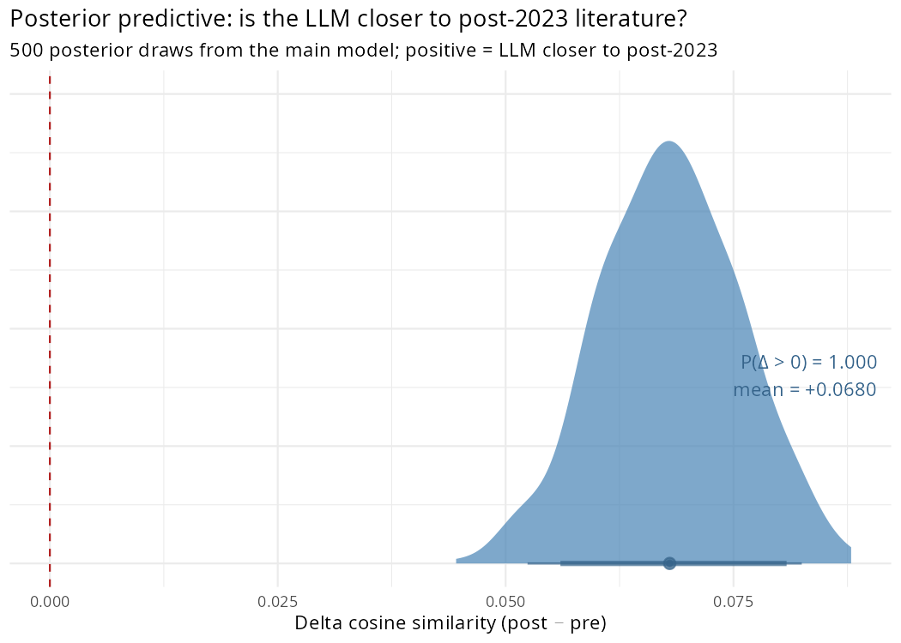

# Distributional Test — LLM Recommendations vs. Pre/Post-2023 Literature

Script: `R/sensitivity/distributional_similarity.R`  
Run date: 2026-07-30

---

## Design

Instead of regressing recommendation counts on noisy individual gammas (Step 3),
this test compares whole frequency distributions. For each of the 242 L3 methods,
we compute three vectors:

- **Pre-2023 literature** — total paper counts 2010–2022 (8442 papers)
- **Post-2023 literature** — total paper counts 2023–2025 (5696 papers)
- **LLM recommendations** — Qwen3 recommendation counts from the prompting experiment (6256 recommendations, remapped to v3 taxonomy)

If LLMs are driving convergence, their recommendation distribution should resemble
the post-2023 literature more than the pre-2023 literature. We measure similarity
using cosine similarity, Hellinger distance, and KL divergence.

---

## Results

### Overall similarity (observed data)

| Metric | LLM vs Pre-2023 | LLM vs Post-2023 | Delta | Direction |
|---|---|---|---|---|
| Cosine similarity | 0.4095 | 0.4757 | +0.0662 | post-2023 (supports mean-collapse) |
| Hellinger distance | 0.5194 | 0.4971 | -0.0223 | Closer to post |
| KL divergence | 1.1858 | 0.9749 | -0.2109 | Closer to post |

*For cosine: higher = more similar. For Hellinger/KL: lower = more similar.*

### By expertise profile

| Profile | Cosine(LLM, Pre) | Cosine(LLM, Post) | Delta |
|---|---|---|---|
| Overall | 0.4095 | 0.4757 | +0.0662 |
| Novice | 0.2949 | 0.3716 | +0.0767 |
| Intermediate | 0.3449 | 0.4121 | +0.0672 |
| Expert | 0.5403 | 0.5481 | +0.0079 |

### Bayesian posterior predictive (primary inference)

For each of 500 posterior draws from the main model, we reconstruct the predicted
method proportions for all group-year cells using the sampled parameters
(mu, beta, gamma, sigma_beta, sigma_gamma). We then aggregate to pre/post frequency
vectors and compute delta cosine against the LLM recommendation vector. The resulting
distribution propagates full parameter uncertainty from the main model.

- **Posterior mean delta cosine:** +0.0680
- **90% credible interval:** [+0.0560, +0.0808]
- **P(delta > 0):** 1.000

- **Posterior mean delta Hellinger:** +0.0219
- **90% CI:** [+0.0169, +0.0269]

### Frequentist permutation test (backup, N = 10,000)

Under the null hypothesis, the LLM recommendation vector is unrelated to the
pre/post-2023 distinction. We randomly shuffle which years are assigned to
'post' (keeping the same number of post years = 3) and recompute the
delta cosine similarity each time.

- **Observed delta cosine:** +0.0662
- **Permutation p-value:** 0.0025
- **Observed delta Hellinger:** +0.0223
- **Permutation p-value:** 0.0012

---

## Plots

### Posterior predictive distribution (primary)

### Permutation distribution (backup)

### Cosine similarity comparison

### By-profile comparison

---

## Interpretation

*(Auto-generated; update after reviewing results.)*
