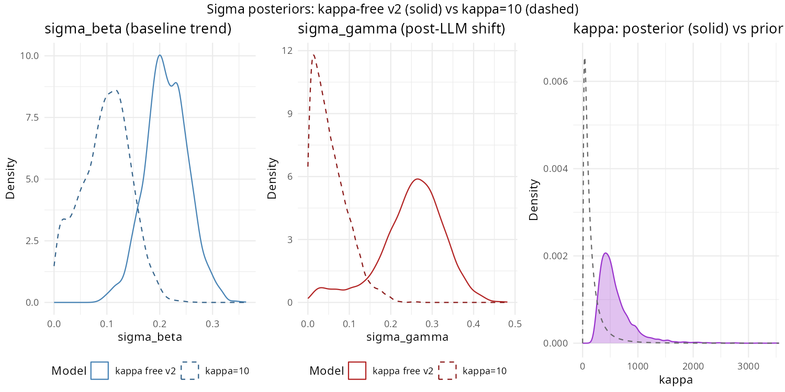
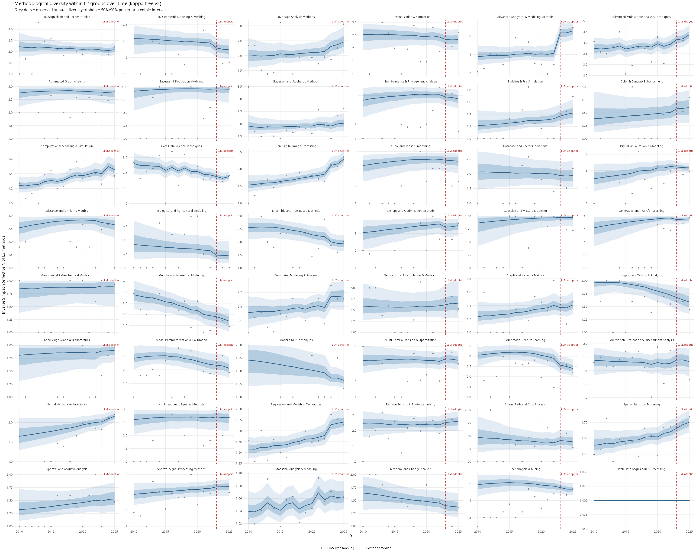
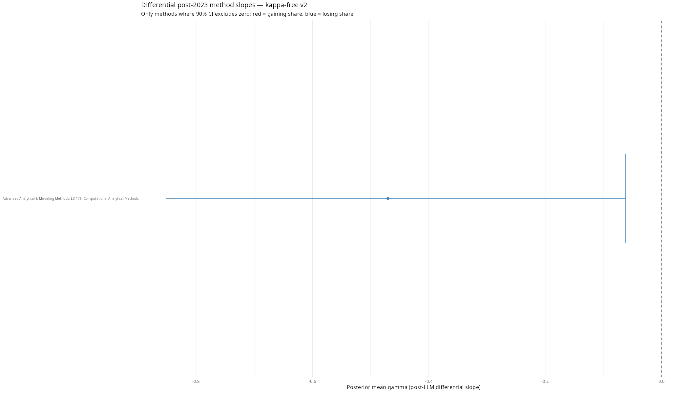
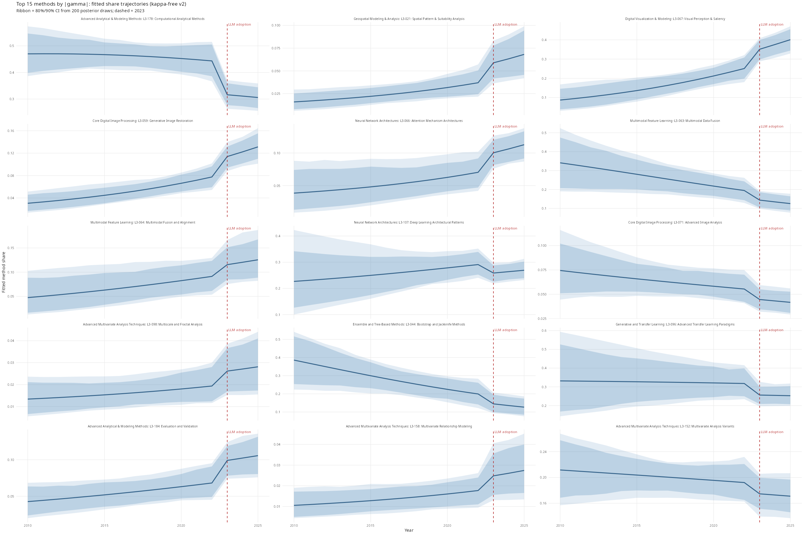
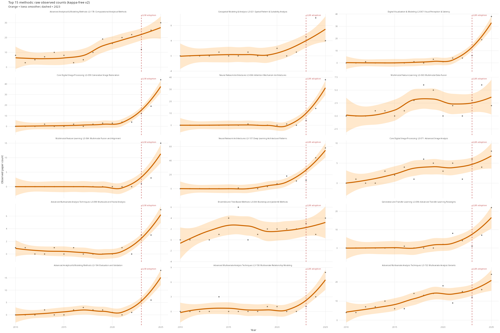

# Kappa Results: Sensitivity Analysis with Free Kappa

## Overview

This document summarises results from fitting `diversity_model_kappa_free.stan`, which extends the primary L3 model by treating kappa (the Dirichlet-Multinomial concentration parameter) as a free parameter estimated from data rather than fixing it at 10. The goal is to test whether the fixed kappa=10 assumption drives the main conclusions.

## The Model

The kappa-free model is identical to `diversity_model.stan` except that kappa appears in the parameters block with a lognormal prior:

```stan
parameters {
  real<lower=0> kappa;
  ...
}

model {
  kappa ~ lognormal(log(100), 1.0);
  sigma_beta  ~ exponential(2);
  sigma_gamma ~ exponential(4);
  ...
}
```

The prior `lognormal(log(100), 1.0)` has median 100 and 90% interval approximately [14, 716], reflecting the empirical distribution of kappa estimated by `R/00b_kappa_exploration.R` across L2 groups. The primary estimand remains `sigma_gamma` — the global scale of post-LLM slope heterogeneity across methods.

## Reference: Fixed-kappa results (kappa = 10)

These are from the primary analysis in [`docs/l3_results.md`](l3_results.md).

| Parameter | kappa = 10 |
|---|---|
| sigma_gamma mean | 0.0563 |
| sigma_gamma 95% CI | [0.0018, 0.1671] |
| sigma_beta mean | 0.0965 |
| Rhat sigma_gamma | 1.0016 |
| ESS sigma_gamma | 1268 |

## Kappa-free results (v2: lognormal(log(100), 1.0))

| Parameter | kappa free v2 (lognormal(log(100), 1.0)) |
|---|---|
| kappa mean | 599.6 |
| kappa 90% CI | [254.1, 1505.7] |
| sigma_gamma mean | 0.25 |
| sigma_gamma 90% CI | [0.0426, 0.3825] |
| sigma_beta mean | 0.2129 |
| Rhat sigma_gamma | 1.0818 |
| ESS sigma_gamma | 67 |
| Runtime | 157.5 min |

### Plots (kappa-free v2)






## Summary comparison

| Model | kappa | sigma_gamma mean | sigma_gamma 90% CI | Converged? |
|---|---|---|---|---|
| Fixed kappa = 10 | 10 (fixed) | 0.0563 | [0.0018, 0.1671] | YES |
| Kappa free (v2) | 599.6 (estimated) | 0.25 | [0.0426, 0.3825] | PARTIAL (Rhat=1.0818, ESS=67) |
