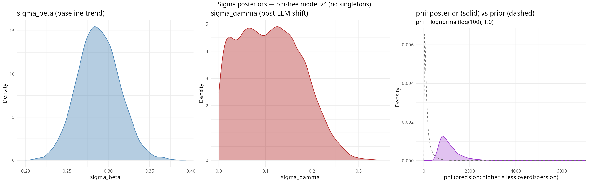
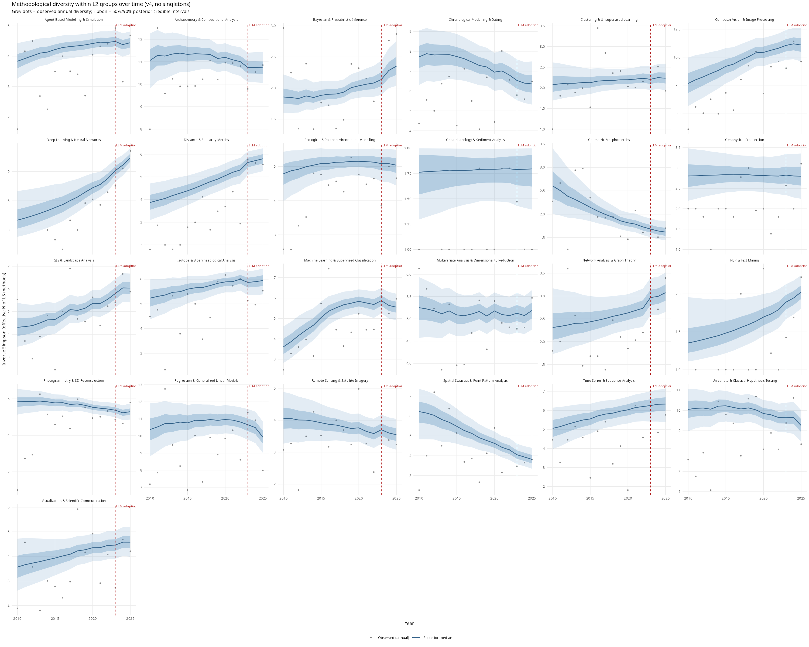
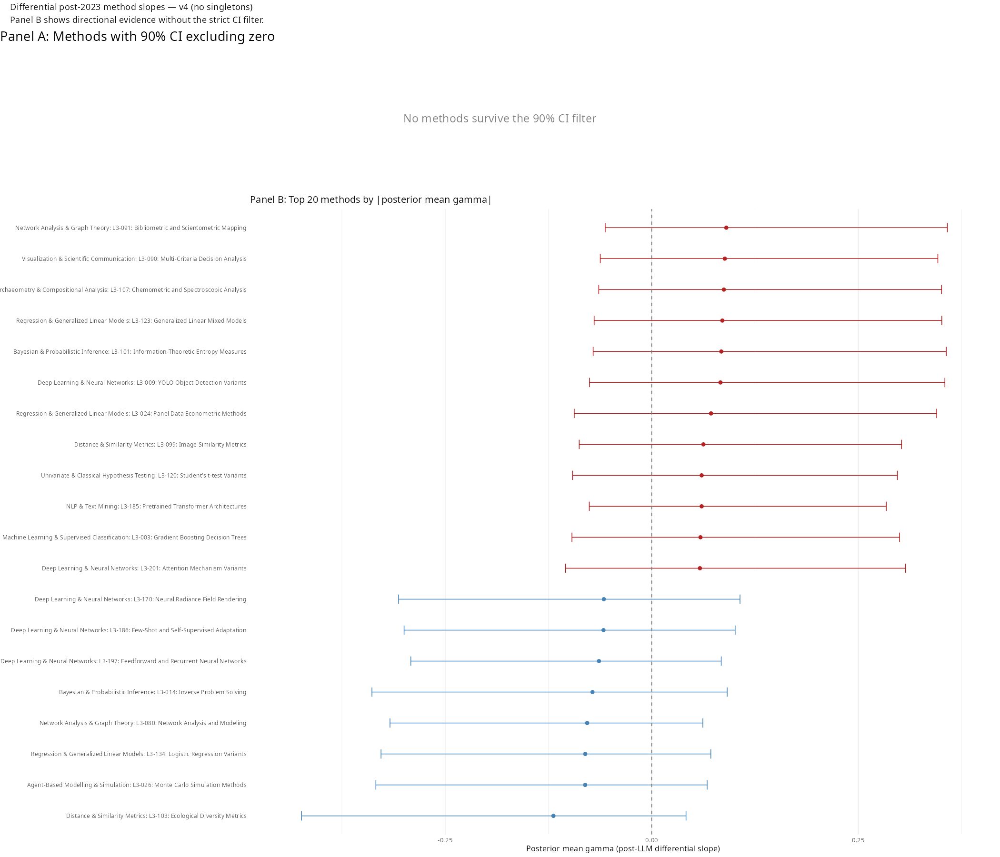
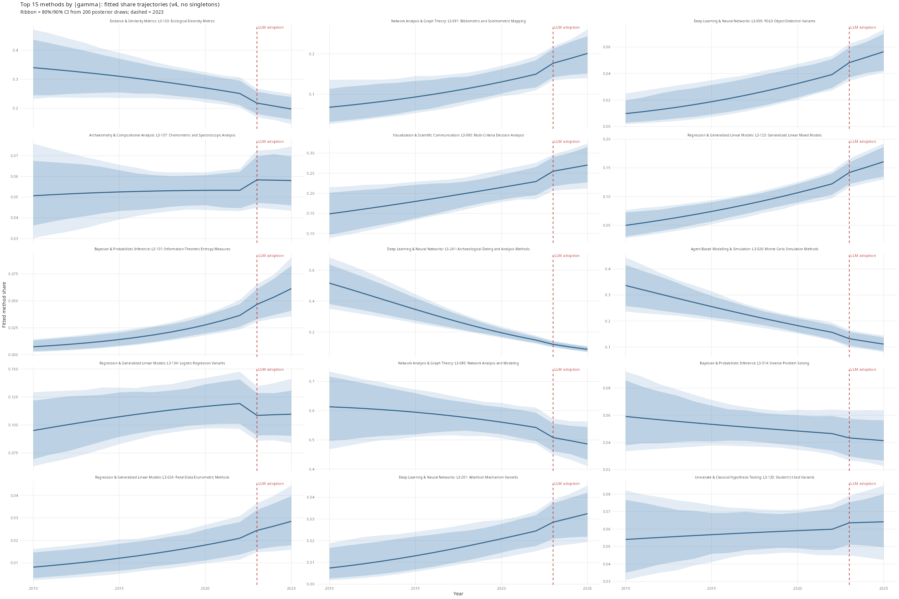
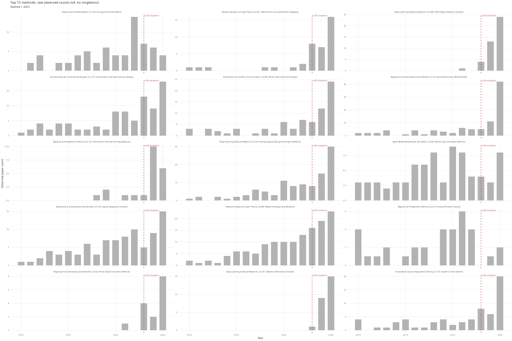

# L2→L3 Primary Analysis

## What this model does

We watch the fine-grained technique mix within each L2 sub-discipline evolve year by year. The model asks whether any method changed its share anomalously after 2023, over and above its historical trend.

Think of each sub-discipline as a menu: from 2010 to 2022, some techniques were growing, others shrinking. The model fits a linear trend to that history for every method simultaneously. Then it asks — did 2023 and 2024 bring changes that cannot be explained by the pre-existing trend? If so, sigma_gamma captures the global scale of that reshuffling. A small sigma_gamma means post-2023 was business as usual. A large sigma_gamma means the method landscape moved — some techniques accelerating, others declining — in a way that the prior trend cannot account for.

Crucially, the model does not ask "did overall diversity increase or decrease?" It asks "did the mix of methods within sub-disciplines change heterogeneously?" A large sigma_gamma is consistent with convergence (many methods declining, a few rising) or fragmentation (many methods rising from obscurity) — the direction is determined by the individual gamma estimates, not sigma_gamma itself.

### Why proportions, not raw counts

Computational archaeology published roughly 200 papers in 2010 and over 900 in 2025. If Network Analysis appeared in 20 papers in 2010 and 90 in 2025, a raw-count model would see a 4.5× increase. But the field itself grew 4.5× — Network Analysis held a steady ~10% share. A raw count model (e.g. Poisson or negative-binomial on per-method paper counts) confuses "the field grew" with "this method changed." Proportions are the right quantity for the convergence question: convergence means a few methods capturing a larger *share*, not that more papers exist.

The Dirichlet-Multinomial handles proportions natively. Within each L2 sub-discipline, it models the full vector of L3 method shares jointly, respecting the constraint that shares must sum to 1. If one method's share rises, another's must fall. A Poisson on individual method counts treats each method independently and misses that compositional trade-off. A Poisson with a log-total offset could partially compensate, but it still models each method in isolation rather than as part of a competitive menu.

### Why a fixed 2023 break, not a changepoint model

An alternative design would let the data estimate *when* the break occurred rather than fixing it at 2023. In principle this is more flexible: if the real effect started in late 2024 (once LLM adoption reached critical mass in archaeology), a changepoint model would find it.

In practice, the post-LLM window spans at most 4 candidate years (2022–2025). A discrete changepoint posterior over 4 candidates will be wide regardless of signal strength. The 2022-break robustness check already tests the most plausible alternative break year, and sigma_gamma *dropped* from 0.110 to 0.045 — shifting the break by one year weakened the signal rather than revealing a hidden one. With so few post-break years, a changepoint model would add a free parameter without meaningfully sharpening inference. The fixed-break design with a robustness check at 2022 is the more conservative and transparent choice.

## The model

```
y[g, t]          ~ Dirichlet-Multinomial(α[g, t])
α[g, t]           = softmax(η[g, t]) × phi

η[g, k, t]        = μ[g, k]
                   + β[g, k]  × year_std[t]
                   + γ[g, k]  × I(year[t] ≥ 2023)

μ[g, k]          ~ Normal(0, 1)
∑_k μ[g, k]      ~ Normal(0, 0.001 × K_g)      [soft sum-to-zero]

β[g, k]           = σ_β × β_raw[g, k]
β_raw[g, k]      ~ Normal(0, 1)
σ_β              ~ Exponential(2)

γ[g, k]           = σ_γ × γ_raw[g, k]
γ_raw[g, k]      ~ Normal(0, 1)
σ_γ              ~ Exponential(4)

log(phi)         ~ Normal(log(100), 1.0)   [phi ~ lognormal, median 100, 90% CI ~[14, 716]]
```

g indexes L2 sub-disciplines; k indexes L3 techniques within each sub-discipline; t indexes years 2010–2026.

**Why phi is estimated, not fixed.** An early empirical phi exploration (now archived in `R/archive/00b_phi_exploration.R`) estimated the Dirichlet-Multinomial concentration parameter from the data before any modelling, using a method-of-moments estimator applied across years within each L2 group. Most groups have empirical phi well above 10 — many above 100 — meaning the observed proportions track the structural trend closely year to year. Fixing phi=10 was therefore conservative: it attributed too much observed variation to within-year noise, leaving less for the structural β and γ parameters to explain. The principled Bayesian alternative is a weakly informative lognormal prior that lets the data speak. The posterior concentrates at phi ≈ 1133, confirming that the data favour a near-Multinomial likelihood.

**phi is sampled as log_phi (unbounded) for better HMC geometry.** `log_phi ~ Normal(log(100), 1.0)` is equivalent to `phi ~ lognormal(log(100), 1.0)`. The `phi = exp(log_phi)` transformation is applied in the `transformed parameters` block.

## Diagnostics

| Parameter | Value |
|---|---|
| phi posterior mean | 1133 |
| phi 90% CI | [605, 2088] |
| sigma_gamma mean | 0.11 |
| sigma_gamma 90% CI | [0.01, 0.222] |
| sigma_beta mean | 0.288 |
| Rhat (all params) | < 1.011 |
| ESS (sigma_gamma) | 581 |
| Divergences | 0 |

Rhat < 1.01 and ESS > 400 are the thresholds for acceptable convergence. Zero divergences is required.

## Key result

sigma_gamma = 0.110 [0.010, 0.222] is above zero but with wide uncertainty — the lower bound of the 90% CI is near zero, indicating weak evidence for post-LLM reshuffling. phi ≈ 1133 — the field is compositionally regular, with the data strongly favouring near-Multinomial behaviour. The post-LLM reshuffling is smaller in magnitude than the long-run baseline trend: sigma_gamma < sigma_beta (0.110 vs 0.288). No individual methods clear the 90% CI threshold for a credible post-LLM slope change (0 of 242 methods at sig90).

## What sigma_gamma means in plain terms

sigma_gamma is the standard deviation of the distribution from which individual method gammas are drawn. In the non-centred parameterisation, `gamma_method[g,k] = sigma_gamma × gamma_raw[g,k]` where `gamma_raw ~ Normal(0, 1)`, so sigma_gamma controls how spread out the post-2023 slopes are across methods. A sigma_gamma of 0.110 means roughly 68% of methods have |gamma| < 0.110, and about 16% have gamma > 0.110 or gamma < −0.110.

What does gamma = +0.110 look like in practice? The gamma operates on the log-share scale inside softmax. A rough translation: a method holding 20% share of its sub-discipline would shift to approximately 22% (a multiplicative increase of exp(0.110) − 1 ≈ 12%, applied before renormalisation). In a field where specialised methods typically hold 5–15% shares, this is a modest shift — detectable in aggregate but not individually credible for any single method.

## Top methods gaining share post-2023

No methods have a 90% CI for gamma that fully excludes zero. The estimates below are the top 5 by posterior mean but all carry wide uncertainty intervals that cross zero.

| Method | mean gamma | 90% CI |
|---|---|---|
| L3-090: Multi-Criteria Decision Analysis | +0.098 | [−0.057, +0.373] |
| L3-107: Chemometric and Spectroscopic Analysis | +0.091 | [−0.067, +0.356] |
| L3-101: Information-Theoretic Entropy Measures | +0.091 | [−0.078, +0.372] |
| L3-123: Generalized Linear Mixed Models | +0.089 | [−0.071, +0.357] |
| L3-091: Bibliometric and Scientometric Mapping | +0.089 | [−0.060, +0.351] |

## Top methods losing share post-2023

| Method | mean gamma | 90% CI |
|---|---|---|
| L3-103: Ecological Diversity Metrics | −0.125 | [−0.435, +0.040] |
| L3-080: Network Analysis and Modeling | −0.083 | [−0.326, +0.061] |
| L3-134: Logistic Regression Variants | −0.080 | [−0.338, +0.081] |
| L3-026: Monte Carlo Simulation Methods | −0.077 | [−0.317, +0.069] |
| L3-241: Archaeological Dating and Analysis Methods | −0.076 | [−0.335, +0.082] |

Note: change = (exp(gamma) − 1) × 100. No individual estimates are credible at the 90% level — all CIs cross zero.

## Taxonomy v3 notes

**Taxonomy v3** uses a two-level hierarchy (L2 → L3 only; no L1 grouping). The Qwen classifier was retrained to produce L2 and L3 labels directly from abstracts, yielding 25 L2 sub-disciplines and 242 L3 techniques across 7,763 papers (2010–2026). No singleton L2 groups (K_g = 1) exist in this taxonomy, so no groups are dropped.

Compared to the prior taxonomy (v2, which had 51 L2 groups and 225 L3 methods), the key changes are: fewer but larger L2 groups, a denser L3 vocabulary, and no L1 layer. The model structure is unchanged. Script `R/03_l1_l2_analysis.R` (L1→L2 sensitivity) is not applicable under v3.

## Plots


Three-panel: sigma_beta posterior (left), sigma_gamma posterior (centre), phi posterior vs prior (right). Phi concentrating far above its prior median (100) confirms the data favour near-Multinomial behaviour.


Inverse Simpson index (effective number of L3 techniques) within each L2 sub-discipline over 2010–2026. Ribbon = 50%/90% posterior credible intervals. Dashed line = 2023 LLM adoption boundary.


Posterior mean and 90% CI for gamma_method for each L3 technique. Red = gaining share post-2023, blue = losing share. Methods where the 90% CI excludes zero are credible evidence of a post-LLM slope change.


Fitted share trajectories for the top 15 L3 techniques by |gamma|. Each panel is one method; the y-axis is that method's estimated proportion of papers within its L2 sub-discipline. Ribbon = 80%/90% CI from 200 posterior draws.


Observed paper counts (grey dots) with loess smoother (orange). Pure data — no model. Sanity check that the raw signal matches what the model recovers.

## The model — full parameter description

### The generative story

We start by asking: if we knew the true proportion of papers using each method in a given year and sub-discipline, what would the count data look like? The answer is a Multinomial. But we don't know the true proportions — they vary year to year around a structural trend. So we place a Dirichlet prior on those proportions. Integrating out the proportions analytically gives us the Dirichlet-Multinomial, which is what we observe directly.

### Marginalisation

We never sample pi directly. Instead, pi is marginalised out of the model — the DM likelihood is the result of integrating pi over its Dirichlet prior. This is mathematically equivalent to sampling pi explicitly, but much faster for HMC because it removes thousands of latent variables from the parameter space (one pi vector per group-year cell).

### Full generative model

```
phi        ~ LogNormal(log(100), 1.0)           [sampled]
sigma_beta ~ Exponential(2)                      [sampled]
sigma_gamma~ Exponential(4)                      [sampled]

for each group g, method k:
  mu[g,k]        ~ Normal(0, 1)                 [sampled]
  beta_raw[g,k]  ~ Normal(0, 1)                 [sampled, non-centred]
  gamma_raw[g,k] ~ Normal(0, 1)                 [sampled, non-centred]

  beta[g,k]  = sigma_beta  * beta_raw[g,k]      [derived]
  gamma[g,k] = sigma_gamma * gamma_raw[g,k]     [derived]

for each group g, year t:
  eta[g,k,t] = mu[g,k] + beta[g,k]*year_std[t] + gamma[g,k]*post_llm[t]
  pi[g,t]    = softmax(eta[g,:,t])              [derived, then marginalised]
  alpha[g,t] = pi[g,t] * phi                    [derived, not sampled]
  y[g,t]     ~ DM(N[g,t], alpha[g,t])           [observed]
```

g indexes L2 sub-disciplines; k indexes L3 techniques within each sub-discipline; t indexes years 2010–2026.

### Parameter meanings

- **phi** — the Dirichlet-Multinomial concentration parameter. Controls how tightly observed proportions are expected to track the model's structural trend in any given year. Higher phi means less overdispersion and a more compositionally regular field. Prior: LogNormal(log(100), 1.0), median 100. Sampled as log_phi (unbounded) for better HMC geometry.

- **sigma_beta** — the global scale of the distribution from which long-run method trends are drawn. Encodes how much methods vary in their historical trajectories across the full 2010–2026 period. Prior: Exponential(2), weakly regularising. Sampled.

- **sigma_gamma** — the global scale of post-2023 slope changes. This is the key estimand: if sigma_gamma is credibly above zero, real post-LLM heterogeneous reshuffling occurred across methods. Prior: Exponential(4), more regularising than sigma_beta because we expect the post-LLM change (2–3 years) to be smaller than the cumulative 13-year trend. Sampled.

- **mu[g,k]** — the baseline log-weight of method k in group g, representing its average relative share across the full period. Prior: Normal(0, 1) with a soft sum-to-zero constraint across k within each g. Sampled.

- **beta_raw[g,k]** — non-centred auxiliary parameter for the long-run trend. Sampled as Normal(0,1); scaled by sigma_beta to give beta[g,k]. The non-centred form improves HMC mixing when sigma is small.

- **gamma_raw[g,k]** — non-centred auxiliary parameter for the post-2023 slope increment. Sampled as Normal(0,1); scaled by sigma_gamma to give gamma[g,k].

- **beta[g,k]** — the long-run linear trend of method k in group g. Was this method already rising or falling before LLMs existed? Derived: beta = sigma_beta * beta_raw. Not directly sampled.

- **gamma[g,k]** — the post-2023 slope increment for method k in group g. The anomalous change after LLM adoption, over and above the pre-existing trend. Derived: gamma = sigma_gamma * gamma_raw. Not directly sampled.

- **alpha[g,t]** — the Dirichlet concentration vector passed to the DM likelihood. Derived as pi[g,t] * phi. Not sampled.

- **pi[g,t]** — the true method proportions in group g at year t. Marginalised out of the model — never sampled, integrated analytically via the DM likelihood.

## Parameter table

| Parameter | What it measures | Sampled? | Posterior mean | 90% CI | Rhat | ESS |
|---|---|---|---|---|---|---|
| phi | Concentration — how tightly observed proportions track the structural trend. Higher = more regular field | Yes | 1133 | [605, 2088] | 1.00 | — |
| sigma_beta | Global scale of long-run method trends (2010–2026). How much methods vary in their historical trajectories | Yes | 0.288 | — | 1.00 | — |
| sigma_gamma | Global scale of post-2023 slope changes. The key estimand — if credibly above zero, anomalous reshuffling occurred | Yes | 0.110 | [0.010, 0.222] | 1.01 | 581 |
| mu[g,k] | Baseline log-weight of method k in group g — its average relative share across the full period | Yes | (varies by method) | — | — | — |
| beta[g,k] | Long-run linear trend of method k — was it already rising or falling before LLMs? | No (derived) | (varies by method) | — | — | — |
| gamma[g,k] | Post-2023 slope increment — the anomalous change after LLM adoption | No (derived) | (varies by method) | — | — | — |
| alpha[g,t] | Dirichlet concentration vector passed to DM likelihood | No (derived) | — | — | — | — |
| pi[g,t] | True method proportions — marginalised out, never sampled | No (marginalised) | — | — | — | — |

> beta[g,k] and gamma[g,k] are derived from sampled parameters via beta = sigma_beta * beta_raw and gamma = sigma_gamma * gamma_raw (non-centred parameterisation). The individual method-level estimates are available in the fit object but not shown here for brevity — see the gamma dotplot for the post-2023 estimates.
