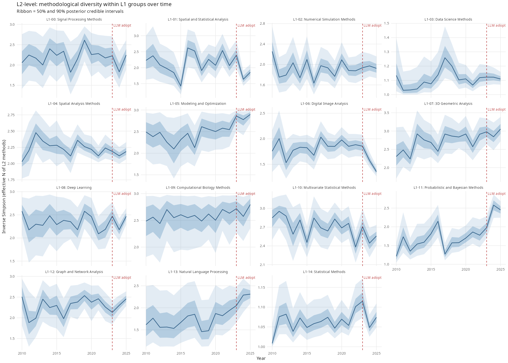
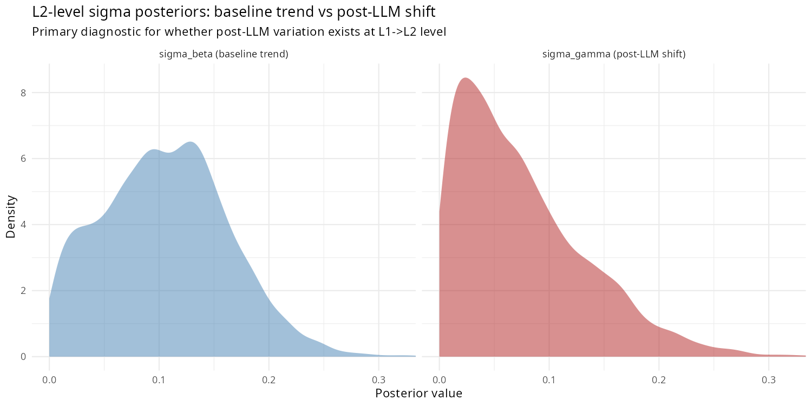
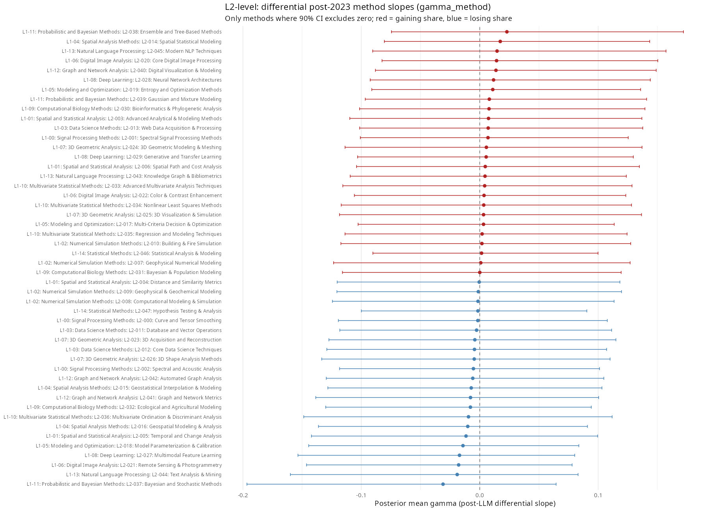
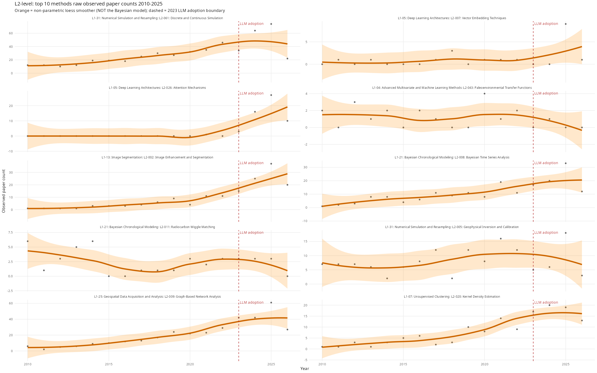
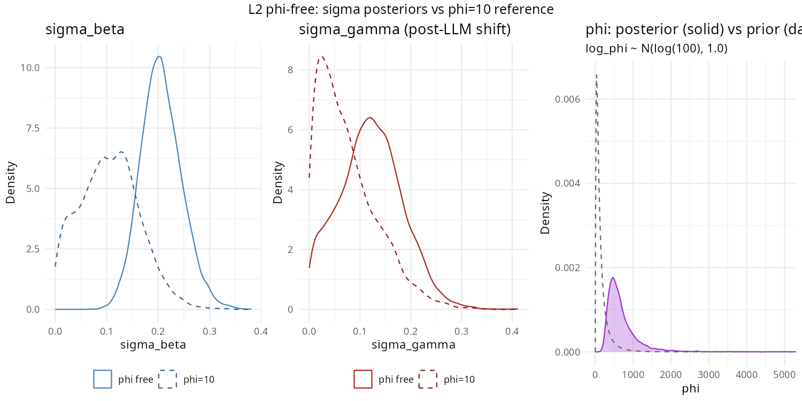
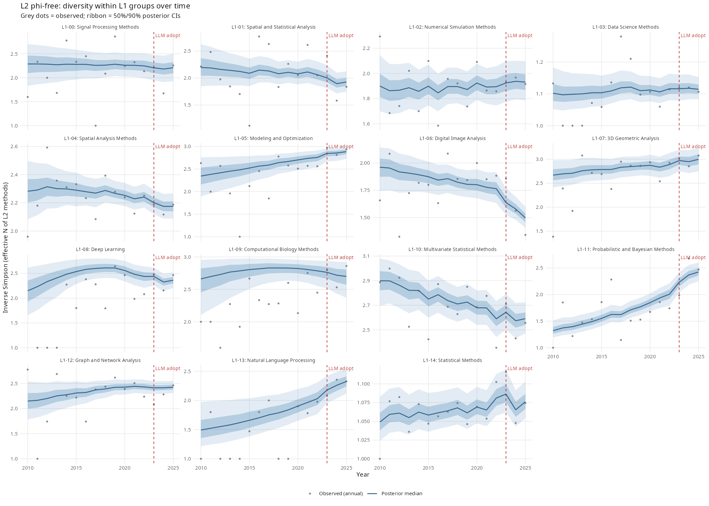
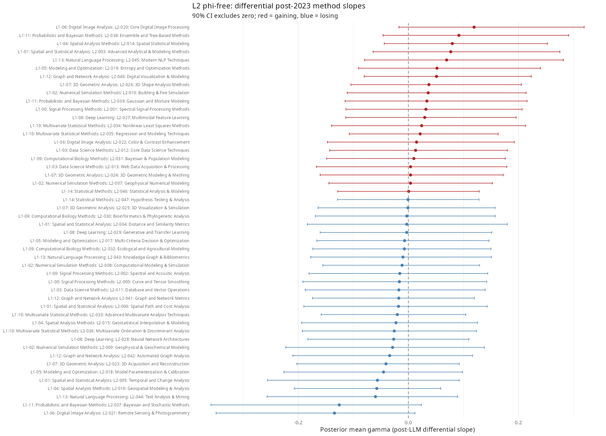
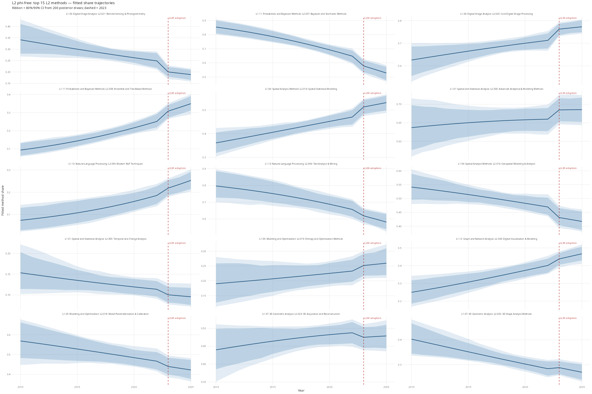
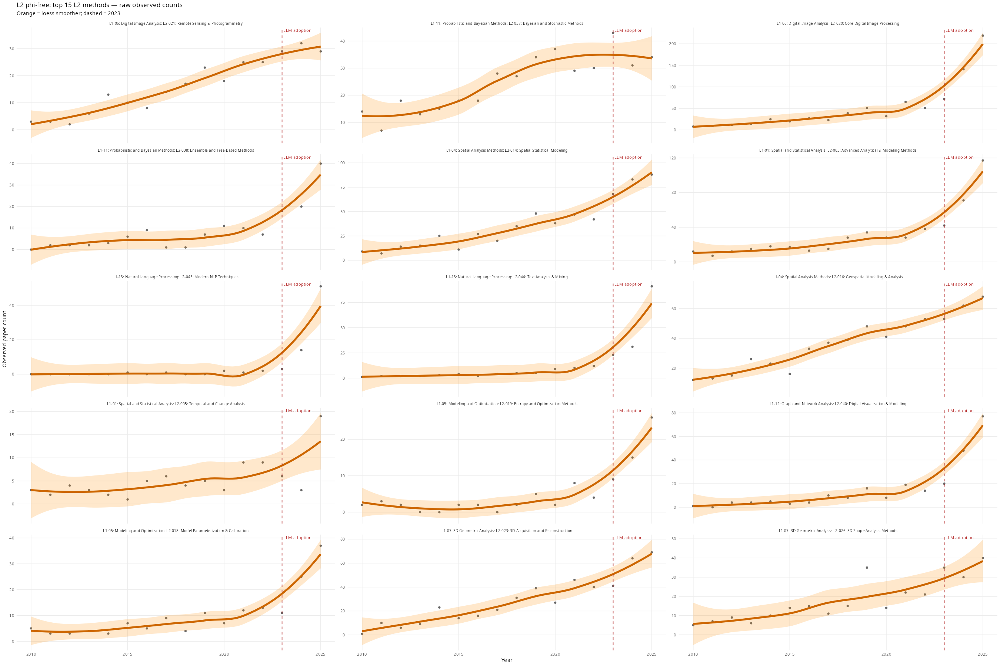

# L2 Results: L1 to L2 Sensitivity Analysis

## The Model

This is a sensitivity check running the same model at one taxonomic level coarser. Rather than watching technique shares within L2 sub-disciplines, we watch L2 sub-discipline shares within broad L1 methodological families. The generative model is:

```
y[g, t]          ~ Dirichlet-Multinomial(α[g, t])
α[g, t]           = softmax(η[g, t]) × κ

η[g, k, t]        = μ[g, k]
                   + β[g, k]  × year_std[t]
                   + γ[g, k]  × I(year[t] ≥ 2023)

μ[g, k]          ~ Normal(0, 1)
∑_k μ[g, k]      ~ Normal(0, 0.001 × K_g)      [soft sum-to-zero]

β[g, k]           = σ_β × β_raw[g, k]
β_raw[g, k]      ~ Normal(0, 1)
σ_β              ~ Exponential(2)

γ[g, k]           = σ_γ × γ_raw[g, k]
γ_raw[g, k]      ~ Normal(0, 1)
σ_γ              ~ Exponential(4)

κ = 10            [fixed concentration]
```

Here g indexes L1 families (e.g., Remote Sensing, Geophysical Methods) and k indexes L2 sub-disciplines within each family. Everything else is identical to the L3 analysis: same Dirichlet-Multinomial likelihood, same two-slope linear predictor, same non-centred parameterisation, same soft sum-to-zero constraint, same priors. See [docs/l3_results.md](l3_results.md) for a full line-by-line deconstruction of the model.

The inline Stan code in `R/03_l2_analysis.R` is structurally identical to `stan/diversity_model.stan`. Any changes to the model specification should be applied to both.

**σ_γ is again the primary estimand**, now measuring the global scale of post-2023 sub-discipline-level variation within L1 families. Comparing it to σ_γ from the L3 analysis is the core sensitivity check: qualitative agreement (both credibly above zero, similar ratio to σ_β) supports robustness of the main finding across taxonomic levels.

**Diversity in `generated quantities`: conjugate posterior, not prior predictive.** Each posterior draw yields a sample of π[g,t] — the simplex of sub-discipline shares — which is used to compute Inverse Simpson and effective N Shannon. These are *not* computed from `softmax(η)` directly. That would be the prior predictive: it ignores the observed counts entirely and produces needlessly wide CIs.

Instead, π[g,t] is drawn from the exact conjugate posterior. The prior on π is Dirichlet(softmax(η[g,t]) × κ); the likelihood is Multinomial(y[g,t]); by Dirichlet-Multinomial conjugacy:

```
π[g,t] | y[g,t]  ~  Dirichlet( softmax(η[g,t]) × κ  +  y[g,t] )
```

The posterior update is simply: add observed counts to the prior concentration. The practical effect depends on how N compares to κ = 10:

- **N >> κ**: data dominates — diversity CIs are tight because the observed shares are informative.
- **N << κ**: prior dominates — CIs are wide, reflecting trend uncertainty rather than data.
- **Crossover near N ~ κ**: prior and data contribute roughly equally.

For group-year cells with no papers (N_gt = 0), π falls back to softmax(η). Diversity CIs are therefore *data-adaptive*: they are not a uniform function of trend uncertainty but shrink or expand with how much information each year actually contains.

### A note on phi

κ = 10 is currently a fixed modelling assumption, not estimated from data. It controls overdispersion: how much the observed proportions in any given year are permitted to deviate from what the model predicts based on the trend.

Think of it like this. If κ is large, the model trusts the trend strongly — it treats year-to-year fluctuations in composition as noise around the smooth trajectory described by μ and β. If κ is small, the model allows the observed shares to deviate substantially from the trend each year, attributing more variation to genuine within-year randomness rather than measurement error.

Concretely, κ = 10 means the prior on the composition simplex has total concentration 10, so any individual year's data needs to substantially outweigh 10 "pseudo-observations" before it pulls the posterior away from the trend. The crossover between trend-dominated and data-dominated inference happens near N_papers ~ κ = 10: groups with fewer than 10 papers in a year are mostly regularised toward the trend; groups with hundreds of papers have their diversity CIs tightened by the actual data.

The empirical phi exploration in `R/00b_phi_exploration.R` estimates κ from the data before any modelling, using a method-of-moments estimator applied across years within each L1 group (at this taxonomic level). This tests whether κ = 10 is a reasonable assumption or whether overdispersion varies substantially across sub-discipline groups.

If κ varies substantially (interquartile range > 5 units across groups), the next model iteration should replace the single fixed value with group-specific κ_g drawn from a lognormal hyperprior: κ_g ~ lognormal(μ_κ, σ_κ), with μ_κ ~ Normal(log(10), 1) and σ_κ ~ Exponential(1). This is identifiable because κ_g is estimated within-group from count data, not competing with μ for the same signal.

## Diagnostics

| Quantity | Value |
|---|---|
| Divergent transitions | 0 |
| sigma_beta Rhat | 1.0019 |
| sigma_gamma Rhat | 0.9994 |
| sigma_beta ESS | 1060 |
| sigma_gamma ESS | 2197 |
| Runtime (minutes) | {{RUNTIME_MIN_L2}} |

Rhat < 1.01 and ESS > 400 are the thresholds for acceptable convergence. Zero divergences is required.

## Key Results

| Parameter | Posterior mean | 95% CI |
|---|---|---|
| sigma_beta | 0.1061 | [0.009, 0.2214] |
| sigma_gamma | 0.0724 | [0.0027, 0.2166] |
| ratio gamma/beta | 0.682 | — |

Interpretation: the post-LLM shift scale at L2 (sigma_gamma = 0.0724, 95% CI [0.0027, 0.2166]) is 0.682 times the baseline trend scale (sigma_beta = 0.1061, 95% CI [0.009, 0.2214]). Compare these values with the L3 analysis in docs/l3_results.md to assess whether the post-LLM signal is consistent across taxonomic levels. Qualitative agreement (both sigma_gamma credibly above zero, similar ratio) supports robustness of the main finding.

## Plots


Inverse Simpson index (effective number of L2 sub-disciplines) within each L1 family over 2010-2025. Ribbon = 50% and 90% posterior credible intervals. Dashed line = 2023 LLM adoption boundary.


Posterior densities of sigma_beta (baseline trend scale, blue) and sigma_gamma (post-LLM shift scale, red) at the L1-to-L2 level.


Posterior mean and 90% CI for gamma_method for each L2 sub-discipline whose CI excludes zero. Red = gaining share post-2023, blue = losing share.


Raw observed paper counts for the same top 10 sub-disciplines. The orange curve is a non-parametric loess smoother fitted directly to the observed counts — not derived from the Bayesian model. Sanity check that the sub-disciplines flagged by the model show plausible trends in the raw data.

## Phi-free results (concentration estimated from data)

This section repeats the L2 analysis with phi treated as a free parameter estimated from data rather than fixed at 10. The model parameterises phi on the log scale (`log_phi ~ Normal(log(100), 1.0)`, i.e. `phi ~ lognormal(log(100), 1.0)`, median=100, 90% CI ≈ [14, 716]). This is the principled Bayesian alternative to the fixed-phi assumption.

### Diagnostics

| Quantity | Value |
|---|---|
| Divergent transitions | 0 |
| sigma_gamma Rhat | {{L2_PHI_FREE_RHAT}} |
| sigma_gamma ESS | {{L2_PHI_FREE_ESS}} |
| Runtime (minutes) | {{L2_PHI_FREE_RUNTIME}} |
| Converged? | {{L2_PHI_FREE_CONVERGED}} |

### Key results

| Parameter | phi-free |
|---|---|
| phi mean | {{L2_PHI_FREE_PHI_MEAN}} |
| phi 95% CI | {{L2_PHI_FREE_PHI_CI}} |
| sigma_gamma mean | {{L2_PHI_FREE_SIGMA_GAMMA_MEAN}} |
| sigma_gamma 90% CI | {{L2_PHI_FREE_SIGMA_GAMMA_CI}} |
| sigma_beta mean | {{L2_PHI_FREE_SIGMA_BETA_MEAN}} |
| ratio gamma/beta | {{L2_PHI_FREE_RATIO}} |

### Plots


Three-panel: sigma_beta (left), sigma_gamma (centre) each compared to the phi=10 reference, and phi posterior vs prior (right). A phi posterior far above 100 means the data favour near-Multinomial behaviour — less overdispersion than the prior assumed.


Inverse Simpson index within each L1 family over 2010–2025 under the phi-free model. Compare to the fixed-phi version above.


L2 sub-disciplines with 90% CI for gamma excluding zero under the phi-free model. Red = gaining share post-2023, blue = losing share.


Fitted share trajectories for the top 15 L2 sub-disciplines by |gamma| under the phi-free model. Ribbon = 80%/90% CI from 200 posterior draws.


Raw observed paper counts for the same top 15 sub-disciplines. Pure data sanity check — no model involved.
