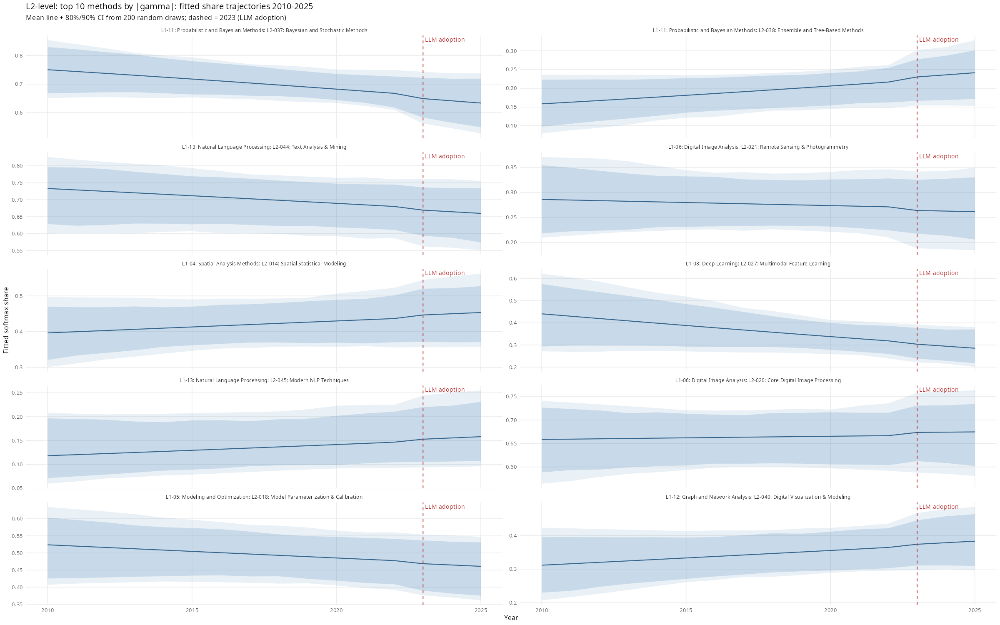

# L2 Results: L1 to L2 Sensitivity Analysis

## The Model

This is a sensitivity check running the same model at one taxonomic level coarser. Rather than watching technique shares within sub-disciplines, we watch sub-discipline shares within broad methodological families. The data for each L1 group g and year t is a vector of paper counts across K_g L2 sub-disciplines. As before, we use a Dirichlet-Multinomial likelihood with kappa fixed at 10.

The linear predictor has the same two-slope structure:

```
eta[g, k, t] = mu[g, k] + beta_method[g, k] * year_std[t] + gamma_method[g, k] * post_llm[t]
p[g, k, t]   = softmax(eta[g, k, t])
```

Here mu[g, k] is the baseline log-share of sub-discipline k within L1 family g; beta_method[g, k] is its linear trend 2010-2025; and gamma_method[g, k] is the additional post-2023 shift. The sum-to-zero constraint, non-centred parameterisation, and hierarchical priors on sigma_beta and sigma_gamma are identical to the L3 analysis. See docs/l3_results.md for full model documentation.

The inline Stan code in R/03_l2_analysis.R is identical in structure to stan/diversity_model.stan. Any changes to the model specification should be applied to both.

The key estimand is again sigma_gamma_L2: the global scale of post-2023 sub-discipline-level variation within L1 families. Comparing this to sigma_gamma from the L3 analysis tells us whether the convergence signal is consistent across taxonomic levels.

## Diagnostics

| Quantity | Value |
|---|---|
| Divergent transitions | {{DIVERGENCES_L2}} |
| sigma_beta Rhat | {{RHAT_SIGMA_BETA_L2}} |
| sigma_gamma Rhat | {{RHAT_SIGMA_GAMMA_L2}} |
| sigma_beta ESS | {{ESS_SIGMA_BETA_L2}} |
| sigma_gamma ESS | {{ESS_SIGMA_GAMMA_L2}} |
| Runtime (minutes) | {{RUNTIME_MIN_L2}} |

Rhat < 1.01 and ESS > 400 are the thresholds for acceptable convergence. Zero divergences is required.

## Key Results

| Parameter | Posterior mean | 95% CI |
|---|---|---|
| sigma_beta | {{SIGMA_BETA_MEAN_L2}} | {{SIGMA_BETA_CI_L2}} |
| sigma_gamma | {{SIGMA_GAMMA_MEAN_L2}} | {{SIGMA_GAMMA_CI_L2}} |
| ratio gamma/beta | {{RATIO_L2}} | — |

Interpretation: the post-LLM shift scale at L2 (sigma_gamma = {{SIGMA_GAMMA_MEAN_L2}}, 95% CI {{SIGMA_GAMMA_CI_L2}}) is {{RATIO_L2}} times the baseline trend scale (sigma_beta = {{SIGMA_BETA_MEAN_L2}}, 95% CI {{SIGMA_BETA_CI_L2}}). Compare these values with the L3 analysis in docs/l3_results.md to assess whether the post-LLM signal is consistent across taxonomic levels. Qualitative agreement (both sigma_gamma credibly above zero, similar ratio) supports robustness of the main finding.

## Plots


Inverse Simpson index (effective number of L2 sub-disciplines) within each L1 family over 2010-2025. Ribbon = 50% and 90% posterior credible intervals. Dashed line = 2023 LLM adoption boundary.


Posterior densities of sigma_beta (baseline trend scale, blue) and sigma_gamma (post-LLM shift scale, red) at the L1-to-L2 level.


Posterior mean and 90% CI for gamma_method for each L2 sub-discipline whose CI excludes zero. Red = gaining share post-2023, blue = losing share.


Fitted softmax share trajectories 2010-2025 for the 10 L2 sub-disciplines with largest absolute gamma. Mean line + 80% and 90% CI from 200 posterior draws.


Observed paper counts for the same top 10 sub-disciplines. Loess smoother overlaid as a sanity check.
