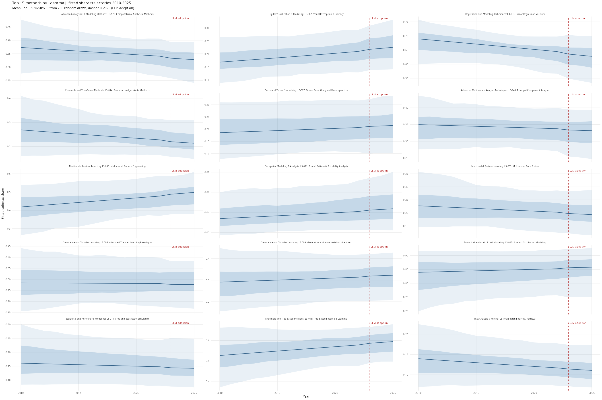

# L3 Results: L2 to L3 Diversity Analysis

## The Model

We are modelling how the composition of archaeological methods changes over time within each L2 sub-discipline. The data for each group g and year t is a vector of paper counts across K_g L3 techniques. We treat these counts as drawn from a Dirichlet-Multinomial distribution: a Multinomial where the category probabilities are themselves uncertain, smoothed by a concentration parameter kappa fixed at 10.

The expected probability of each technique is computed via softmax over a linear predictor:

```
eta[g, k, t] = mu[g, k] + beta_method[g, k] * year_std[t] + gamma_method[g, k] * post_llm[t]
p[g, k, t]   = softmax(eta[g, k, t])
```

Here mu[g, k] is the baseline log-share of technique k in group g; beta_method[g, k] is its linear trend across the full 2010-2025 period (year_std is standardised to mean 0, sd 1); and gamma_method[g, k] is an additional slope that turns on from 2023 onward (post_llm = 1 for year >= 2023, 0 otherwise).

Because the softmax is invariant to adding a constant to all elements of eta, the model is only identified up to a group-level mean. We enforce a sum-to-zero constraint on mu, beta_method, and gamma_method within each group. This pins the reference level and ensures the parameters are interpretable as deviations from the group mean, not arbitrary shifts.

The method-level slopes are given hierarchical priors via a non-centred parameterisation: beta_method[g, k] = sigma_beta * beta_raw[g, k], where beta_raw ~ Normal(0, 1) and sigma_beta ~ Exponential(2). The same structure applies to gamma_method. This reparameterisation improves HMC geometry by separating the scale (sigma) from the shape (the raw draws).

The key estimand is sigma_gamma: the global standard deviation of the post-LLM method-level slopes. If sigma_gamma is credibly above zero, the post-2023 period produced real, heterogeneous shifts in technique shares across methods.

## Diagnostics

| Quantity | Value |
|---|---|
| Divergent transitions | {{DIVERGENCES}} |
| sigma_beta Rhat | {{RHAT_SIGMA_BETA}} |
| sigma_gamma Rhat | {{RHAT_SIGMA_GAMMA}} |
| sigma_beta ESS | {{ESS_SIGMA_BETA}} |
| sigma_gamma ESS | {{ESS_SIGMA_GAMMA}} |
| Runtime (minutes) | {{RUNTIME_MIN}} |

Rhat < 1.01 and ESS > 400 are the thresholds for acceptable convergence. Zero divergences is required; if non-zero, increase adapt_delta or inspect geometry.

## Key Results

| Parameter | Posterior mean | 95% CI |
|---|---|---|
| sigma_beta | {{SIGMA_BETA_MEAN}} | {{SIGMA_BETA_CI}} |
| sigma_gamma | {{SIGMA_GAMMA_MEAN}} | {{SIGMA_GAMMA_CI}} |
| ratio gamma/beta | {{RATIO}} | — |

Interpretation: the post-LLM shift scale (sigma_gamma = {{SIGMA_GAMMA_MEAN}}, 95% CI {{SIGMA_GAMMA_CI}}) is {{RATIO}} times the baseline trend scale (sigma_beta = {{SIGMA_BETA_MEAN}}, 95% CI {{SIGMA_BETA_CI}}). A ratio credibly below 1 is expected given the shorter post-LLM window; what matters is whether sigma_gamma is itself credibly above zero, indicating real heterogeneous shifts in technique shares after 2023.

## Plots


Inverse Simpson index (effective number of L3 techniques) within each L2 group over 2010-2025. Ribbon = 50% and 90% posterior credible intervals. Dashed line = 2023 LLM adoption boundary.


Posterior densities of sigma_beta (baseline trend scale, blue) and sigma_gamma (post-LLM shift scale, red). The primary diagnostic for whether post-2023 method-level variation exists.


Posterior mean and 90% CI for gamma_method for each L3 technique whose CI excludes zero. Red = gaining share post-2023, blue = losing share.


Fitted softmax share trajectories 2010-2025 for the 15 methods with largest absolute gamma. Mean line + 50% and 90% CI from 200 posterior draws.


Observed paper counts for the same top 15 methods. Loess smoother overlaid as a sanity check that the model is tracking real signal.
