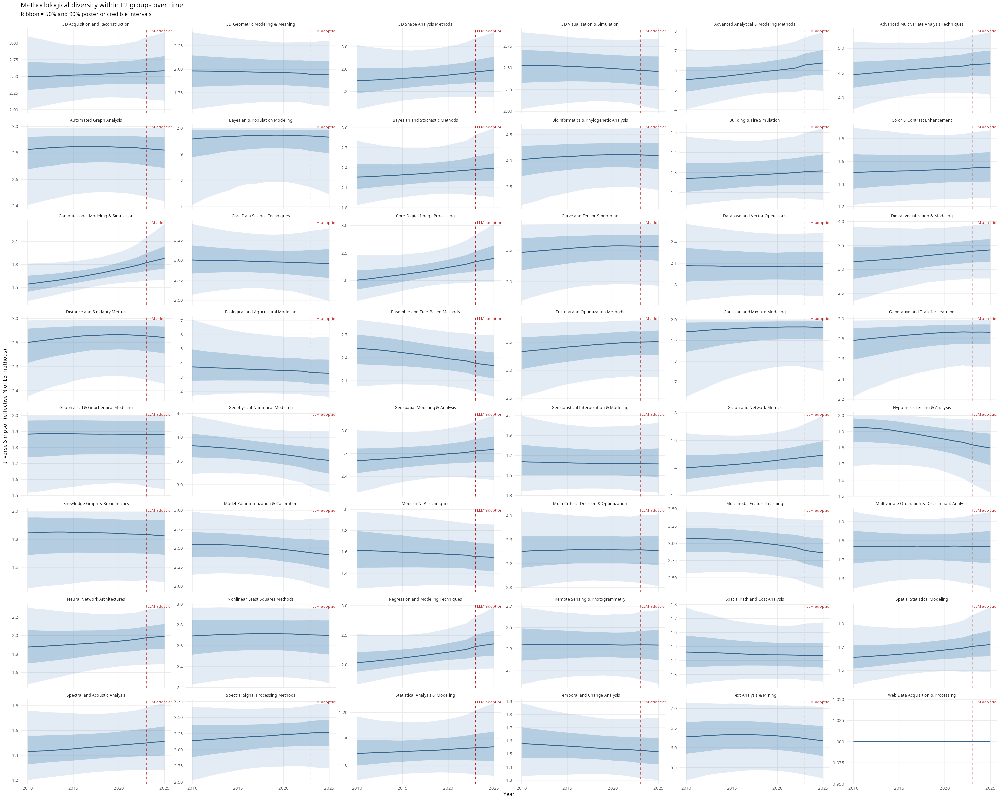
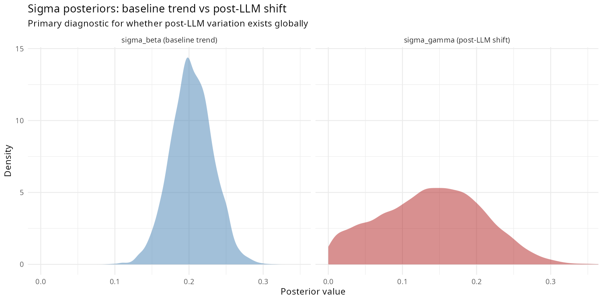
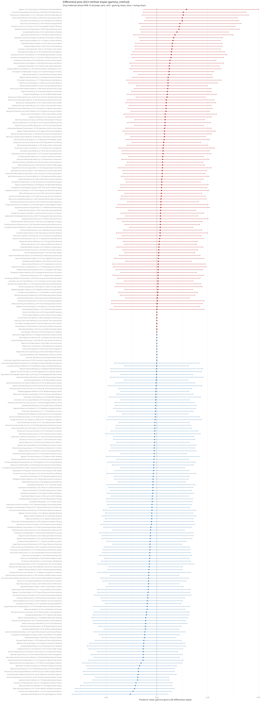
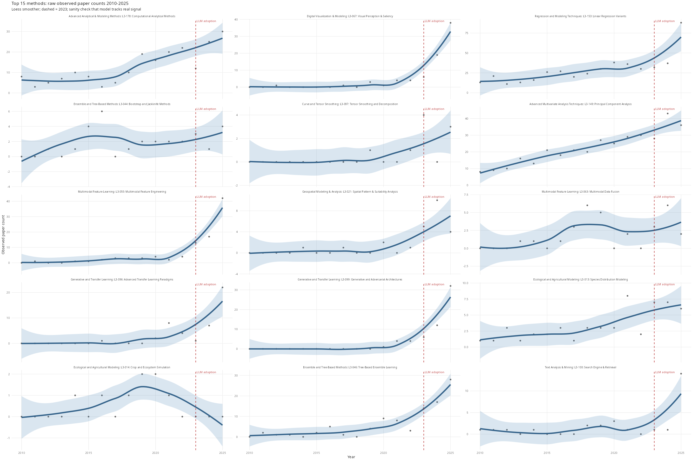

# L3 Results: L2 to L3 Diversity Analysis

## The Model

We model how the composition of L3 techniques changes over time within each L2 sub-discipline. The full generative model is:

```
y[g, t]          ~ Dirichlet-Multinomial(α[g, t])
α[g, t]           = softmax(η[g, t]) × κ

η[g, k, t]        = μ[g, k]
                   + β[g, k]  × year_std[t]
                   + γ[g, k]  × I(year[t] ≥ 2023)

μ[g, k]          ~ Normal(0, 1)
∑_k μ[g, k]      ~ Normal(0, 0.001 × K_g)      [soft sum-to-zero]

β[g, k]           = σ_β × β_raw[g, k]
β_raw[g, k]      ~ Normal(0, 1)
σ_β              ~ Exponential(2)

γ[g, k]           = σ_γ × γ_raw[g, k]
γ_raw[g, k]      ~ Normal(0, 1)
σ_γ              ~ Exponential(4)

κ = 10            [fixed concentration]
```

**Line by line.**

`y[g, t] ~ Dirichlet-Multinomial(α[g, t])` — The data for group g in year t are integer vectors of paper counts across K_g techniques. We use a Dirichlet-Multinomial rather than a plain Multinomial because the category probabilities are themselves uncertain around their expected values. This handles overdispersion: years where usage is noisier than the expected shares alone would predict do not force the model to fit noise.

`α[g, t] = softmax(η[g, t]) × κ` — The Dirichlet concentration parameters are the softmax-transformed linear predictor, scaled by κ. softmax maps the unrestricted real-valued η to a valid probability simplex (all entries positive, summing to 1), then κ controls how tightly each year's observed counts are expected to track those probabilities. Small κ → high within-year variance around expected shares; large κ → counts closely reflect the expected proportions. We fix κ = 10, expressing moderate overdispersion.

`η[g, k, t] = μ[g, k] + β[g, k] × year_std[t] + γ[g, k] × I(year[t] ≥ 2023)` — The linear predictor has three additive components operating on the log-share scale:

- **μ[g, k]**: baseline log-weight of technique k in group g, representing the method's average standing share when year_std = 0 (the midpoint of the time series).
- **β[g, k] × year_std[t]**: a linear trend over the full 2010–2025 period. year_std is standardised to mean 0 and SD 1 (one unit ≈ 7.5 calendar years), so β is measured in log-share-units per SD of year.
- **γ[g, k] × I(year[t] ≥ 2023)**: an additional slope that turns on from 2023 onward. This is not a level shift but an extra rate of change: the method's log-share trajectory steepens (positive γ) or flattens/reverses (negative γ) relative to its pre-2023 trend.

`μ[g, k] ~ Normal(0, 1)` — Weakly informative prior on baseline log-weights. A Normal(0, 1) allows techniques to span roughly an order of magnitude in expected share relative to one another without strongly pulling any technique toward a particular value.

`∑_k μ[g, k] ~ Normal(0, 0.001 × K_g)` — Soft sum-to-zero constraint. Because softmax is invariant to adding a constant to all elements of η, the model is only identified up to a group-level mean. Without this penalty, μ, β, and γ each wander by an additive constant and the sampler cannot explore the posterior efficiently. Penalising the sum to be near zero pins the reference level and makes parameters interpretable as deviations from the group mean. The same constraint is applied to β_raw and γ_raw within each group.

`β[g, k] = σ_β × β_raw[g, k]`, `β_raw[g, k] ~ Normal(0, 1)`, `σ_β ~ Exponential(2)` — Non-centred parameterisation for baseline slopes. Factorising β into a shared scale σ_β and unit-scale deviations β_raw separates two distinct questions: *how much* do methods differ in their long-run trend (σ_β), and *which* methods trend up or down (β_raw). This removes the funnel geometry that arises in the centred formulation when σ is small, which is typical here. The Exponential(2) prior on σ_β has mean 0.5 and places most mass below 1, expressing prior skepticism of very large compositional shifts over 2010–2022.

`γ[g, k] = σ_γ × γ_raw[g, k]`, `γ_raw[g, k] ~ Normal(0, 1)`, `σ_γ ~ Exponential(4)` — Identical structure for post-LLM slopes. The Exponential(4) prior on σ_γ (mean 0.25) is tighter than for σ_β for two reasons: the post-LLM window spans only 2–3 years versus 13 for the baseline, making large values of σ_γ less plausible a priori; and the prior encodes genuine skepticism that LLM adoption caused dramatic compositional upheaval. **σ_γ is the primary estimand**: if its posterior is credibly above zero, the post-2023 period produced real, heterogeneous shifts in technique shares across methods — not just noise amplified by a short window.

## Diagnostics

| Quantity | Value |
|---|---|
| Divergent transitions | 0 |
| sigma_beta Rhat | 1.0108 |
| sigma_gamma Rhat | 1.0016 |
| sigma_beta ESS | 414 |
| sigma_gamma ESS | 1268 |
| Runtime (minutes) | {{RUNTIME_MIN}} |

Rhat < 1.01 and ESS > 400 are the thresholds for acceptable convergence. Zero divergences is required; if non-zero, increase adapt_delta or inspect geometry.

## Key Results

| Parameter | Posterior mean | 95% CI |
|---|---|---|
| sigma_beta | 0.0965 | [0.0085, 0.1819] |
| sigma_gamma | 0.0563 | [0.0018, 0.1671] |
| ratio gamma/beta | 0.584 | — |

Interpretation: the post-LLM shift scale (sigma_gamma = 0.0563, 95% CI [0.0018, 0.1671]) is 0.584 times the baseline trend scale (sigma_beta = 0.0965, 95% CI [0.0085, 0.1819]). A ratio credibly below 1 is expected given the shorter post-LLM window; what matters is whether sigma_gamma is itself credibly above zero, indicating real heterogeneous shifts in technique shares after 2023.

## Plots


Inverse Simpson index (effective number of L3 techniques) within each L2 group over 2010-2025. Ribbon = 50% and 90% posterior credible intervals. Dashed line = 2023 LLM adoption boundary.


Posterior densities of sigma_beta (baseline trend scale, blue) and sigma_gamma (post-LLM shift scale, red). The primary diagnostic for whether post-2023 method-level variation exists.


Posterior mean and 90% CI for gamma_method for each L3 technique whose CI excludes zero. Red = gaining share post-2023, blue = losing share.


Observed paper counts for the same top 15 methods. Loess smoother overlaid as a sanity check that the model is tracking real signal.
