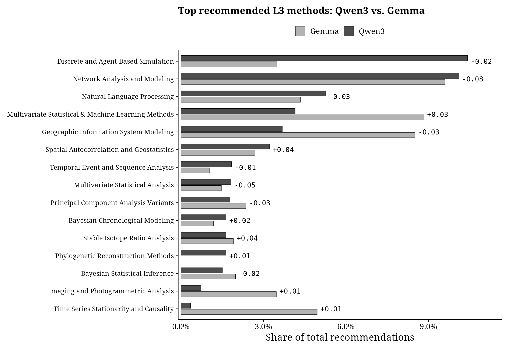
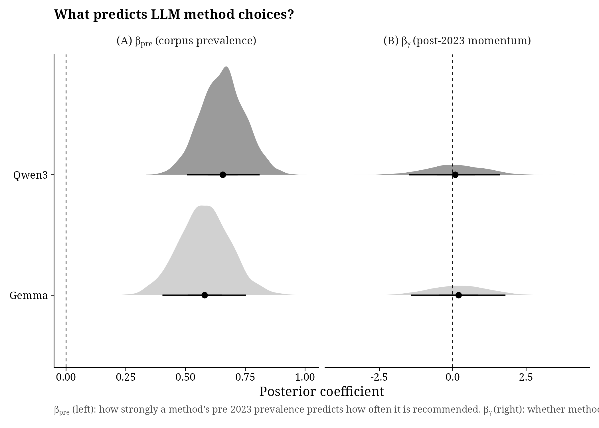
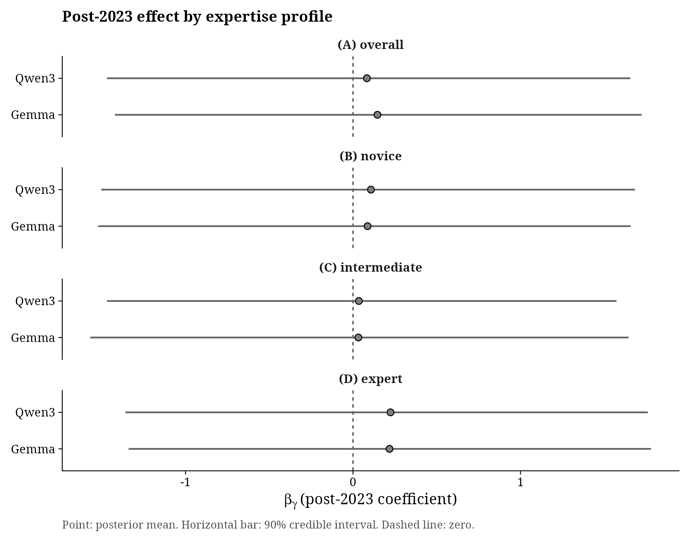

# Main Text Figures — Selection, Results, and Order

Figures are listed in the order they appear in the paper, following the
structure: Introduction -> Methods (3.2--3.4) -> Results (4).

Numbering follows the manuscript (`docs/Manuscript.txt`), where **Fig. 1** is the
LLM-typical word-frequency plot. That figure is produced separately; Figs. 2--7
are generated by `R/09_main_text_figures.R` in greyscale academic style
(300 DPI).

> Note on numbering: earlier drafts of this file numbered the R-generated
> figures 1--6. They are now Figs. 2--7 to match the manuscript, which counts
> the word-frequency plot as Fig. 1. File names on disk are unchanged
> (`fig1_raw_counts.png` = manuscript Fig. 2, `fig2_sigma_posteriors.png` =
> Fig. 3, and so on).

Each entry below records where the figure goes in the manuscript, keyed to a
phrase that can be searched for in the text.

---

## Fig. 1 — Frequency of 'LLM-typical' words in archaeological literature

**Section:** Introduction (bibliometric preamble)

**File:** produced outside `R/09_main_text_figures.R` — [add path]

**What it shows:** Occurrences per 10,000 words of 25 marker words characteristic
of LLM-generated text, across ~120,000 Scopus abstracts (2010--2025). Vertical
dashed line marks the release of ChatGPT (November 2022).

**Placement:** End of the Introduction paragraph closing "...in line with what
Liang et al. (2025) already observed for STEM preprints." The caption already
sits there in the manuscript.

**Also referenced:** in Results, the sigma-posteriors paragraph currently reads
"(Figure X)" — change to "(Fig. 1)".

---

## Fig. 2 — Raw method counts over time (bibliometric stream)

**Section:** Methods 3.2 / Results 4.1

**File:** `main_text/fig1_raw_counts.png`

**What it shows:** Time series of observed paper counts for the top 15 L3 methods
(2010--2025), with the post-2023 LLM boundary marked. Non-parametric trend
ribbons give the reader an immediate visual sense of which methods are growing,
declining, or stable before any model results are introduced.

**Results:** Strong heterogeneity across the top 15 methods. Several methods show
steep post-2020 growth (Feedforward and Recurrent Neural Networks, Automated
Content Classification, K-Means Clustering), while others plateau or decline
(Geometric Morphometrics, Multivariate Statistical Analysis). The dashed 2023
boundary does not mark a visible inflection in the raw data — any post-LLM
effect on the literature side is too subtle to detect without modelling.

**Placement:** The manuscript caption currently sits at the end of 3.2, before
"3.3. Analysis of the bibliometric stream". Keep it there, or move it to the
first Results mention: the sentence ending "...raw counts of the L3 methods
extracted from the bibliometric stream". Change the inline "(Figure: Raw method
counts over time)" to "(Fig. 2)". The 3.2 cross-reference "(see Phase 4.5 below
and Fig. 2)" already uses the correct number.

---

## Fig. 3 — Sigma posteriors: baseline trend vs post-LLM shift

**Section:** Results (bibliometric model, 4.1)

**File:** `main_text/fig2_sigma_posteriors.png`

**What it shows:** Posterior densities of sigma_beta (baseline trend variation)
and sigma_gamma (post-LLM shift variation). sigma_gamma credibly above zero is
the global-level answer to "did methods diverge unevenly after 2023?"

**Results:** sigma_beta = 0.249 [90% CI: 0.210, 0.289] — substantial heterogeneity
in baseline growth rates across L3 methods. sigma_gamma = 0.106 [90% CI: 0.010,
0.219] — the entire posterior mass lies above zero, confirming that
post-2023 shifts are unevenly distributed across methods. The effect is roughly
one-third the magnitude of baseline trend variation.

**Placement:** Immediately after the Results paragraph ending "...it cannot be
localised to any specific method." That paragraph contains the callout
"(see Figure: Sigma posteriors)" — change to "(Fig. 3)".

---

## Fig. 4 — Method share by L2 sub-discipline: literature vs both LLMs

**Section:** Results (experiment descriptive, 4.2)

**File:** `main_text/fig3_l2_triple_bar.png`

**What it shows:** Horizontal bar chart comparing method shares across the 24 L2
categories for four sources: pre-2023 literature, post-2023 literature,
Qwen3 recommendations, and Gemma recommendations.

**Results:** Both LLMs dramatically over-represent a handful of L2 categories
(notably Network Analysis, Agent-Based Simulation, Machine Learning Methods)
and under-represent the long tail of specialist techniques (Isotope Analysis,
Archaeobotany, Faunal Analysis). The literature distribution is far more even.
Post-2023 literature shares are close to pre-2023 shares for most categories.
Qwen3 and Gemma show very similar concentration patterns, reinforcing that
this is a structural property of LLM recommendations rather than a
model-specific artefact.

**Manuscript caption:** Method shares in the Qwen3 and Gemma recommendation profiles compared to pre- and post-2023 literature, aggregated across L2 sub-disciplines.

**Placement:** Immediately after the Results paragraph ending "...with Qwen3
being marginally more diverse than Gemma (Figure: L2 shares: literature vs both
LLMs)." Change that callout to "(Fig. 4)".

---

## Fig. 5 — Top 10 L3 methods: Qwen3 vs Gemma

**Section:** Results (cross-model comparison, 4.2)

**File:** `main_text/fig4_top10_qwen_vs_gemma.png`

**What it shows:** Union of each model's top 10 recommended L3 methods, compared
as share of total recommendations. Each bar is annotated with the method's
post-2023 literature trajectory (γ from the bibliometric model): positive values
indicate methods gaining share in recent literature, negative values indicate
methods declining relative to their pre-2023 trend.

**Results:** High structural agreement between the two LLMs. Network Analysis and
Modeling dominates both (~10% share each) despite a declining literature
trajectory (γ = −0.08). The rank ordering is largely preserved across
architectures, though Gemma allocates slightly more to GIS Modeling and
Multivariate Statistical & Machine Learning, while Qwen3 favours Discrete and
Agent-Based Simulation more strongly. The gamma annotations show that top LLM
picks include both gaining and declining methods, foreshadowing the Fig. 6
finding that LLM recommendations track training-corpus prevalence (b_pre) rather
than post-2023 momentum (b_gamma ≈ 0).

**Manuscript caption:** The most-recommended L3 methods by each model, ranked by share of total recommendations. The label beside each bar shows the method's estimated post-2023 trajectory in the literature: positive values indicate methods gaining share, negative values indicate methods declining relative to their pre-2023 trend.

**Placement:** No callout currently exists in the manuscript. Add one sentence to
the concentration paragraph ending "...(Jiang et al., 2025)", e.g. noting that
both models concentrate on the same small set of L3 techniques (Network Analysis
and Modeling, Discrete and Agent-Based Simulation, GIS Modeling) regardless of
profile (Fig. 5). Insert the figure after Table 1.

---

## Table 1 — Effective number of methods: literature vs LLM profiles

**Section:** Results (concentration analysis, 4.3 / 3.4.1)

**Format:** Table (replaces figure — the key message is the size of the gap, not
the shape of the distribution. A table makes the contrast readable at a glance
and saves a figure slot.)

**What it shows:** Effective number of methods (inverse Simpson index) for each
source, derived from a Dirichlet conjugate posterior. Each estimate is the
posterior median with 90% credible interval.

> Numbers from the 2025 refit (2010–2025 window). Final.

| Source | Profile | Median | 90% CI |
|--------|---------|-------:|--------|
| Literature pre-2023 | — | 87.6 | [84.6, 90.6] |
| Literature post-2023 | — | 111.2 | [107.7, 114.7] |
| Qwen3 | Novice | 20.9 | [19.5, 22.4] |
| Qwen3 | Intermediate | 30.5 | [28.3, 33.0] |
| Qwen3 | Expert | 60.7 | [56.8, 64.7] |
| Qwen3 | Overall | 31.6 | [30.2, 33.0] |
| Gemma | Novice | 20.5 | [19.0, 21.9] |
| Gemma | Intermediate | 29.5 | [27.3, 31.7] |
| Gemma | Expert | 46.8 | [43.4, 50.2] |
| Gemma | Overall | 28.8 | [27.6, 30.0] |

**Key contrasts for manuscript:** Even the most diverse LLM configuration
(Qwen3 expert) covers roughly half as many effective methods as the pre-2023
literature. The novice–expert gradient is consistent across both models.
Post-2023 literature is *more* diverse than pre-2023 (no convergence in the
published record so far).

**Placement:** Immediately after the concentration paragraph ending "...rather
than simply an incidental outcome derived from our prompt design
(Jiang et al., 2025)." Repoint the earlier reference "(ESM, Table §S9.1)" in the
preceding paragraph to "(Table 1)".

---

## Fig. 6 — What predicts LLM method choices?

**Section:** Results (mean-collapse test, 4.4 / 3.4.2)

**File:** `main_text/fig5_bpre_bgamma_posteriors.png`

**Manuscript caption:** Posterior distributions from a two-predictor count regression testing what drives LLM method recommendations. β_pre measures how strongly a method's pre-2023 prevalence in the literature predicts how often it is recommended; β_γ measures whether methods that gained momentum after 2023 are recommended more often. Results shown for both Qwen3 and Gemma; see figure legend for the zero line, credible-interval bands, and posterior mean.

**What it shows:** A two-predictor negative binomial regression that separates
two possible drivers of LLM method concentration. The outcome is n_rec (how many
times each L3 method was recommended by the LLM). The two predictors are:
(A) b_pre, which weights log1p(pre-2023 literature count) — a proxy for how
prevalent each method was in the LLM's training corpus; and (B) b_gamma, which
weights each method's posterior gamma (its post-2023 excess growth above
baseline trend, estimated from the bibliometric model in Section 4.1). If LLMs
simply echo what was common in their training data, b_pre should be positive.
If LLMs additionally track which methods are gaining momentum post-2023
(mean-collapse amplification), b_gamma should also be positive.

**Results:** b_pre is credibly positive for both models: Qwen3 = 0.657
[90% CI: 0.509, 0.806], Gemma = 0.576 [0.400, 0.751]. Methods that appear
more often in the pre-2023 literature are recommended more often — LLMs echo
what was prevalent in their training corpus. b_gamma is centred near zero for
both models: Qwen3 = 0.115 [-1.391, 1.701], Gemma = 0.191 [-1.354, 1.759].
The concentration collapse documented in Table 1 is real, but its mechanism is
training-corpus echo (b_pre), not post-2023 momentum amplification (b_gamma).
LLMs concentrate on popular methods because those methods dominated the
pre-2023 literature they were trained on, not because they are tracking
which methods are currently trending.

**Placement:** Immediately after the Results paragraph beginning "Finally, the
Negative Binomial regression gives us the ability to distinguish between two
reasons...". Add "(Fig. 6)" after the b_pre results sentence in that paragraph.

---

## Fig. 7 — Post-2023 effect by expertise profile

**Section:** Results (mean-collapse test, profile gradient, 4.4)

**File:** `main_text/fig6_bgamma_by_profile.png`

**What it shows:** b_gamma posteriors broken out by (A) overall, (B) novice,
(C) intermediate, and (D) expert profiles for both Qwen3 and Gemma.

**b_gamma in plain language:** the coefficient on whether a method has been
gaining momentum in the literature *after* 2023. If b_gamma > 0, LLMs preferentially
recommend methods that are currently trending. If b_gamma ≈ 0 (what we find),
LLMs do not track recent momentum — their concentration is explained by what was
prevalent in the training corpus (b_pre), not what is newly gaining ground.

**Two gradients — do not confuse them:**

1. **Concentration gradient (Table 1)**: expert profiles ARE more
   diverse than novice profiles (~61 vs ~21 effective methods for Qwen3). This
   gradient is present and expected.

2. **b_gamma gradient (this figure)**: tests whether the *post-2023 momentum
   effect* varies by profile. The hypothesis: novice prompts are unconstrained,
   so any echo of recent trends should be strongest there. Result: b_gamma ≈ 0
   for all profiles. If anything, expert point estimates are marginally higher
   (Qwen3 expert: 0.212 vs novice: 0.089) — the opposite of the hypothesis —
   though all intervals span zero. This reversal may reflect that constraining
   the output to one L2 category forces the model into a smaller vocabulary where
   post-2023 patterns have proportionally more leverage.

**Key writing note:** the b_gamma null is not surprising given what the
bibliometric stream already showed. σ_γ is small (~0.11) — some methods moved
after 2023, but modestly. The individual γ values fed into the NB2 regression
are therefore mostly small. There was limited post-2023 momentum in the
literature for the LLMs to amplify in the first place. Connect this explicitly
in the manuscript: the gun is not loaded yet in the literature, and the LLMs
are not trying to fire it either.

**Results:** b_gamma remains centred near zero across all profile-model
combinations: novice (Qwen3: 0.089; Gemma: 0.131), intermediate (Qwen3: 0.070;
Gemma: 0.098), expert (Qwen3: 0.212; Gemma: 0.235). All 90% credible intervals
comfortably span zero.

**Placement:** Immediately after Fig. 6, in the same Results paragraph. Add
"(Fig. 7)" after the sentence "...the post-2023 term has no detectable signal
(with 90% confidence intervals ranging from -1.5 to +1.8)." Alternative: demote
this figure to the ESM and stop the main text at six figures — the manuscript
currently gives only the pooled b_gamma interval, not the per-profile breakdown.

---

## Figures for ESM (Electronic Supplementary Material)

The following figures support reproducibility and robustness but would
overload the main text:

| Figure | File | Rationale for ESM |
|--------|------|-------------------|
| Gamma dotplot (all L3 methods) | `l2_l3/plot_gamma_dotplot.png` | ~240 methods; too dense for main text, but valuable reference |
| Diversity over time by L2 group | `l2_l3/plot_diversity_by_group.png` | 24 panels; supports the sigma result but not needed to understand it |
| Beta-gamma scatter | `exploratory/plot_beta_gamma_scatter.png` | Exploratory; visually interesting but subsumed by the NegBin2 |
| Top 20 L4 methods (Qwen3) | `exploratory/plot_top20_l4.png` | L4 detail too granular for main text |
| Top 20 L4 methods (Gemma) | `exploratory_gemma/plot_top20_l4_gemma.png` | Same, for second model |
| Top 20 L3 methods (Qwen3 only) | `main_text/fig4_top20_l3_gamma.png` | Qwen3-only version; superseded by combined Fig. 5 |
| Top 20 L3 methods (Gemma only) | `exploratory_gemma/plot_top20_l3_gemma.png` | Gemma-only version; superseded by combined Fig. 5 |
| L2 triple bar (Gemma only) | `exploratory_gemma/plot_l2_triple_bar_gemma.png` | Gemma-only version; superseded by combined Fig. 4 |
| Concentration comparison bar chart | `comparison/plot_concentration_comparison.png` | Simpler version of Table 1 (no uncertainty); useful as a quick summary |
| Qwen3 vs Gemma L3 scatter | `comparison/plot_l3_qwen_vs_gemma.png` | Cross-model correlation; supplementary to Fig. 5 |
| Robustness: 2022 breakpoint | `robustness/plot_robustness_2022.png` | Sensitivity check |
| Prior predictive | `workflow/plot_prior_predictive.png` | Bayesian workflow diagnostic |
| Prior sensitivity | `workflow/plot_prior_sensitivity.png` | Bayesian workflow diagnostic |
| Posterior predictive density | `workflow/plot_ppc_density.png` | Bayesian workflow diagnostic |
| Posterior predictive p-values | `workflow/plot_ppc_pvalues.png` | Bayesian workflow diagnostic |
| Fake data recovery | `workflow/plot_fake_data_recovery.png` | Bayesian workflow diagnostic |
| Pathfinder vs MCMC (all `kf_` prefixed) | `l2_l3/kf_*.png`, `l1_l2/kf_*.png` | Approximate vs full posterior comparison |
| Sensitivity: count threshold | `sensitivity/` | Sensitivity analysis |
| Sensitivity: remapped taxonomy | `step3_remapped/` | Sensitivity analysis |
| Diversity trajectory by group | `../R/sensitivity/diversity_gamma_by_group.png` | Sensitivity analysis |
