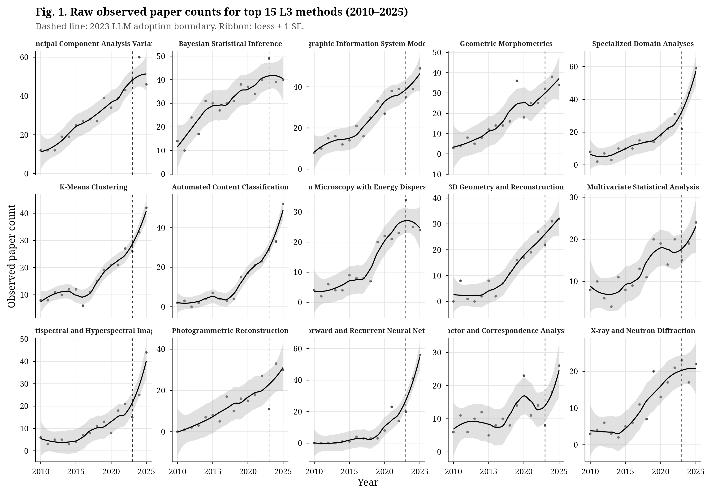
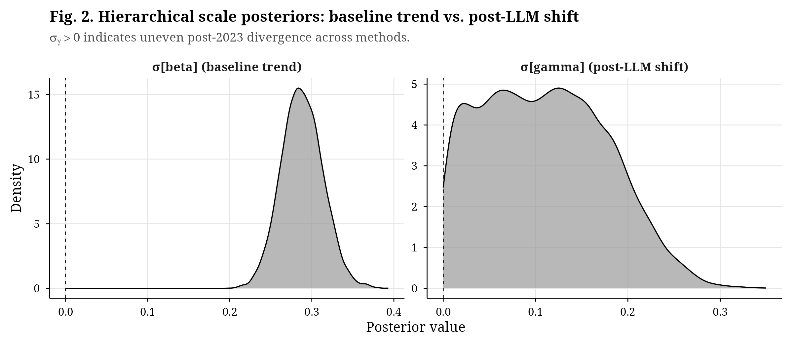
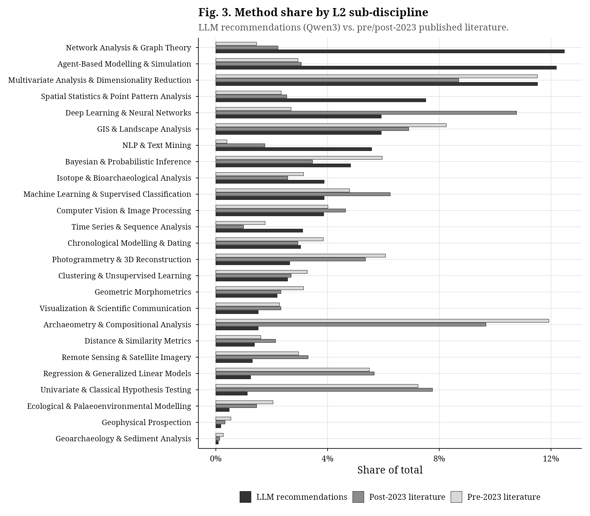
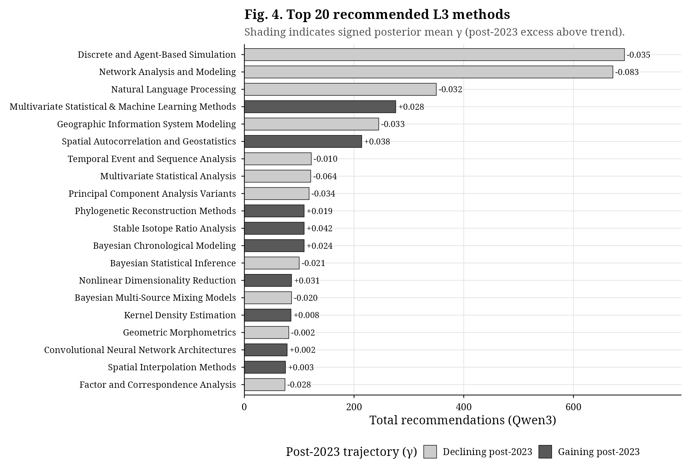
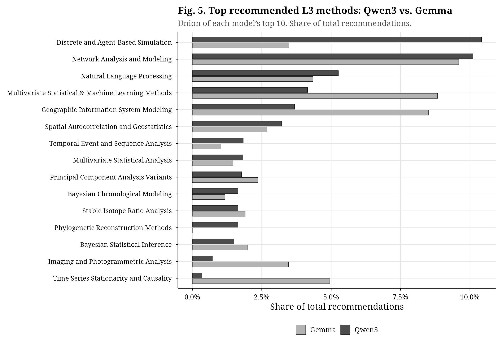
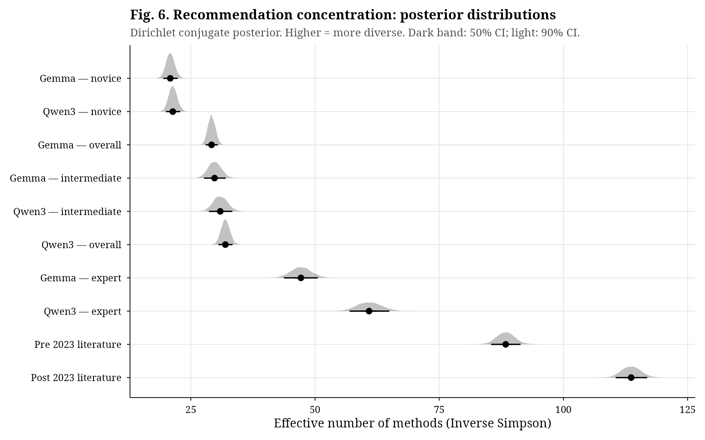
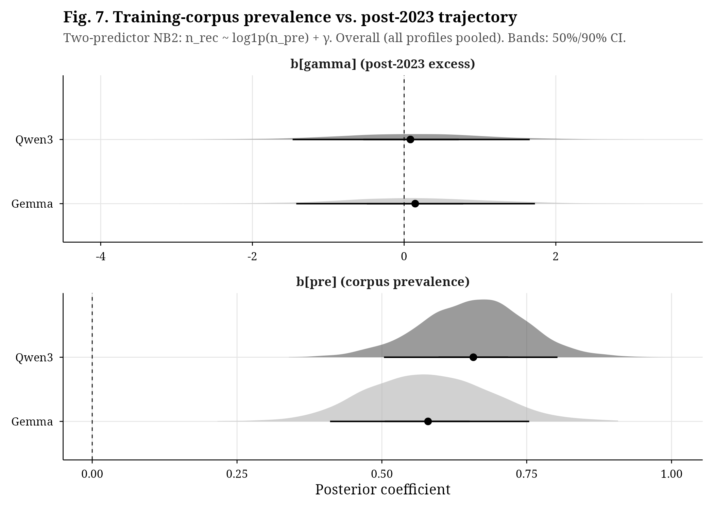
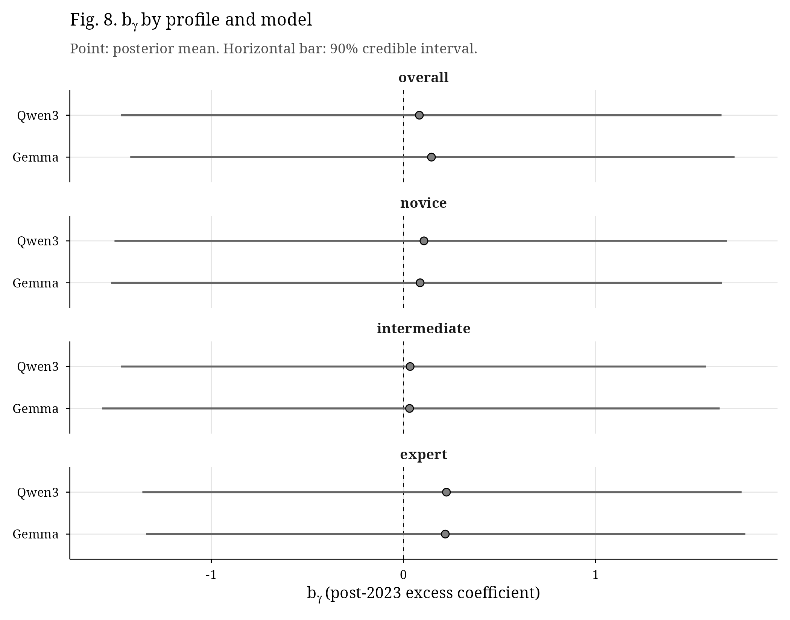

# Main Text Figures — Proposed Selection and Order

Figures are listed in the order they would appear in the paper,
following the structure: Methods (3.3) -> Results (4).
Generated by `R/09_main_text_figures.R` in greyscale academic style (300 DPI).

---

## Fig. 1 — Raw method counts over time (bibliometric stream)

**Section:** Results (bibliometric model, 3.3 / 4.1)

**What it shows:** Time series of observed paper counts for the top 15 L3 methods
(2010--2025), with the post-2023 LLM boundary marked. Non-parametric trend
ribbons give the reader an immediate visual sense of which methods are growing,
declining, or stable before any model results are introduced.

**Why main text:** Orients the reader to the data before showing model output.
Essential for building intuition about the scale and heterogeneity of the corpus.

---

## Fig. 2 — Sigma posteriors: baseline trend vs post-LLM shift

**Section:** Results (bibliometric model, 4.1)

**What it shows:** Posterior densities of sigma_beta (baseline trend variation)
and sigma_gamma (post-LLM shift variation). sigma_gamma credibly above zero is
the global-level answer to "did methods diverge unevenly after 2023?"

**Why main text:** This is the single most important diagnostic for the paper's
central empirical claim. It directly answers the question posed in Section 2.

---

## Fig. 3 — Method share by L2 sub-discipline: literature vs LLM recommendations

**Section:** Results (experiment descriptive, 4.2)

**What it shows:** Horizontal bar chart comparing method shares across the 24 L2
categories for three sources: pre-2023 literature, post-2023 literature, and
LLM recommendations (Qwen3). Immediately shows which domains LLMs over- and
under-represent relative to the published record.

**Why main text:** Bridges the two streams (bibliometric and experiment). Gives
the reader a concrete, intuitive picture of the LLM recommendation profile
before the formal tests.

---

## Fig. 4 — Top 20 recommended L3 methods, shaded by gamma direction

**Section:** Results (experiment descriptive, 4.2)

**What it shows:** The 20 most-recommended L3 methods by Qwen3, with bars shaded
by the sign of gamma (dark = gaining post-2023, light = declining). Lets the
reader see at a glance whether the top recommendations skew toward post-2023
gainers.

**Why main text:** Directly foreshadows the mean-collapse test. The shading pattern
is the visual version of the hypothesis tested formally in Fig. 7.

---

## Fig. 5 — Top 10 L3 methods: Qwen3 vs Gemma side-by-side

**Section:** Results (cross-model comparison, 4.2)

**What it shows:** Union of each model's top 10 recommended L3 methods, compared
as share of total recommendations. Shows structural overlap and divergences
between two LLMs from different training corpora.

**Why main text:** The paper runs two LLMs specifically to distinguish structural
patterns from model-specific artefacts. This figure is the visual evidence for
that argument.

---

## Fig. 6 — Concentration posteriors: literature vs LLM profiles

**Section:** Results (concentration analysis, 4.3 / 3.4.1)

**What it shows:** Posterior distributions of the effective number of methods
(inverse Simpson) for pre/post-2023 literature and each LLM x profile
combination. Demonstrates that all LLM profiles are dramatically more
concentrated than the literature, with the expected novice < intermediate <
expert gradient.

**Why main text:** Core result for the concentration analysis (Section 3.4.1).
The novice-to-expert gradient is a key prediction of the mean-collapse
hypothesis.

---

## Fig. 7 — Training-corpus prevalence vs post-2023 trajectory (NegBin2 posteriors)

**Section:** Results (mean-collapse test, 4.4 / 3.4.2)

**What it shows:** Posterior densities of b_pre (corpus prevalence effect) and
b_gamma (post-2023 excess effect) for both Qwen3 and Gemma, overall (all
profiles pooled). b_pre credibly positive = LLM echoes pre-2023 literature.
b_gamma near zero = no additional mean-collapse signal beyond corpus echo.

**Why main text:** This is the formal test of the mean-collapse hypothesis.
The most important inferential figure in the paper.

---

## Fig. 8 — Post-2023 trajectory coefficient by profile and model

**Section:** Results (mean-collapse test, profile gradient, 4.4)

**What it shows:** b_gamma posteriors broken out by profile (novice, intermediate,
expert) and model. Tests the prediction that the mean-collapse signal should be
strongest for the novice profile and weakest for the expert profile.

**Why main text:** Completes the mean-collapse argument. The profile gradient is
a pre-registered prediction of the hypothesis.

---

## Figures for ESM (Electronic Supplementary Material)

The following figures support reproducibility and robustness but would
overload the main text:

| Figure | File | Rationale for ESM |
|--------|------|-------------------|
| Gamma dotplot (all L3 methods) | `l2_l3/plot_gamma_dotplot.png` | ~240 methods; too dense for main text, but valuable reference |
| Diversity over time by L2 group | `l2_l3/plot_diversity_by_group.png` | 24 panels; supports the sigma result but not needed to understand it |
| Beta-gamma scatter | `exploratory/plot_beta_gamma_scatter.png` | Exploratory; visually interesting but subsumed by the NegBin2 |
| Top 20 L4 methods (Qwen3) | `exploratory/plot_top20_l4.png` | L4 detail too granular for main text |
| Top 20 L4 methods (Gemma) | `exploratory_gemma/plot_top20_l4_gemma.png` | Same, for second model |
| Top 20 L3 methods (Gemma) | `exploratory_gemma/plot_top20_l3_gemma.png` | Gemma parallel of Fig. 4 |
| L2 triple bar (Gemma) | `exploratory_gemma/plot_l2_triple_bar_gemma.png` | Gemma parallel of Fig. 3 |
| Concentration comparison bar chart | `comparison/plot_concentration_comparison.png` | Simpler version of Fig. 6 (no uncertainty); useful as a quick summary table |
| Qwen3 vs Gemma L3 scatter | `comparison/plot_l3_qwen_vs_gemma.png` | Cross-model correlation; supplementary to Fig. 5 |
| Robustness: 2022 breakpoint | `robustness/plot_robustness_2022.png` | Sensitivity check |
| Prior predictive | `workflow/plot_prior_predictive.png` | Bayesian workflow diagnostic |
| Prior sensitivity | `workflow/plot_prior_sensitivity.png` | Bayesian workflow diagnostic |
| Posterior predictive density | `workflow/plot_ppc_density.png` | Bayesian workflow diagnostic |
| Posterior predictive p-values | `workflow/plot_ppc_pvalues.png` | Bayesian workflow diagnostic |
| Fake data recovery | `workflow/plot_fake_data_recovery.png` | Bayesian workflow diagnostic |
| Pathfinder vs MCMC (all `kf_` prefixed) | `l2_l3/kf_*.png`, `l1_l2/kf_*.png` | Approximate vs full posterior comparison |
| Sensitivity: count threshold | `sensitivity/` | Sensitivity analysis |
| Sensitivity: remapped taxonomy | `step3_remapped/` | Sensitivity analysis |
| Diversity trajectory by group | `../R/sensitivity/diversity_gamma_by_group.png` | Sensitivity analysis |
