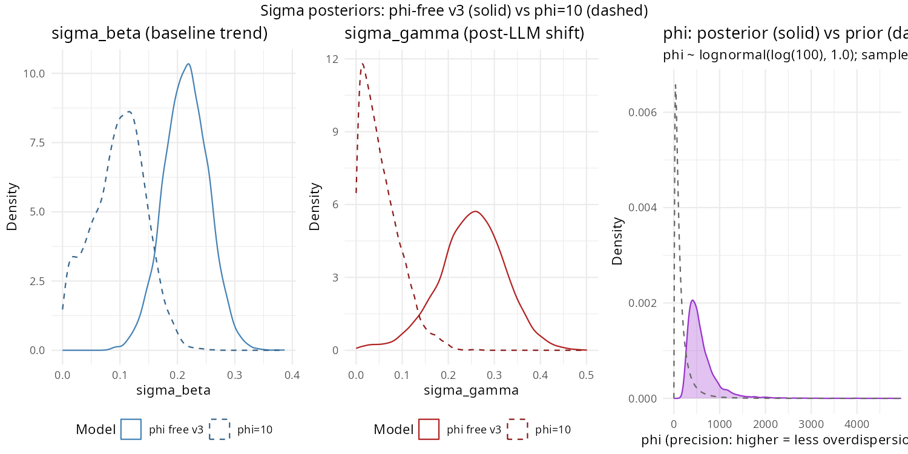
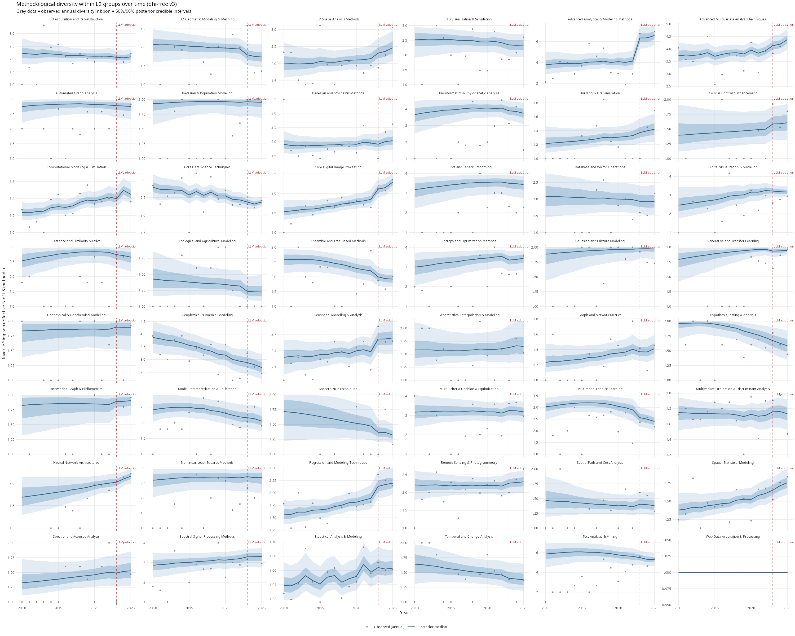
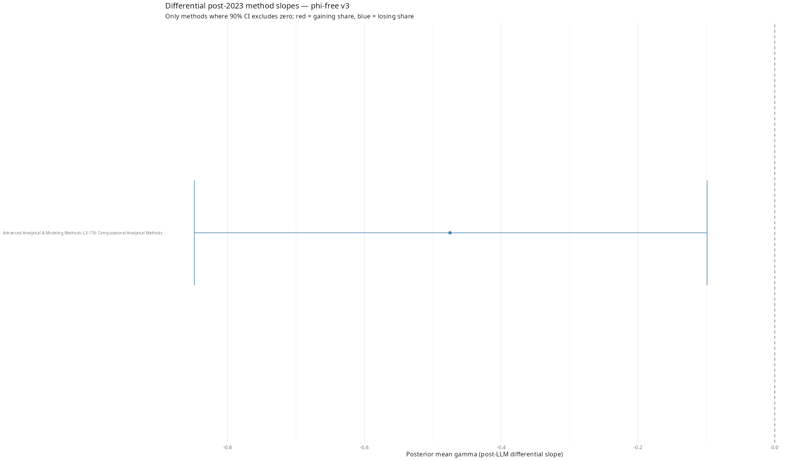
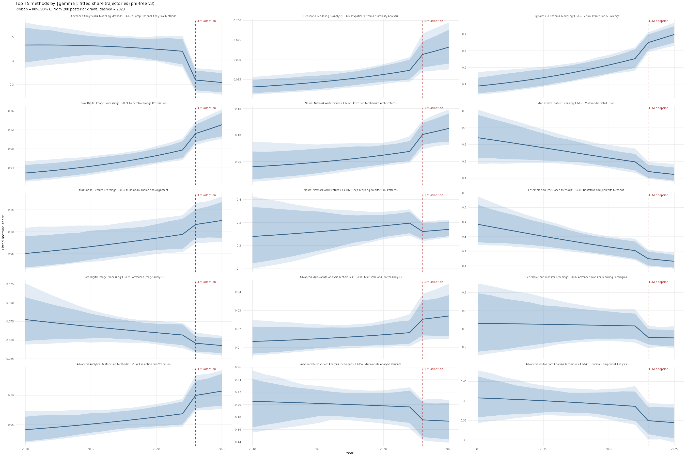
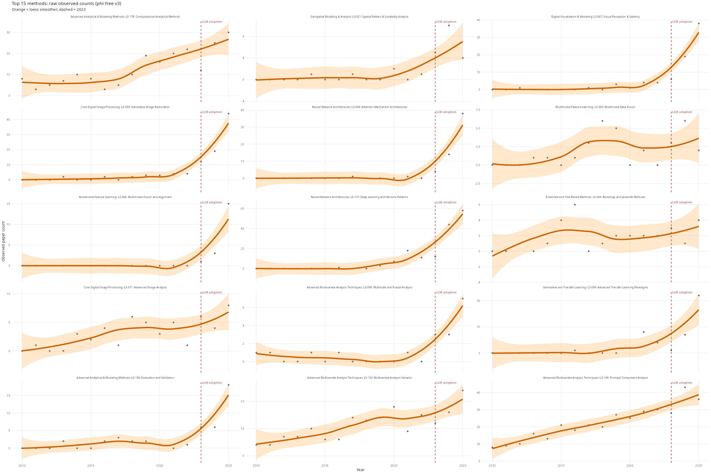

# Phi Results: Sensitivity Analysis with Free Phi

## Overview

This document summarises results from fitting `diversity_model_phi_free.stan`, which extends the primary L3 model by treating phi (the Dirichlet-Multinomial precision/concentration parameter) as a free parameter estimated from data rather than fixing it at 10. The goal is to test whether the fixed phi=10 assumption drives the main conclusions.

**phi interpretation:** phi controls how tightly method shares concentrate around their mean. Higher phi = tighter concentration (less overdispersion, shares vary less year to year); at phi → ∞ the model becomes Multinomial. Fixing phi at a single value is equivalent to a Dirac-delta prior — not properly Bayesian. This model is the principled alternative.

## The Model

The phi-free model is identical to `diversity_model.stan` except that phi is estimated from data. To improve HMC geometry, phi is parameterised on the log scale (`log_phi` is sampled; `phi = exp(log_phi)`):

```stan
parameters {
  real log_phi;  // phi = exp(log_phi); unbounded — better HMC geometry than constrained phi
  ...
}
transformed parameters {
  real<lower=0> phi = exp(log_phi);
  ...
}
model {
  // Equivalent to phi ~ lognormal(log(100), 1.0): median=100, 90% CI ~[14, 716]
  log_phi ~ normal(log(100), 1.0);
  sigma_beta  ~ exponential(2);
  sigma_gamma ~ exponential(4);
  ...
}
```

The prior has median phi=100 and 90% interval approximately [14, 716], reflecting the empirical distribution of phi estimated by `R/00b_phi_exploration.R` across L2 groups. The primary estimand remains `sigma_gamma` — the global scale of post-LLM slope heterogeneity across methods.

## Reference: Fixed-phi results (phi = 10)

These are from the primary analysis in [`docs/l3_results.md`](l3_results.md).

| Parameter | phi = 10 |
|---|---|
| sigma_gamma mean | 0.0563 |
| sigma_gamma 95% CI | [0.0018, 0.1671] |
| sigma_beta mean | 0.0965 |
| Rhat sigma_gamma | 1.0016 |
| ESS sigma_gamma | 1268 |

## Phi-free results (v3: log_phi parameterisation, warmup=2000, iter=4000)

_v3 key change: phi sampled as log_phi (unbounded) for better HMC geometry; warmup doubled; max_treedepth raised to 14._

| Parameter | phi free v3 |
|---|---|
| phi mean | 604.6 |
| phi 90% CI | [254.1, 1503.5] |
| sigma_gamma mean | 0.2502 |
| sigma_gamma 90% CI | [0.095, 0.3865] |
| sigma_beta mean | 0.2148 |
| Rhat sigma_gamma | 1.0019 |
| ESS sigma_gamma | 1824 |
NA

### Plots (phi-free v3)

#### 1. Parameter posteriors
Left: sigma_beta (baseline linear trend), centre: sigma_gamma (post-LLM shift scale) —
both compared to the phi=10 reference. Right: phi posterior (solid purple) vs
lognormal(log(100), 1.0) prior (dashed). Phi concentrates far above its prior median (100),
suggesting the data favour a near-Multinomial likelihood.



#### 2. Methodological diversity by L2 group
Posterior median (line) with 50% and 90% credible intervals (ribbon) for inverse Simpson
diversity within each of the 48 L2 groups. Grey dots = observed annual diversity.
Dashed red line = 2023 LLM adoption boundary.



#### 3. Differential post-2023 slopes (gamma_method)
Methods where the 90% posterior CI for gamma excludes zero — credible evidence of a
post-LLM slope change. Red = gaining share post-2023, blue = losing share.



#### 4. Share trajectories: top 15 methods by |gamma|

**How this differs from plot 2**: Plot 2 shows _aggregate diversity_ — the effective number
of L3 techniques in active use within each L2 group (inverse Simpson index), one panel per
group. That answers "is this sub-discipline becoming more or less methodologically diverse?"

This plot shows _individual method shares_ for the 15 specific L3 techniques with the largest
|gamma| (the biggest estimated post-2023 slope change). Each panel is one method; the y-axis
is that method's estimated proportion of papers within its L2 group. The ribbon is the 80%/90%
posterior CI from 200 posterior draws. The trajectory change at the 2023 boundary (dashed line)
is the signal sigma_gamma is measuring at the global level.

In short: plot 2 = the forest (group-level diversity); plot 4 = the individual trees that moved most.



#### 5. Raw observed counts: top 15 methods
Observed paper counts (grey dots) with loess smoother (orange). Pure data — no model.
Useful sanity check: does the raw signal match what the model recovers?



## Summary comparison

| Model | phi | sigma_gamma mean | sigma_gamma 90% CI | Converged? | Notes |
|---|---|---|---|---|---|
| Fixed phi = 10 | 10 (fixed) | 0.0563 | [0.0018, 0.1671] | YES | Primary model; phi is a Dirac-delta prior |
| Fixed phi = 50 | 50 (fixed) | ~0.095 | — | YES | Sensitivity check; not Bayesian |
| Phi free (v3) | 604.6 (estimated) | 0.2502 | [0.095, 0.3865] | YES (Rhat OK, ESS OK) | log_phi parameterisation; genuinely Bayesian |
