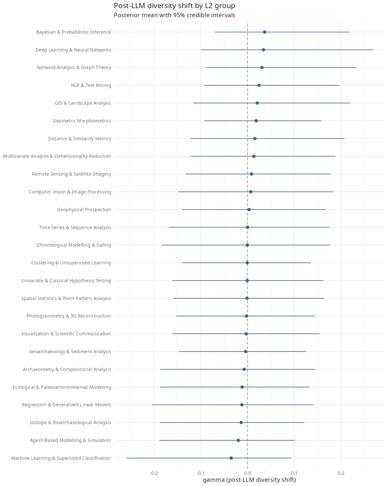

# Sensitivity Analyses

Scripts: `R/sensitivity/` | Stan model (Sensitivity D): `stan/sensitivity/diversity_trajectory.stan`

---

## Overview

Four sensitivity analyses test the robustness of the main findings. Results are summarised here; the corresponding scripts and models are in the `R/sensitivity/` directory.

| Label | Analysis | Main finding tested | Result |
|---|---|---|---|
| A | Count threshold (>=50 papers) | Step 3 NB regression null | Confirmed: overall beta = -0.138, P(beta > 0) = 0.438 |
| B | v2-to-v3 taxonomy remapping | Step 3 NB regression null | Confirmed: overall beta = -0.339, P(beta > 0) = 0.368 |
| C | Distributional test | LLM resembles post-2023 literature | Positive: delta cosine = +0.071, 90% CI [+0.058, +0.085], P = 1.000 |
| D | Direct diversity trajectory | Literature not converging | Confirmed: sigma_gamma effectively null |

---

## Sensitivity A — Count threshold

Script: `R/archive/rare_method_threshold.R`

The Step 3 NB regression is re-run after restricting to L3 methods with at least 50 papers in 2023--2025. This tests whether the null result is driven by rarely used methods with noisy gamma estimates: if noisy gammas attenuate the coefficient toward zero, removing them should sharpen the signal.

33 of 242 L3 methods survive the filter. Under this restriction, overall beta = -0.138, P(beta > 0) = 0.438 --- still negative and consistent with the main analysis. The null Step 3 result is robust to restricting to well-represented methods.

---

## Sensitivity B — v2-to-v3 taxonomy remapping

Script: `R/archive/taxonomy_version_remap.R` | [Full results](step3_remapped_results.md)

The L3 taxonomy was revised during the project (v2: 225 methods to v3: 242 methods), with many labels renamed or reorganised. An earlier experiment run was classified under v2; only 53 of 242 v3 methods matched exactly. This sensitivity uses fuzzy string matching to remap the v2 labels onto v3, raising coverage to 205 of 242 (85%). The results are unchanged: overall beta = -0.339, P(beta > 0) = 0.368. All profiles remain negative.

Note: the current experiment data was reclassified directly against v3, so this sensitivity applies only to the earlier v2-classified run.

---

## Sensitivity C — Distributional test

Script: `R/sensitivity/distributional_similarity.R` | [Full results](distributional_test_results.md)

Instead of regressing on noisy individual gammas, this test compares the whole LLM recommendation distribution to the pre- versus post-2023 literature frequency vectors using cosine similarity, Hellinger distance, and KL divergence.

The LLM recommendation distribution is credibly closer to the post-2023 literature than the pre-2023 literature. Posterior predictive delta cosine = +0.071, 90% CI [+0.058, +0.085], P(delta > 0) = 1.000. The frequentist permutation test agrees (p = 0.0013).

The profile gradient matches the mean-collapse prediction: novice delta (+0.080) > intermediate (+0.069) > expert (+0.013). Less expert guidance produces stronger alignment with the post-2023 method mix.

This test recovers the positive signal that the regression could not detect. The Step 3 regression asked whether individual methods' gammas predicted recommendation counts, but all 242 gammas are noisy (0 of 242 reach sig90), so the predictor was dominated by measurement error. The distributional test sidesteps this by comparing whole frequency vectors: it does not need any individual gamma to be well estimated, only the overall distribution shape to differ between periods.

Caveats: this establishes distributional similarity, not causation. The LLM's recommendations could resemble the post-2023 literature because the LLM influenced adoption (the mean-collapse mechanism), because the LLM mirrors trends already present in its training data, or both.

---

## Sensitivity D — Direct diversity trajectory

Script: `R/sensitivity/diversity_trajectory_model.R` | Stan model: `stan/sensitivity/diversity_trajectory.stan`

### Rationale

The primary model (Dirichlet-Multinomial regression) estimates compositional shifts at the technique level: it asks which specific methods changed share after 2023 and by how much. This preserves full technique-level resolution but does not directly answer a simpler question: did the overall *diversity* within sub-disciplines change after 2023?

The inverse Simpson index --- computed for each sub-discipline and year in the `generated quantities` block of the primary model --- summarises the full compositional vector into a single number: the effective number of equally frequent methods. A decline in this index would signal convergence (fewer methods dominating); a rise signals diversification.

Sensitivity D takes these posterior draws of inv_simpson from the primary model and fits a second-level model that estimates whether the diversity trajectory shifted after 2023.

### Model

For each L2 group g and year t, the observed diversity (posterior mean of inv_simpson from the primary model) is modelled as:

```
obs_diversity[g, t] ~ Normal(mu[g, t], total_sd[g, t])

mu[g, t]       = alpha[g] + beta[g] * year_std[t] + gamma[g] * post_llm[t]
total_sd[g, t] = sqrt(meas_sd[g, t]^2 + sigma_resid^2)
```

where `meas_sd[g, t]` is the posterior standard deviation of inv_simpson from the primary model (propagating upstream parameter uncertainty), and `sigma_resid` captures residual variation not explained by the linear trend.

The parameters `beta[g]` and `gamma[g]` are hierarchical (non-centred parameterisation): `beta[g] = sigma_beta * beta_raw[g]`, `gamma[g] = sigma_gamma * gamma_raw[g]`. This is the same two-slope structure as the primary model, but operating on the diversity index rather than on individual method shares.

Priors: `alpha ~ Normal(0, 1)`, `sigma_beta ~ Normal(0, 0.5)`, `sigma_gamma ~ Normal(0, 0.5)`, `sigma_resid ~ Normal(0, 0.5)`.

### Results

| Parameter | Estimate | 90% CI | Interpretation |
|---|---|---|---|
| sigma_gamma | 0.064 | [0.003, 0.174] | Effectively null: post-2023 diversity shift is negligible |
| sigma_beta | 0.677 | [0.510, 0.910] | Pre-existing trend variation is 10x larger |

All 25 group-level gamma credible intervals straddle zero.



### Interpretation

The field reorients internally --- individual methods shift within sub-disciplines --- but does not measurably homogenise at the sub-discipline level. The pre-existing trend variation (sigma_beta = 0.677) is an order of magnitude larger than the post-2023 shift (sigma_gamma = 0.064). This corroborates the primary model's finding that sigma_gamma (0.105 at the technique level) is smaller than sigma_beta (0.264), and that 0 of 242 methods show a credible post-2023 shift.

The inverse Simpson index rose from approximately 88.4 (pre-2023 pooled) to 112.2 (post-2023 pooled) effective methods. The literature has been diversifying, and this trend continued uninterrupted through the post-LLM period.
