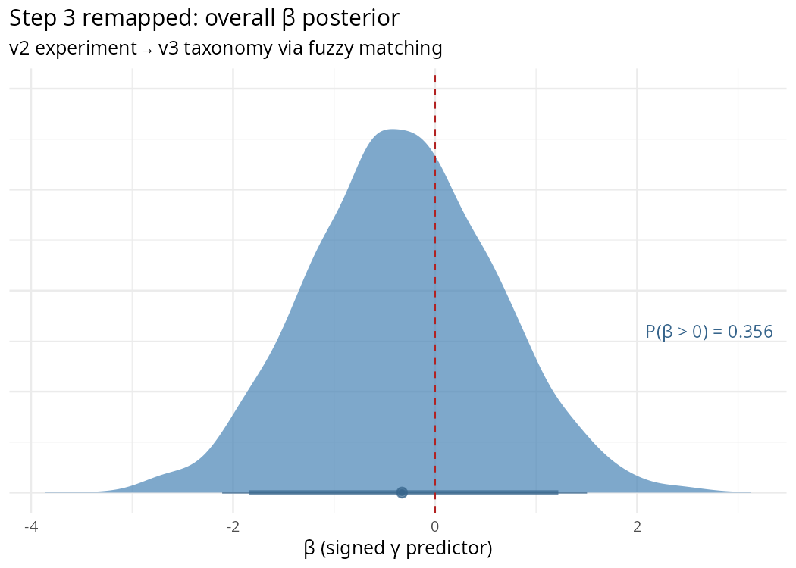
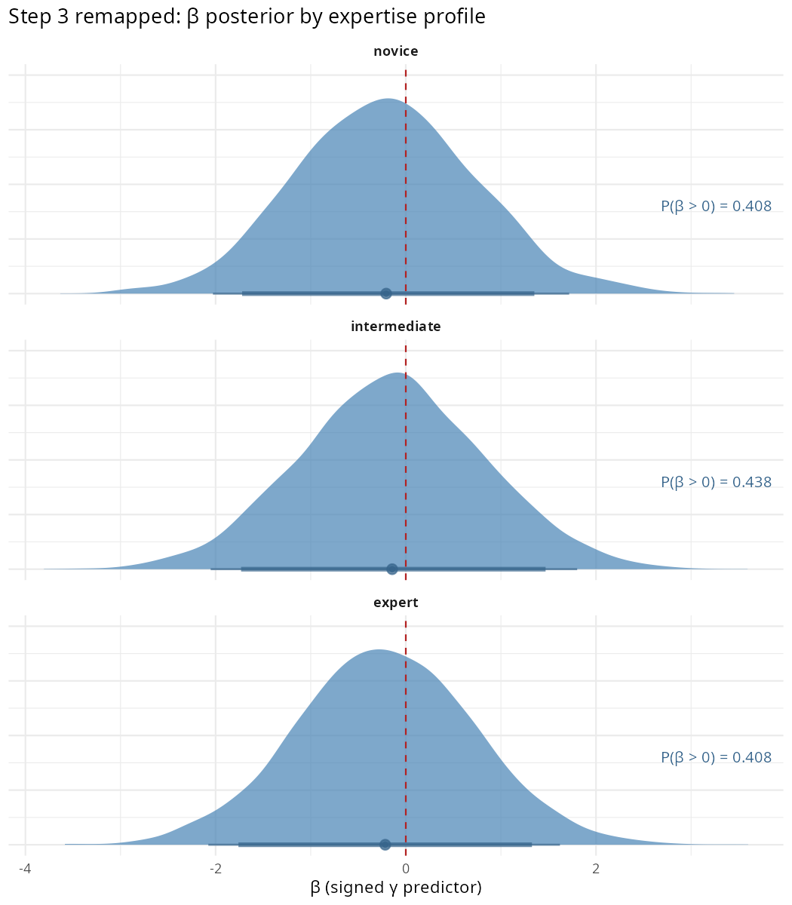
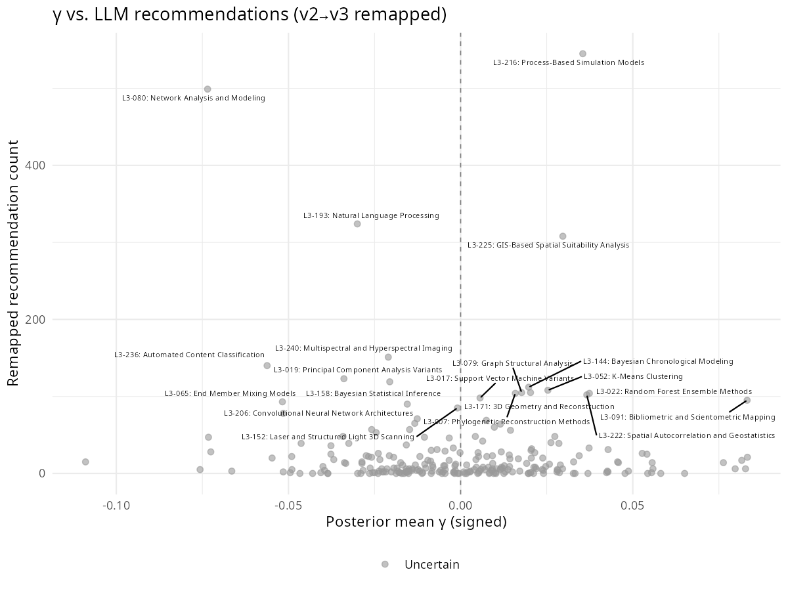
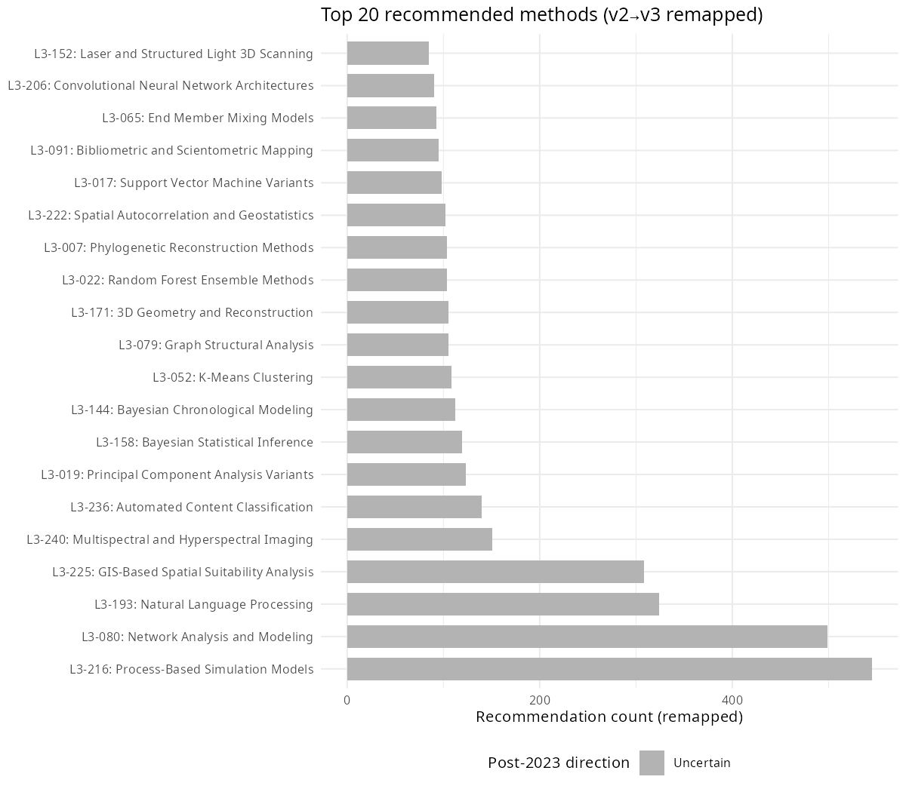

# Step 3 Remapped — v2 Experiment → v3 Taxonomy

Script: `R/sensitivity/B_v2_taxonomy_remap.R`  
Run date: 2026-06-05

---

## What this does

The prompting experiment (Step 3) was run with the v2 taxonomy (225 L3 methods).
Taxonomy v3 has a different L3 vocabulary (242 methods with renamed labels).
Under direct matching, only 53/242 methods had recommendation data — too few
for a meaningful regression.

This script bridges the gap by mapping v2 L3 labels to v3 L3 labels using two
strategies:

1. **Prefix matching** (same L3 number, e.g. L3-009 → L3-009): 153 methods
2. **Exact match** (identical labels): 52 methods
3. **Fuzzy string match** (Jaro-Winkler distance, close): 0 methods
4. **Fuzzy string match** (distant, >0.15): 0 methods

After remapping, **205 / 242** v3 methods have recommendation data (85%).

The full mapping table is saved to `data/output/step3_v2_to_v3_mapping.csv`.

---

## Results

| Profile | β mean | 90% CI | P(β > 0) |
|---|---|---|---|
| Overall | -0.327 | [-1.838, 1.220] | 0.356 |
| Novice | -0.206 | [-1.721, 1.352] | 0.408 |
| Intermediate | -0.143 | [-1.732, 1.470] | 0.438 |
| Expert | -0.216 | [-1.760, 1.326] | 0.408 |

### Convergence

| Profile | Max Rhat | Min n_eff |
|---|---|---|
| Overall | 1.0014 | 3862 |
| Novice | 1.0016 | 3894 |
| Intermediate | 1.0010 | 3648 |
| Expert | 1.0015 | 4185 |

---

## Plots

### Overall β posterior

### β posterior by expertise profile

### γ vs. recommendation count

### Top 20 recommended methods

---

## Interpretation

*(Auto-generated; update after reviewing results.)*
