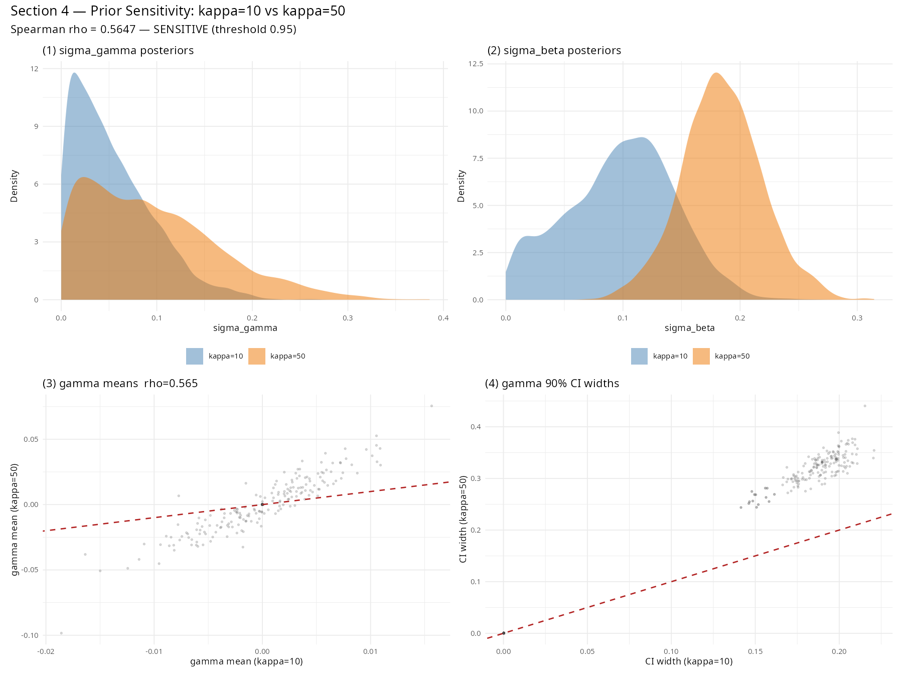

# Bayesian Workflow Checks

*Last updated: 2026-04-05 19:53*

These checks implement the four-stage workflow from Gelman et al. (2020, arXiv:2011.01808). They are run from `R/04_workflow_checks.R` using the already-fitted `fit.rds` and `fit_l2.rds` — no refitting is done except for the fake-data simulation in Section 3 (single group, small, fast).

---

## Section 1 — Prior Predictive Check (§2.4)

**Question:** do our priors generate plausible data before we look at the likelihood?

We draw S = 1000 samples from the priors directly in R, bypassing the likelihood entirely:

```
sigma_beta  ~ Exponential(2)
sigma_gamma ~ Exponential(4)
mu_raw      ~ Normal(0, 1)
beta_raw    ~ Normal(0, 1)     beta  = sigma_beta  × beta_raw
gamma_raw   ~ Normal(0, 1)     gamma = sigma_gamma × gamma_raw

eta   = mu_raw + beta × year_std[t] + gamma × post_llm[t]
pi    = softmax(eta)
inv_simpson = 1 / sum(pi^2)
```

This is repeated for the 5 largest L2 groups, sampling a random year each draw to cover the full temporal range. The resulting prior predictive distribution of inv_simpson is plotted alongside the observed empirical range (shaded band).

**Result: PASS**

Prior predictive 5th–95th percentile = [1.25, 5.54]; observed range = [1, 6.97].

**Interpretation.** If the prior predictive covers 1 to K_g — the full range from one dominant method to perfectly uniform distribution — the priors are weakly informative and acceptable. A prior that places all mass outside the observed range would indicate miscalibration and require tightening or widening the hyperpriors.


---

## Section 2 — Posterior Predictive Check (§6.1)

**Question:** does the fitted model reproduce the structure of the observed data?

For each posterior draw d and each group-year (g, t) with N_gt > 0:

1. Extract π[g,t,d] = softmax(μ[g] + β[g] × year_std[t] + γ[g] × post_llm[t]) from the posterior
2. Simulate y_rep[g,t,d] ~ Multinomial(N_gt, π[g,t,d])
3. Compute inv_simpson_rep = 1 / sum((y_rep / N_gt)²)

We use S = 200 draws (randomly subsampled from the posterior) per group-year cell.

The **PPC tail probability** per group is the fraction of posterior predictive draws whose inv_simpson exceeds the observed value, averaged over all years with data. It is not a frequentist p-value — there is no null hypothesis; it simply reports where the observation sits within the model's own predictive distribution. Values near 0.5 indicate good calibration; values near 0 or 1 indicate systematic misfit (the model consistently over- or under-predicts diversity). The density panels (Section 2a) show the same check graphically. *Gelman et al. (2020) call this a "Bayesian p-value" but we avoid the term to prevent confusion with frequentist p-values.*

**Result: 44 / 48 groups pass at the 0.05–0.95 threshold**

### Section 2a — Density panels (9 largest groups)

The grey distribution is the posterior predictive — what the model expects inv_simpson to look like if we simulated new data from the fitted parameters. The red line is the observed group mean across years. A well-calibrated model would place the red line near the centre of the grey distribution.

What we observe: in most groups the red line falls in the left third of the grey distribution, meaning the model systematically predicts higher diversity than observed. This is a consistent pattern rather than random scatter. Two explanations are plausible: (1) kappa=10 allows too much year-to-year flexibility, letting the model spread probability mass across more methods than actually appear; (2) some L3 methods in the taxonomy co-occur systematically (a paper using Random Forest also tends to use cross-validation), which the DM independence assumption cannot capture. The kappa=50 sensitivity check in Section 4 tests explanation (1) directly — if the misfit shrinks with higher kappa, concentration was the issue.


### Section 2b — PPC tail probabilities

Orange dashed lines = 0.05/0.95 (acceptable); green dotted lines = 0.10/0.90 (good); red points = flagged groups.


**Interpretation.** A group failing the PPC (tail probability outside 0.05–0.95) suggests the model is systematically misrepresenting the diversity of that group. Common causes: wrong K_g (methods collapsed at the wrong level), year-group cells with very small N that are noise-dominated, or a structural break not captured by the two-slope parameterisation.

---

## Section 3 — Fake Data Simulation (§4.1)

**Question:** can the model recover σ_γ when the true value is known?

This validates that the key estimand (σ_gamma, the post-LLM shift scale) is identifiable given our data structure — i.e., that the posterior contracts meaningfully relative to the prior rather than simply echoing it.

**Setup.** We select the largest L2 group (most total papers) and generate fake counts from known ground-truth parameters:

```
sigma_beta_true  = 0.1
sigma_gamma_true = 0.0600
mu_true, beta_true, gamma_true drawn from their hierarchical priors

y_fake[t] ~ DM( N_gt_observed, softmax(mu_true + beta_true × year_std[t]
                                        + gamma_true × post_llm[t]) × 10 )
```

We then fit the standard single-group Stan model to the fake data (2 chains × 500 samples, adapt_delta = 0.90) and compare the recovered posterior to the true value.

**Result: true σ_gamma recovered = TRUE**

```
True sigma_gamma  = 0.0600
Recovered mean    = 0.2119
90% CI            = [0.0117, 0.6131]
True value inside CI: TRUE
```


**Interpretation.** The dashed grey curve is the prior Exp(4); the solid blue curve is the posterior from the fake data. If the posterior contracts noticeably toward the true value (red line) relative to the prior, σ_gamma is identifiable from this data structure. A posterior that simply matches the prior indicates weak identifiability — the data carry almost no information about post-LLM heterogeneity at the group level.

Note: with only 3 post-LLM years and moderate sample sizes, σ_gamma is weakly identified. Some posterior-prior overlap is expected and acceptable, as long as the true value falls within the credible interval.

---

## Section 4 — Prior Sensitivity Analysis (§6.3)

**Question:** do the conclusions change if we use κ = 50 instead of κ = 10?

κ controls the Dirichlet-Multinomial concentration: how closely observed proportions are expected to track the model's predicted shares in any given year. κ = 10 (primary analysis) allows moderate year-to-year deviation; κ = 50 implies much tighter tracking and less overdispersion.

**Posterior comparison of σ_gamma:**

| | mean | SD | 90% CI |
|---|---|---|---|
| κ = 10 | 0.054 | 0.042 | [0.004, 0.132] |
| κ = 50 | 0.095 | 0.070 | [0.007, 0.229] |

σ_gamma roughly doubles under κ = 50. This is not a numerical accident — it reflects a genuine reallocation of variance in the model. With κ = 10, some of the between-method variation can be absorbed by year-to-year noise. With κ = 50, that escape route is closed, and the model attributes more of the observed compositional differences to the structural parameters β and γ. Both posteriors remain credibly above zero.

σ_beta also shifts substantially (peak ~0.10 under κ=10, ~0.18 under κ=50), consistent with the same reallocation mechanism.

**Rank stability of individual γ estimates:**

The Spearman rank correlation between per-method posterior mean γ under κ=10 vs κ=50 is ρ = 0.565. In a Bayesian analysis we do not test whether this is 'significant' — we ask whether the ordinal story is consistent. A threshold of ρ > 0.95 would indicate that the ranking of methods by their post-LLM slope is essentially unchanged by the kappa assumption. ρ = 0.565 means it is not: the specific methods identified as gaining or losing share post-2023 change meaningfully depending on the concentration assumption.

**Implication:** the global finding (σ_gamma credibly above zero at both κ values) appears robust. The identification of specific methods does not. This has three consequences for the paper:

1. Individual γ estimates should be presented with explicit caveats about κ sensitivity
2. The prompting experiment is no longer optional corroboration — it is essential to identify which specific methods are genuinely LLM-driven, independent of the κ assumption
3. The next modelling iteration treats κ as a parameter with a weakly informative lognormal prior — see Section 5 below.



---

## Summary

| Check | Result |
|---|---|
| Prior predictive | [PASS] prior covers plausible inv_simpson range |
| Posterior predictive | 44 / 48 groups pass at 0.05–0.95 |
| Fake data recovery | [YES] true σ_gamma inside 90% CI |
| Prior sensitivity (κ) | SENSITIVE — σ_gamma doubles, γ rankings change (ρ=0.565) | Global finding robust; individual methods not |

> Model passes core calibration checks. Global post-LLM signal (σ_gamma > 0) is robust across κ values. Individual method rankings are sensitive to κ — do not over-interpret specific γ estimates without prompting experiment corroboration. **Immediate next step: run `R/01b_fit_kappa_free.R` to estimate κ from data.**

---

## Section 5 — Next modelling step: estimating κ

The sensitivity analysis shows that κ is not a nuisance parameter — it substantially affects both σ_gamma and the ranking of individual methods. The principled solution is to estimate κ from the data using a weakly informative prior rather than fixing it.

**Why the original attempt failed:** in a pilot run without any prior on κ, the runtime exceeded 33 hours. The reason is that free κ and μ are nearly non-identified: you can always increase κ and adjust μ to produce the same likelihood. The solution is not to fix κ but to constrain it with a prior that rules out near-zero values.

**Proposed prior:** κ ~ LogNormal(log(25), 0.8)

This encodes the expectation that κ is around 25 — between our two sensitivity values of 10 and 50 — with uncertainty spanning roughly one order of magnitude (5th percentile ≈ 5, 95th percentile ≈ 130). The lognormal keeps κ strictly positive and places negligible mass near zero, which is where the identification problem originates.

**Implementation:** a new Stan model variant `stan/diversity_model_kappa_free.stan` and corresponding fit script `R/01b_fit_kappa_free.R` are provided. The fit is saved to `data/output/fit_kappa_free.rds`. If the runtime is acceptable (target: under 8 hours), this becomes the primary analysis. If not, the κ=10/κ=50 bracket is presented in the paper as an honest sensitivity analysis.
