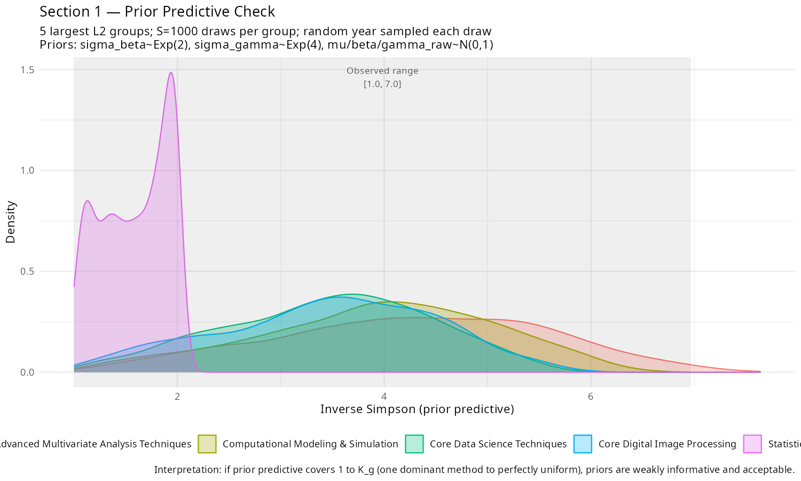
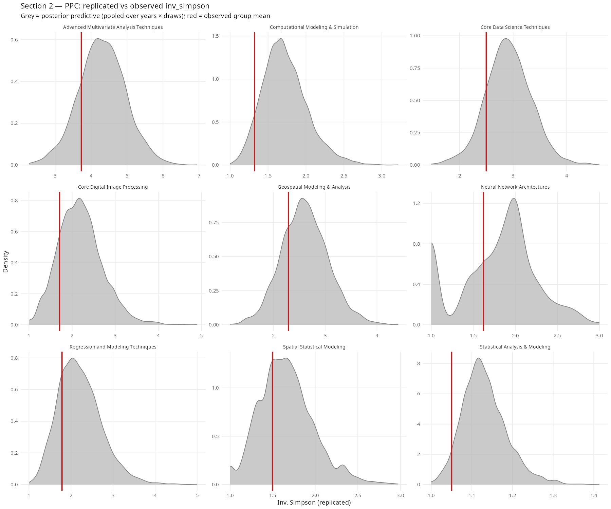
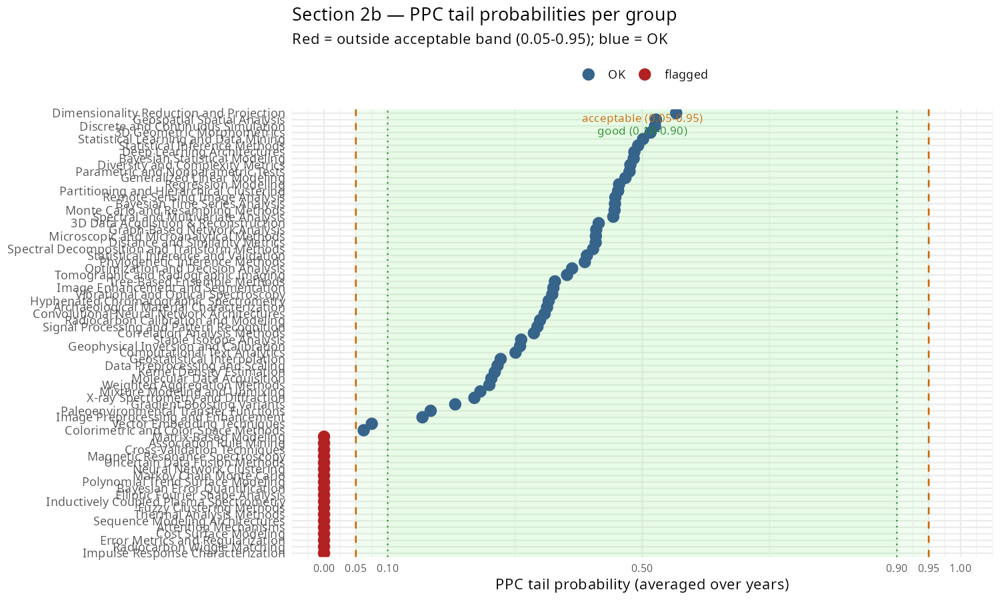
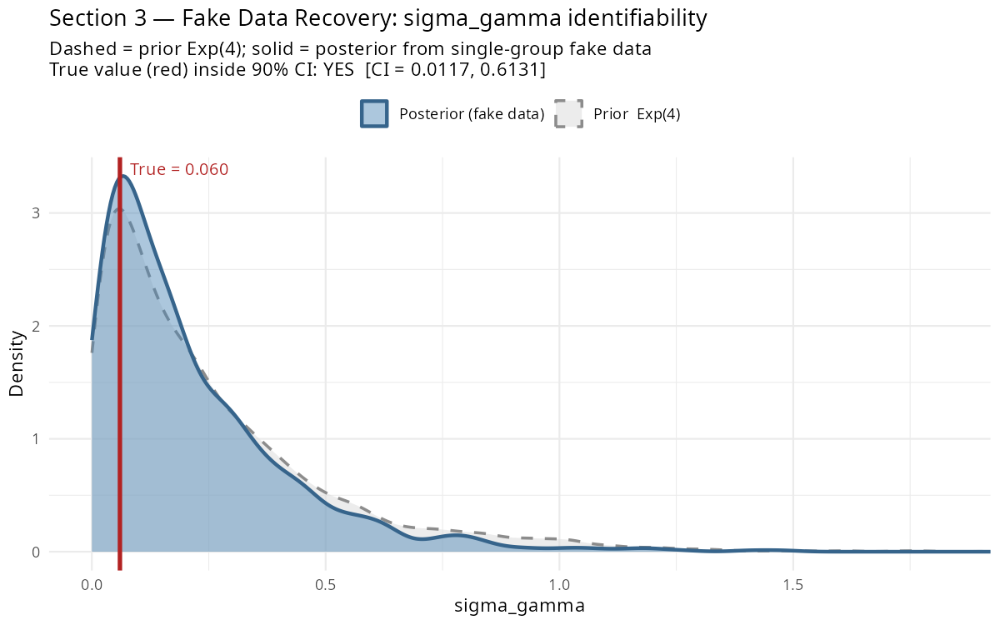

# Bayesian Workflow Checks

*Last updated: 2026-04-05 19:53*

These checks implement the four-stage workflow from Gelman et al. (2020, arXiv:2011.01808). They are run from `R/04_workflow_checks.R` using the already-fitted `fit.rds` and `fit_l2.rds` — no refitting is done except for the fake-data simulation in Section 3 (single group, small, fast).

---

## Section 1 — Prior Predictive Check (§2.4)

**Question:** do our priors generate plausible data before we look at the likelihood?

We draw S = 1000 samples from the priors directly in R, bypassing the likelihood entirely:

```
sigma_beta  ~ Exponential(2)
sigma_gamma ~ Exponential(4)
mu_raw      ~ Normal(0, 1)
beta_raw    ~ Normal(0, 1)     beta  = sigma_beta  × beta_raw
gamma_raw   ~ Normal(0, 1)     gamma = sigma_gamma × gamma_raw

eta   = mu_raw + beta × year_std[t] + gamma × post_llm[t]
pi    = softmax(eta)
inv_simpson = 1 / sum(pi^2)
```

This is repeated for the 5 largest L2 groups, sampling a random year each draw to cover the full temporal range. The resulting prior predictive distribution of inv_simpson is plotted alongside the observed empirical range (shaded band).

**Result: PASS**

Prior predictive 5th–95th percentile = [1.25, 5.54]; observed range = [1, 6.97].

**Interpretation.** If the prior predictive covers 1 to K_g — the full range from one dominant method to perfectly uniform distribution — the priors are weakly informative and acceptable. A prior that places all mass outside the observed range would indicate miscalibration and require tightening or widening the hyperpriors.



---

## Section 2 — Posterior Predictive Check (§6.1)

**Question:** does the fitted model reproduce the structure of the observed data?

For each posterior draw d and each group-year (g, t) with N_gt > 0:

1. Extract π[g,t,d] = softmax(μ[g] + β[g] × year_std[t] + γ[g] × post_llm[t]) from the posterior
2. Simulate y_rep[g,t,d] ~ Multinomial(N_gt, π[g,t,d])
3. Compute inv_simpson_rep = 1 / sum((y_rep / N_gt)²)

We use S = 200 draws (randomly subsampled from the posterior) per group-year cell.

The **PPC tail probability** per group is the fraction of posterior predictive draws whose inv_simpson exceeds the observed value, averaged over all years with data. It is not a frequentist p-value — there is no null hypothesis; it simply reports where the observation sits within the model's own predictive distribution. Values near 0.5 indicate good calibration; values near 0 or 1 indicate systematic misfit (the model consistently over- or under-predicts diversity). The density panels (Section 2a) show the same check graphically.

**Result: 44 / 48 groups pass at the 0.05–0.95 threshold**

### Section 2a — Density panels (9 largest groups)

Grey = posterior predictive distribution (pooled over all years and draws). Red vertical line = observed group mean.

**Note on red-line position.** Because the grey density pools across all years, temporal heterogeneity within a group spreads it; the red line (a single cross-year mean) need not sit at the density peak — this is expected and not a concern on its own. A red line deep in the tails indicates misfit; confirm with the tail probability plot (Section 2b).



### Section 2b — PPC tail probabilities

Orange dashed lines = 0.05/0.95 (acceptable); green dotted lines = 0.10/0.90 (good); red points = flagged groups.



**Interpretation.** A group failing the PPC (tail probability outside 0.05–0.95) suggests the model is systematically misrepresenting the diversity of that group. Common causes: wrong K_g (methods collapsed at the wrong level), year-group cells with very small N that are noise-dominated, or a structural break not captured by the two-slope parameterisation.

---

## Section 3 — Fake Data Simulation (§4.1)

**Question:** can the model recover σ_γ when the true value is known?

This validates that the key estimand (σ_gamma, the post-LLM shift scale) is identifiable given our data structure — i.e., that the posterior contracts meaningfully relative to the prior rather than simply echoing it.

**Setup.** We select the largest L2 group (most total papers) and generate fake counts from known ground-truth parameters:

```
sigma_beta_true  = 0.1
sigma_gamma_true = 0.0600
mu_true, beta_true, gamma_true drawn from their hierarchical priors

y_fake[t] ~ DM( N_gt_observed, softmax(mu_true + beta_true × year_std[t]
                                        + gamma_true × post_llm[t]) × 10 )
```

We then fit the standard single-group Stan model to the fake data (2 chains × 500 samples, adapt_delta = 0.90) and compare the recovered posterior to the true value.

**Result: true σ_gamma recovered = TRUE**

```
True sigma_gamma  = 0.0600
Recovered mean    = 0.2119
90% CI            = [0.0117, 0.6131]
True value inside CI: TRUE
```



**Interpretation.** The dashed grey curve is the prior Exp(4); the solid blue curve is the posterior from the fake data. If the posterior contracts noticeably toward the true value (red line) relative to the prior, σ_gamma is identifiable from this data structure. A posterior that simply matches the prior indicates weak identifiability — the data carry almost no information about post-LLM heterogeneity at the group level.

Note: with only 3 post-LLM years and moderate sample sizes, σ_gamma is weakly identified. Some posterior-prior overlap is expected and acceptable, as long as the true value falls within the credible interval.

---

## Section 4 — Prior Sensitivity Analysis (§6.3)

**Question:** do the conclusions change if we use κ = 50 instead of κ = 10?

κ controls the Dirichlet-Multinomial concentration (how closely observed proportions are expected to track the model's predicted shares). κ = 10 is the primary analysis; κ = 50 implies much tighter tracking and less overdispersion.

**Status: PENDING**

_fit_kappa50.rds not yet available. Rerun `R/04_workflow_checks.R` after the kappa=50 fit completes._

---

## Summary

| Check | Result |
|---|---|
| Prior predictive | [PASS] prior covers plausible inv_simpson range |
| Posterior predictive | 44 / 48 groups pass at 0.05–0.95 |
| Fake data recovery | [YES] true σ_gamma inside 90% CI |
| Prior sensitivity (κ) | [PENDING] pending kappa=50 fit |

> **Recommendation:** model passes all core checks — results are credible for inference.
