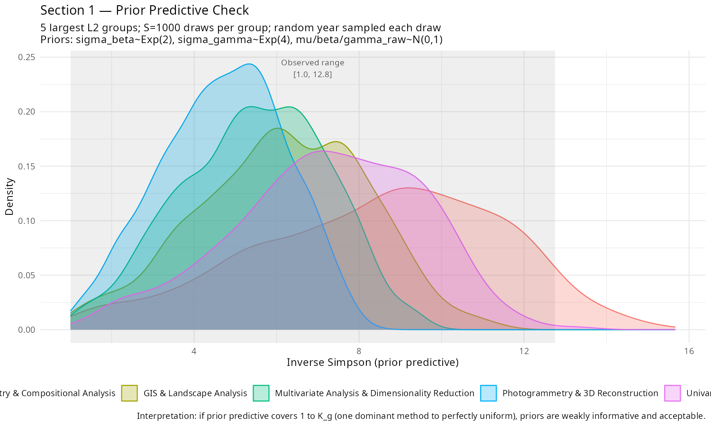
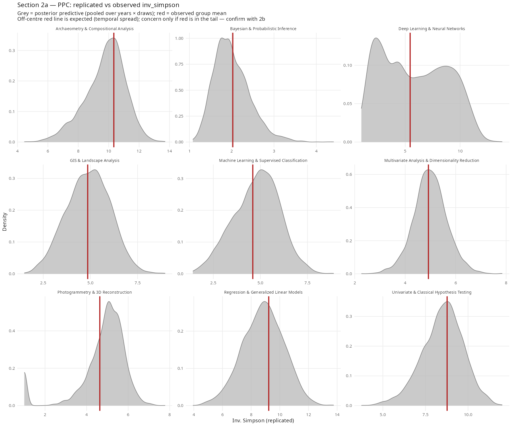
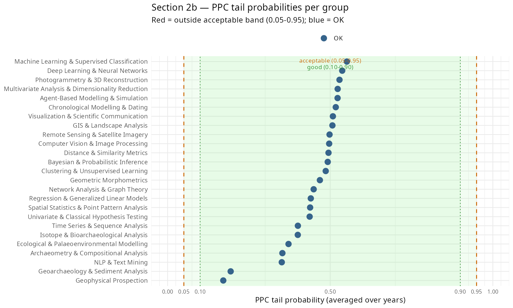
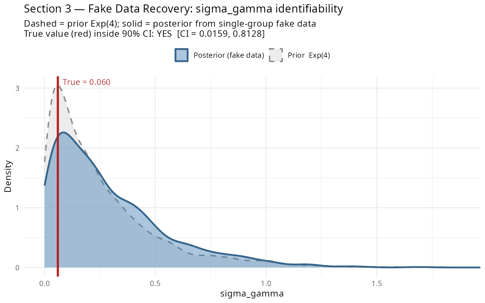

# Bayesian Workflow Checks

*Last updated: 2026-05-21*

These checks implement a subset of the workflow from Gelman et al. (2020, arXiv:2011.01808), run from `R/bibliometric/04_workflow_checks.R` using the fitted Dirichlet-Multinomial model. No refitting is done except for the fake-data simulation (single group, fast).

### Coverage of Gelman et al. (2020)

The paper implements four of the stages Gelman et al. describe:

| Gelman stage | Status | Notes |
|---|---|---|
| Prior predictive check (§2.4) | Done | Priors generate plausible diversity values |
| Posterior predictive check (§6.1) | Done | 25/25 L2 groups pass calibration |
| Fake-data simulation (§4.1) | Done | sigma_gamma recoverable from single-group data |
| Prior sensitivity (§6.3) | Superseded | phi is now estimated from data, removing the main sensitivity axis |
| Cross-validation / model comparison (§7) | Not done | Only one model class (Dirichlet-Multinomial); no alternative likelihood to compare against |
| Iterative model expansion (§5) | Partially done | The phi-free model was developed iteratively from the fixed-phi version, but the iteration is documented in commit history rather than as a formal expansion sequence |

The workflow is honest but incomplete relative to the full Gelman et al. prescription. The missing pieces (cross-validation, formal model comparison) are less critical here because the primary estimand (sigma_gamma) is a scale parameter whose interpretation does not depend on model selection — it asks "how much post-2023 heterogeneity exists?" rather than "which model best predicts held-out data?"

---

## Section 1 — Prior Predictive Check

**Question:** do the priors generate plausible data before seeing the likelihood?

1000 draws from the priors, computed in R (no Stan):

```
sigma_beta  ~ Exponential(2)
sigma_gamma ~ Exponential(4)
mu_raw, beta_raw, gamma_raw ~ Normal(0, 1)

eta   = mu_raw + sigma_beta * beta_raw * year_std[t]
        + sigma_gamma * gamma_raw * post_llm[t]
pi    = softmax(eta)
inv_simpson = 1 / sum(pi^2)
```

Repeated for the 5 largest L2 groups, sampling a random year per draw.

**Result: PASS.** Prior predictive 5th–95th percentile = [2.76, 11.57]; observed range = [1, 12.76]. The priors are weakly informative and cover the plausible range.



---

## Section 2 — Posterior Predictive Check

**Question:** does the fitted model reproduce the observed data structure?

For each posterior draw and each group-year cell with data, the model's predicted proportions are used to simulate new multinomial counts, from which inv_simpson is recomputed. 200 draws per cell. The PPC tail probability per group reports where the observation sits within the model's predictive distribution — values near 0.5 indicate good calibration, values near 0 or 1 indicate systematic misfit.

**Result: 25/25 groups pass at the 0.05–0.95 threshold.**





---

## Section 3 — Fake Data Simulation

**Question:** can the model recover sigma_gamma when the true value is known?

The largest L2 group's data structure (sample sizes, years) is used to generate fake counts from known parameters (sigma_gamma_true = 0.060, sigma_beta_true = 0.1). The model is then fit to the fake data and the recovered posterior is compared to the ground truth.

**Result: true sigma_gamma recovered.**

```
True sigma_gamma  = 0.060
Recovered mean    = 0.168
90% CI            = [0.007, 0.451]
True value inside CI: YES
```

The posterior contracts toward the true value relative to the Exp(4) prior, confirming sigma_gamma is identifiable from this data structure. The posterior is wide because a single group with 3 post-LLM years provides limited information — in the full model, aggregation across 25 groups sharpens the estimate (posterior: 0.110 [0.010, 0.222]).



---

## Section 4 — Phi Estimation

The early fixed-phi specifications (phi = 10, phi = 50) were replaced by the phi-free model, which estimates phi from data using a lognormal(log(100), 1.0) prior. This eliminated the main prior-sensitivity axis.

**Result:** phi posterior concentrates at ~1133 [605, 2088], far above both fixed values. The data favour a near-Multinomial likelihood with minimal overdispersion. The fixed phi = 10 model was overly conservative, attributing structural variation to noise.

This supersedes the phi = 10 vs phi = 50 sensitivity comparison from the original workflow. The relevant sensitivity question is now whether the lognormal prior on phi matters — the posterior is concentrated enough (90% CI spans a factor of ~3.5) that it is data-driven rather than prior-driven.
