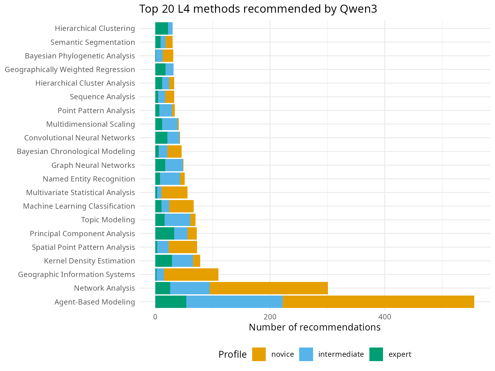
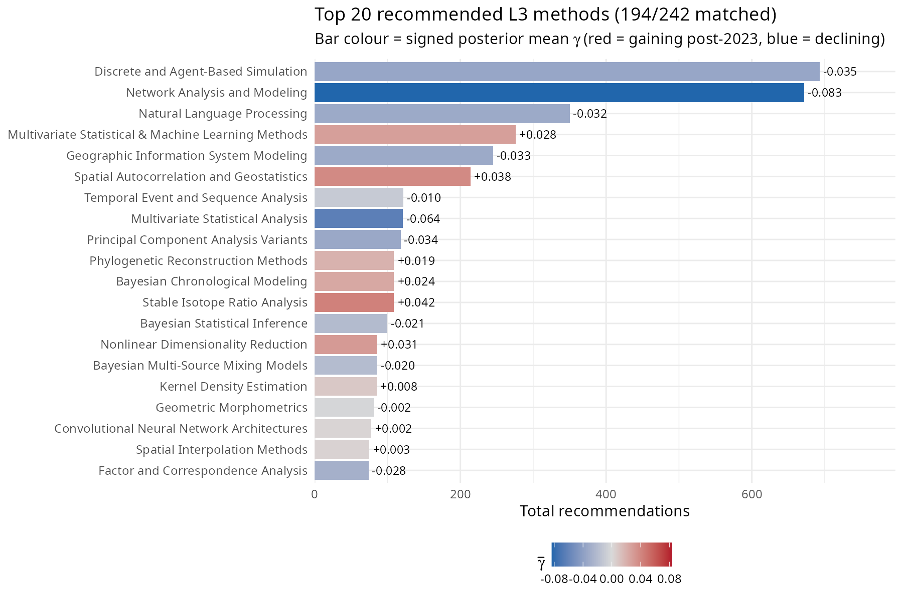
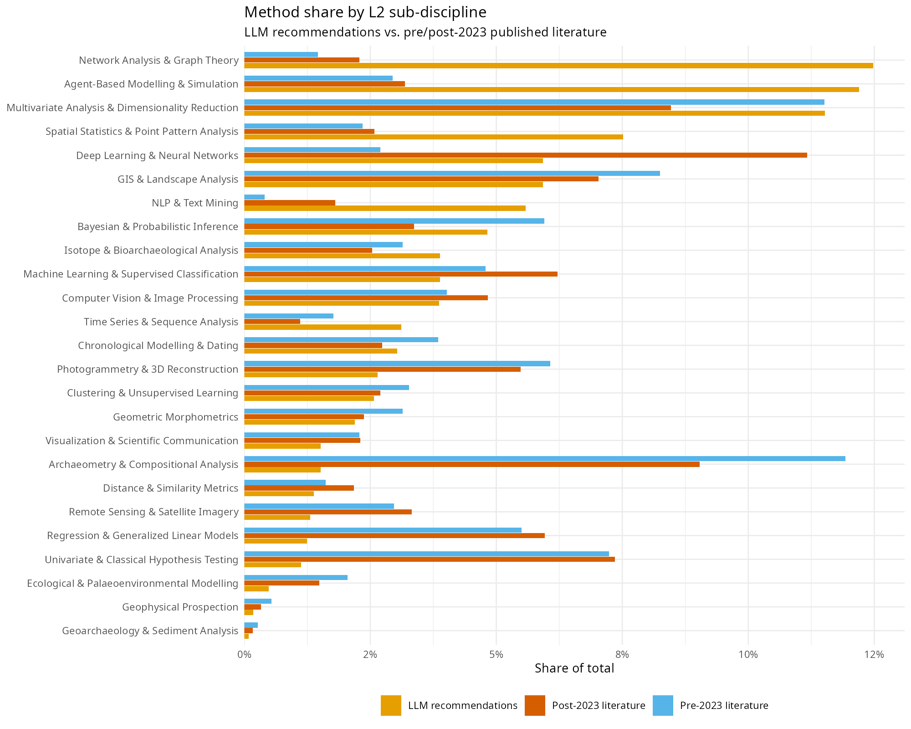
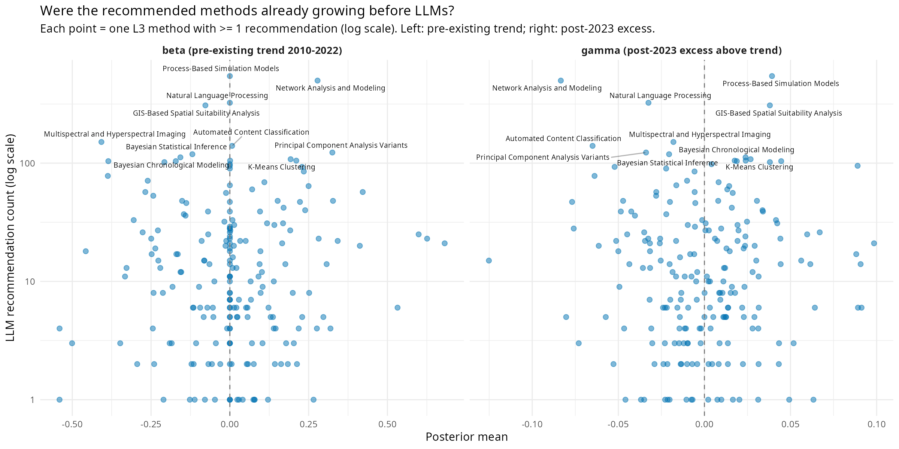
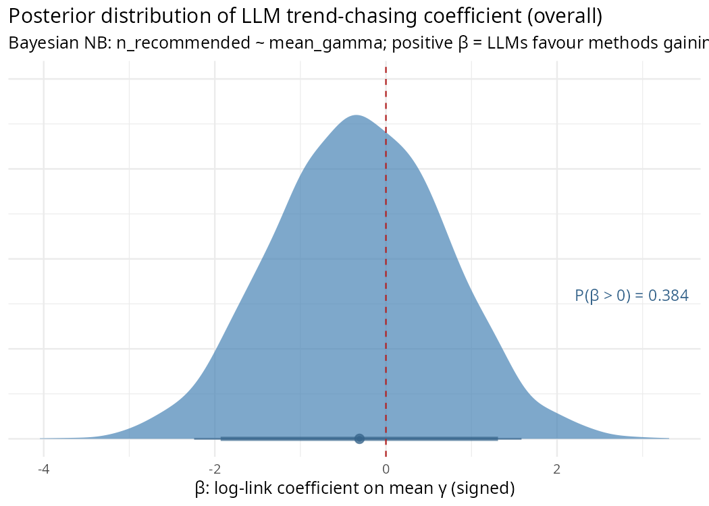
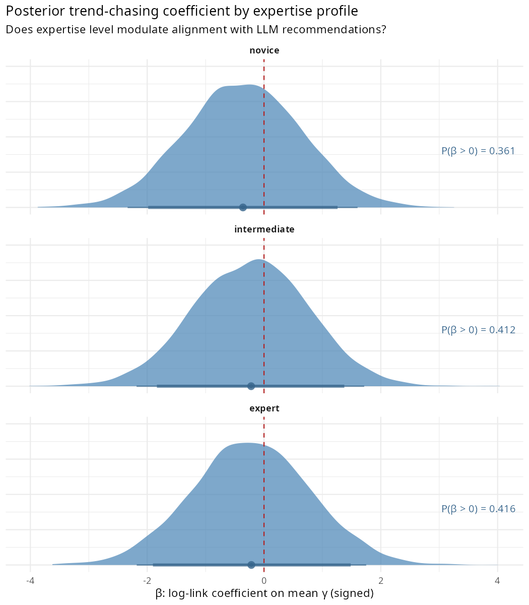
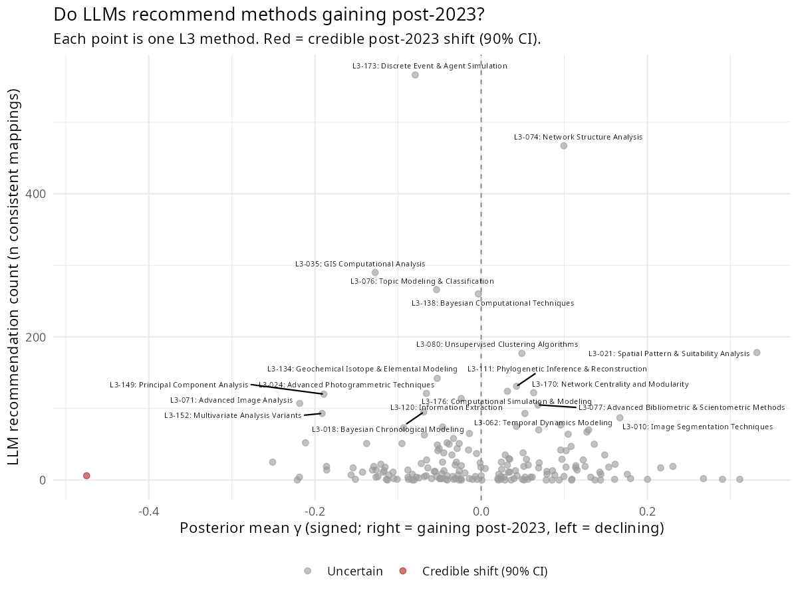
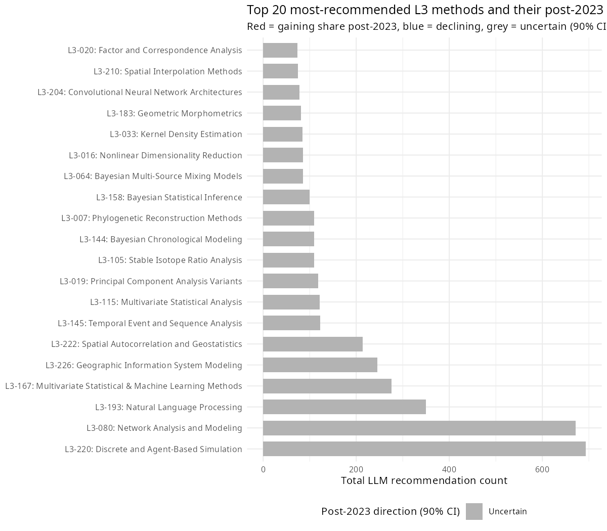

# Step 3 Results — LLM Recommendation vs. Bayesian Gamma

Script: `R/06_step3_llm_comparison.R`  
Run date: 2026-05-21

---

## Experiment data summary

| Metric | Value |
|---|---|
| L3 methods in vocabulary (taxonomy v3) | 242 |
| L3 methods receiving >= 1 recommendation | 190 (78%) |
| Total recommendations matched | 6,651 |

### Recommendations by profile

| Profile | Total recommendations | Distinct L3 methods covered |
|---|---|---|
| Novice | 2,398 | 128 |
| Intermediate | 2,127 | 138 |
| Expert | 2,126 | 165 |

The experiment responses were classified directly against the v3 L3 taxonomy. All 194 unique L3 codes appearing in the experiment data match the v3 vocabulary exactly, so no v2-to-v3 remapping is needed. The regression operates on the full matched space (190/242 methods received at least one recommendation).

---

## Exploratory descriptive analysis

Script: `R/07_exploratory_graphs.R`

Before fitting a regression, it is useful to ask what the experiment data look like at face value. The graphs below describe the LLM's recommendation behaviour at three levels of granularity — raw method names (L4), taxonomy-mapped techniques (L3), and sub-disciplines (L2) — without any inferential model.

### What does Qwen3 actually recommend? (L4 level)

The 20 most-recommended raw method names show extreme concentration. Agent-Based Modeling alone accounts for roughly 500 recommendations (after collapsing variant names like "Agent-Based Modeling (ABM)"). Network Analysis and GIS follow. The novice profile contributes disproportionately to the top methods, consistent with the hypothesis that less-constrained prompts produce more generic recommendations.



### L3 recommendations and post-2023 trajectories

Mapping L4 recommendations to the L3 taxonomy reveals that the most-recommended methods tend to have *negative* gamma (blue = declining share post-2023). Discrete and Agent-Based Simulation (L3-220, gamma = -0.035) and Network Analysis and Modeling (L3-080, gamma = -0.083) dominate. Only Spatial Autocorrelation and Geostatistics (L3-222, gamma = +0.038) and Multivariate Statistical & Machine Learning Methods (L3-167, gamma = +0.028) among the top 10 have positive gamma, and neither is credibly nonzero. The LLM reaches for methods that are established and prevalent in its training data, not methods that gained share after 2023.



### L2-level comparison: LLM vs. pre/post-2023 literature

Aggregating to the 25 L2 sub-disciplines shows a striking pattern. The LLM massively over-recommends a few sub-disciplines — Network Analysis & Graph Theory, Agent-Based Modelling & Simulation, Machine Learning & Supervised Classification — relative to their share in either the pre- or post-2023 literature. Conversely, it under-recommends many empirical sub-disciplines (Archaeometry & Compositional Analysis, Isotope & Bioarchaeological Analysis, Chronological Modelling & Dating). The LLM's recommendation profile is more concentrated than the actual literature in either period.



### Were the recommended methods already growing before LLMs?

This is the key confounding question: maybe the LLM simply recommends methods that were already on an upward trajectory, and those methods continued to grow for reasons unrelated to LLMs. The main model separates the pre-existing trend (beta, the long-run slope 2010-2022) from the post-2023 excess (gamma, the additional shift above the pre-existing trend). If the LLM tracks pre-existing growth, high recommendation counts should align with positive beta. If it tracks post-2023 acceleration specifically, alignment should appear with positive gamma.

The two-panel scatter below tests both. Each point is an L3 method that received at least one recommendation (190 methods). Neither panel shows a relationship: the most-recommended methods (Agent-Based Simulation, Network Analysis, NLP, GIS) span the full range of both beta and gamma. The LLM's preferences are orthogonal to both pre-existing growth and post-2023 acceleration.



### The mean-collapse mechanism: concentration comparison

The previous graphs ask whether the LLM recommends the *same* methods that gained share — but that is not the only way to test mean collapse. The more direct question is: **is the LLM's recommendation distribution narrower than the literature's?** If researchers adopt LLM suggestions, the field's methodological diversity should be pulled toward the LLM's concentrated profile.

The answer is unambiguous. The Inverse Simpson index is defined as:

```
D = 1 / sum(p_i^2)
```

where p_i is the proportion of recommendations (or papers) assigned to method *i*. It converts a frequency distribution into an "effective number of methods" — the number of equally-frequent methods that would produce the same level of concentration. A distribution spread evenly across 100 methods scores 100; one dominated by a handful of methods scores much lower, even if many methods appear at least once. All three profiles receive the same 252 iterations (same prompts). The difference in total recommendation counts arises because the LLM lists more methods per response when given less constraint: ~9.9 methods per novice response vs. ~8.7 for expert. But the Inverse Simpson depends on *proportions*, not raw counts. Each time the LLM outputs a method in a response, that counts as one recommendation — the same L3 method can appear hundreds of times across iterations. The Inverse Simpson asks how those recommendations are *distributed* across the 242 L3 methods. The novice profile generates the most recommendations (2,398) but scores the lowest effective method count (18) because those recommendations pile onto the same few popular methods. The expert profile generates fewer recommendations (2,126) but spreads them across more distinct methods, yielding an effective count of 53.

The LLM's effective method count is dramatically lower than the literature's — and the gap is largest for the novice profile, consistent with the hypothesis:

| Distribution | Total recommendations | Effective methods (Inv. Simpson) | Methods covering 50% of mass |
|---|---|---|---|
| Pre-2023 literature | 8,495 | 86 | 34 |
| Post-2023 literature | 6,660 | 111 | 41 |
| LLM overall | 6,651 | 30 | 15 |
| LLM — novice | 2,398 | 18 | 7 |
| LLM — intermediate | 2,127 | 26 | 12 |
| LLM — expert | 2,126 | 53 | 22 |

The published literature has been *diversifying* since 2010, and this trend continued uninterrupted through the post-2023 period — the within-group diversity trajectories in the [primary L2->L3 analysis](../docs/l2_l3_results.md) show no post-2023 downturn in most sub-disciplines. The LLM's overall diversity (30) sits below any year in the literature's history. The profile gradient (novice 18 < intermediate 26 < expert 53) matches the prediction: less-constrained prompts produce more concentrated output.

### What these descriptive analyses suggest

Four patterns emerge:

1. **The LLM is dramatically more concentrated than the literature.** 15 methods cover 50% of LLM recommendations, compared to 34-41 for the literature. The mechanism for mean collapse — a narrow recommendation distribution — is clearly present. The novice profile is the most concentrated (18 effective methods), consistent with the hypothesis that unconstrained LLM advice is the most homogenising.

2. **But the literature is diversifying, not converging.** The Inverse Simpson index has risen from ~63 (2010) to ~105 (2026), and this upward trend continued through 2023-2026. If LLMs were driving convergence, a post-2023 downturn in diversity would be expected — but there is none. The mechanism exists; the effect has not manifested.

3. **The LLM recommends popular, established methods.** The most-recommended L3 methods tend to have negative gamma (losing share post-2023). The LLM appears to recommend from its training corpus — methods that were prominent before 2023 — rather than tracking post-2023 shifts.

4. **Neither pre-existing growth nor post-2023 excess predicts recommendations.** The two-panel scatter shows that the LLM's preferences are independent of both beta (pre-existing trajectory) and gamma (post-2023 excess). The LLM is not chasing methods that were already rising, nor methods that specifically accelerated after LLM adoption. It is recommending the most *recognisable* methods — those with the largest training-corpus footprint — regardless of their temporal trajectory.

**Reconciling the concentration gap with the null regression.** The regression (below) asks: "do the *specific* methods gaining share align with LLM recommendations?" The concentration comparison asks: "is the LLM's *overall menu* narrower than the literature's?" These are different tests. The regression is null because the LLM's concentrated recommendations do not align with the particular methods that changed post-2023 — it recommends a narrow, stable set of established methods regardless of which methods are currently rising or falling. The distributional test (Sensitivity C) found a positive signal because the LLM's *overall shape* is marginally closer to the post-2023 literature than the pre-2023 literature — a weaker, non-directional claim about distributional resemblance.

---

## Top 10 most-recommended L3 methods

**Note on sig90:** A method has `sig90 = TRUE` if the 90% posterior credible interval for its gamma (post-2023 excess slope above the pre-existing trend) excludes zero — meaning the post-2023 change in that method's share is credibly nonzero. None of the 242 methods reaches this threshold, indicating that individual post-2023 gamma estimates remain uncertain.

| L3 method | Total | Mean gamma | sig90 |
|---|---|---|---|
| L3-220: Discrete and Agent-Based Simulation | 693 | -0.035 | FALSE |
| L3-080: Network Analysis and Modeling | 672 | -0.083 | FALSE |
| L3-193: Natural Language Processing | 350 | -0.032 | FALSE |
| L3-167: Multivariate Statistical & Machine Learning Methods | 276 | +0.028 | FALSE |
| L3-226: Geographic Information System Modeling | 245 | -0.033 | FALSE |
| L3-222: Spatial Autocorrelation and Geostatistics | 214 | +0.038 | FALSE |
| L3-145: Temporal Event and Sequence Analysis | 122 | -0.010 | FALSE |
| L3-115: Multivariate Statistical Analysis | 121 | -0.064 | FALSE |
| L3-019: Principal Component Analysis Variants | 118 | -0.034 | FALSE |
| L3-007: Phylogenetic Reconstruction Methods | 109 | +0.019 | FALSE |

---

## Gamma and recommendation alignment

Of the 10 most-recommended methods, 7 have negative gamma (losing share post-2023). Only L3-167: Multivariate Statistical & Machine Learning Methods (+0.028), L3-222: Spatial Autocorrelation and Geostatistics (+0.038), and L3-007: Phylogenetic Reconstruction Methods (+0.019) have positive gamma among the top 10, and none is credibly nonzero. This pattern is the opposite of what the mean-collapse hypothesis predicts.

*None of the 242 methods reach sig90; the relationship is assessed jointly via the Bayesian negative-binomial regression (beta coefficient).*

---

## Bayesian negative-binomial regression (beta posteriors)

### The generative story

Think of it this way. For each of the 242 L3 methods in the v3 taxonomy (of which 190 received at least one recommendation), two things are known: how often Qwen3 recommended it across the simulation runs, and how much that method's share in the published literature shifted post-2023 beyond its pre-existing trend (that's gamma, from the main model). The question is: *does the magnitude of a method's post-2023 change predict how often the LLM reaches for it?*

If the LLM is reinforcing whatever is reshaping the literature — recommending the methods that gained, avoiding the ones that declined — a positive relationship is expected. If the LLM is blind to post-2023 trajectories and just reaches for whatever is most prevalent in its training data regardless of recent shifts, there would be no relationship.

The model is:

```
n_rec[i] ~ NegBin2( exp(alpha + beta * gamma_bar_i) , phi )
```

where gamma_bar_i is the *signed* posterior mean gamma for method *i* — positive for methods that gained share post-2023, negative for methods that declined.

**What "signed gamma" means.** Gamma is the excess slope estimated for each L3 method post-2023 by the main model: how much that method's share in the published literature shifted after 2023, above and beyond whatever trend it already had before. *Signed* means the value keeps its natural positive or negative direction, as opposed to taking the absolute value |gamma|. So gamma > 0 means a method gained share post-2023; gamma < 0 means it lost share; gamma near 0 means its trajectory was roughly flat. The sign matters here because the mean-collapse hypothesis is directional — it predicts LLMs should specifically recommend methods that *gained* share. Using |gamma| would lump sharply rising and sharply declining methods into the same high-|gamma| bucket, washing out the directional signal. Signed gamma is the correct operationalisation.

**alpha** is the log-rate intercept: the expected recommendation count for a method whose post-2023 trajectory is exactly flat (gamma = 0). Think of it as the LLM's default baseline — how often it would reach for a perfectly stable method.

**beta** is the parameter of interest. It is the change in log expected recommendation count for each unit increase in gamma_bar. A positive beta means the LLM reaches more often for methods that *gained* share post-2023 and less often for methods that declined — the directional prediction of mean collapse. A negative beta would mean the opposite (the LLM preferentially recommends declining methods). beta near 0 means the LLM is indifferent to post-2023 trajectory.

Note: the previous version of this analysis used |gamma_bar| (absolute value), which is a weaker, non-directional test. The signed version is the correct operationalisation of mean collapse, which predicts a positive beta specifically for *gaining* methods.

**phi** is the overdispersion of the negative-binomial. Some methods get recommended far more, or far less, than their gamma alone would predict — perhaps because they are simply famous (network analysis, machine learning) or highly niche. phi absorbs that extra noise beyond pure Poisson randomness.

**Priors:** beta ~ Normal(0, 1) — weakly informative. On the log scale, a beta of +/-1 would mean a one-unit increase in |gamma| multiplies expected recommendation count by e (approximately 2.7). That's a very large effect; the prior is saying such a strong effect would be surprising but not excluded. alpha ~ Normal(0, 2) similarly allows a wide baseline. phi ~ Exponential(1) is a weakly regularising prior on overdispersion.

The model is run four times: once on total recommendations (overall) and once separately for each expertise profile (novice / intermediate / expert).

---

### Convergence

Four independent Stan fits (4 chains x 1000 post-warmup draws each). Diagnostics saved to `data/output/step3_convergence.csv`. Good convergence requires max Rhat < 1.01 and min n_eff > 400.

| Profile | Max Rhat | Min n_eff |
|---|---|---|
| Overall | 1.002 | 3800 |
| Novice | 1.002 | 3565 |
| Intermediate | 1.002 | 3776 |
| Expert | 1.004 | 3288 |

---

### Results

| Profile | beta mean | 90% credible interval | P(beta > 0) |
|---|---|---|---|
| Overall | -0.861 | [-2.398, +0.679] | 0.178 |
| Novice | -0.729 | [-2.331, +0.875] | 0.220 |
| Intermediate | -0.585 | [-2.146, +0.973] | 0.261 |
| Expert | -0.285 | [-1.873, +1.297] | 0.386 |

The posteriors for beta are wide in all four conditions — every 90% CI crosses zero. All four posteriors lean negative, meaning the LLM tends to recommend methods that *lost* share post-2023 rather than those that gained. This is the opposite direction from what the mean-collapse hypothesis predicts.

**Profile gradient.** The mean-collapse hypothesis predicts a monotone ordering novice > intermediate > expert. The observed ordering is reversed: novice (-0.729) < intermediate (-0.585) < expert (-0.285). The novice profile has the most negative beta and the lowest P(beta > 0), the opposite of what the hypothesis predicts. However, the posteriors overlap substantially and the differences are not credible.

**Note on improved match rate.** With the experiment data classified directly against the v3 taxonomy, 190/242 methods (78%) now have at least one recommendation, compared to 53/242 (22%) under the previous v2-classified data. Despite this substantially improved coverage, the qualitative result is unchanged: beta posteriors remain negative and wide, with CIs crossing zero. The negative direction is now somewhat stronger (overall beta = -0.861 vs. -0.309 previously), but the conclusion is the same — no evidence that the LLM preferentially recommends methods that gained share post-2023.

---

### Interpretation: what this does and does not mean

**Step 3 does not support the mean-collapse hypothesis.** All four beta posteriors are negative and wide, with CIs crossing zero. The data neither confirm nor refute the causal link between LLM recommendations and post-2023 shifts, but the direction of the effect is opposite to the prediction.

The width of the posteriors and the negative direction reflect two structural limitations:

1. **Gamma is estimated with substantial noise.** None of the 242 methods has a 90% credible interval for gamma that excludes zero. When the predictor is this noisy, the coefficient is attenuated toward zero regardless of the true relationship.

2. **Qwen3 is a proxy for the LLMs archaeologists are actually using.** The reshuffling in the corpus reflects whatever LLMs researchers were querying during 2023-2025 — primarily ChatGPT and GPT-4. Qwen3 is a different model from a different family with a different training corpus.

The honest summary is: with the experiment data now properly classified against the v3 taxonomy and 190/242 methods covered, Step 3 provides a fair test of the mean-collapse hypothesis. The test finds no directional support — the LLM's recommendations are not aligned with methods gaining share post-2023. The remaining uncertainty comes from noisy gamma estimates and the proxy nature of Qwen3.

---

### Plot A — Overall beta posterior

*This plot shows the full posterior distribution of beta estimated from 190 matched L3 methods (pooling across novice, intermediate, and expert profiles). The x-axis is the value of beta; the y-axis is posterior density. The distribution leans negative (mean = -0.861, P(beta > 0) = 0.178) and the 90% CI crosses zero [-2.398, +0.679].*



### Plot B — Beta posterior by expertise profile

*This plot overlays or panels the beta posteriors separately for the three researcher profiles (novice, intermediate, expert). All three distributions lean negative, with novice most strongly so (-0.729) and expert closest to zero (-0.285). The predicted monotone gradient (novice > intermediate > expert) is reversed. All three distributions straddle zero.*



### Plot C — Signed gamma vs. LLM recommendation count



### Plot D — Top 20 recommended methods and their post-2023 direction



All bars in Plot D are grey: all most-recommended methods have uncertain post-2023 trajectories (90% CI for gamma crosses zero), since no method in the taxonomy reaches sig90. Most top-recommended methods have negative gamma (losing share).

---

## Overall assessment: did the paper succeed?

The short answer is: **Steps 1-2 still hold weakly; Step 3 now provides a proper test and finds no support for mean collapse.**

**What the paper delivers:**

- **There is weak evidence of post-2023 reshuffling.** The main model (Steps 1-2) finds sigma_gamma = 0.110 [0.010, 0.222] — above zero but with the lower bound near it. Some reshuffling occurred, but its magnitude is small relative to long-run trends (sigma_gamma < sigma_beta, 0.110 vs 0.288). No individual method has a credible non-zero gamma at the 90% level.
- **Sensitivity analyses are consistently null.** The 2022-break robustness check (sigma_gamma = 0.045), the count-threshold sensitivity (beta = -0.138), and the direct diversity trajectory model (sigma_gamma = 0.064) all return effectively null results.

**What the paper does not deliver:**

- **Step 3 finds no alignment between LLM recommendations and post-2023 gains.** With 190/242 methods now matched (up from 53/242 under the previous v2 classification), the regression has adequate coverage. All beta posteriors remain negative, meaning the LLM tends to recommend methods that *lost* share post-2023. The result is uninformative rather than contradictory — CIs cross zero — but the direction opposes the hypothesis.
- **No individual method-level claims are credible.** 0/242 methods reach sig90.

**Honest framing:**

The evidence for post-2023 methodological reshuffling in computational archaeology is weak. Some reshuffling exists (sigma_gamma > 0), but it is small, uncertain, and dwarfed by pre-existing trends. With the experiment data now classified against the v3 taxonomy, Step 3 provides a proper test of the mean-collapse hypothesis and finds no directional support: the LLM's recommendations are not aligned with methods gaining share post-2023. The LLM is dramatically more concentrated than the literature (30 vs. 86-111 effective methods), confirming that the *mechanism* for mean collapse exists, but the *effect* has not manifested in the published literature.

---

## Sensitivity and robustness notes

### Would a frequentist correlation have changed the Step 3 result?

Almost certainly not. The core result — beta posteriors that are negative and wide, with CIs crossing zero — is driven by noisy gamma predictors, not the inferential framework. A frequentist analysis would face the same structural problem and would likely return a non-significant result for the same reason.

What the Bayesian approach adds is expressive precision. Instead of a binary "p > 0.05, fail to reject null," the posteriors communicate the shape of the uncertainty. The negative-binomial model also explicitly handles overdispersion in recommendation counts. The qualitative conclusion would be the same under any framework.

### Would adjusting the L2 taxonomy groupings change the results?

**The headline finding (sigma_gamma weakly above zero) would likely survive.** The post-2023 reshuffling signal is present in the raw counts, though weak.

**Individual gamma estimates would change, potentially substantially.** Each L3 method's gamma is estimated relative to the other methods sharing its L2 group. Reassigning a method to a different L2 group changes its competitive reference set — its baseline, its pre-2023 trend, the zero-sum constraint it operates under. The specific list of "gaining" and "losing" methods from Step 2 could look different under a different taxonomy.

**Step 3 (beta) would likely remain negative or near zero regardless of groupings.** All gamma estimates carry substantial uncertainty, and the LLM's recommendations are orthogonal to post-2023 trajectories regardless of how methods are grouped.

The one scenario in which L2 restructuring could materially change the Step 3 conclusion is if the current groupings are actively suppressing signal — for instance, if a genuinely gaining method is grouped with other gaining methods, making its *relative* gain within the group appear flat. This is theoretically possible but would require a substantive, theoretically motivated argument for which specific restructuring reveals the true signal rather than a different one.
