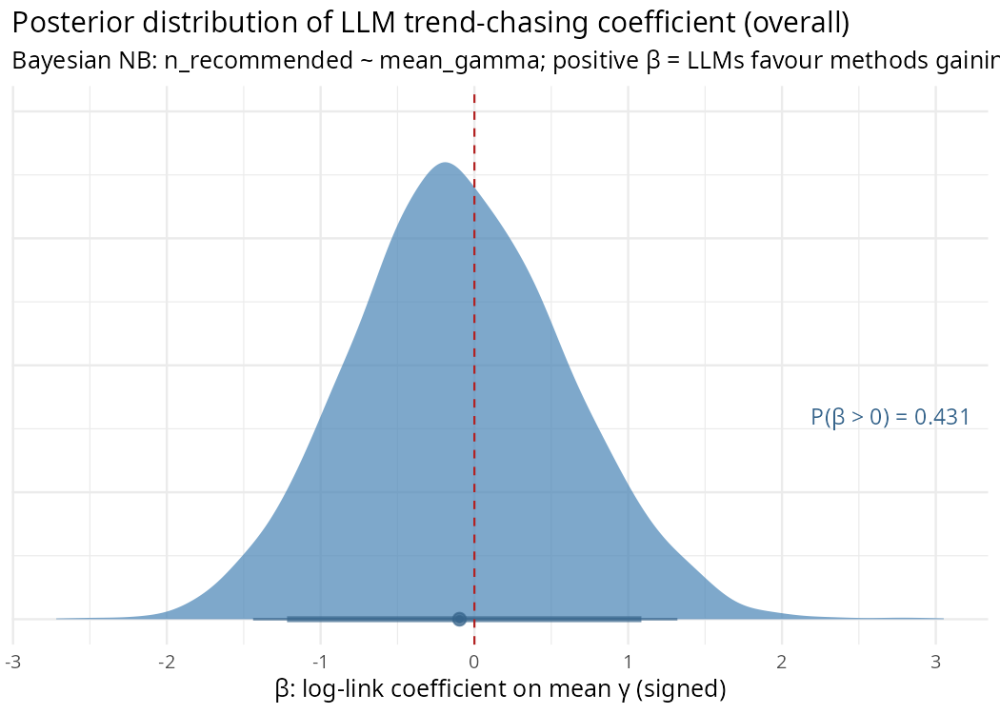
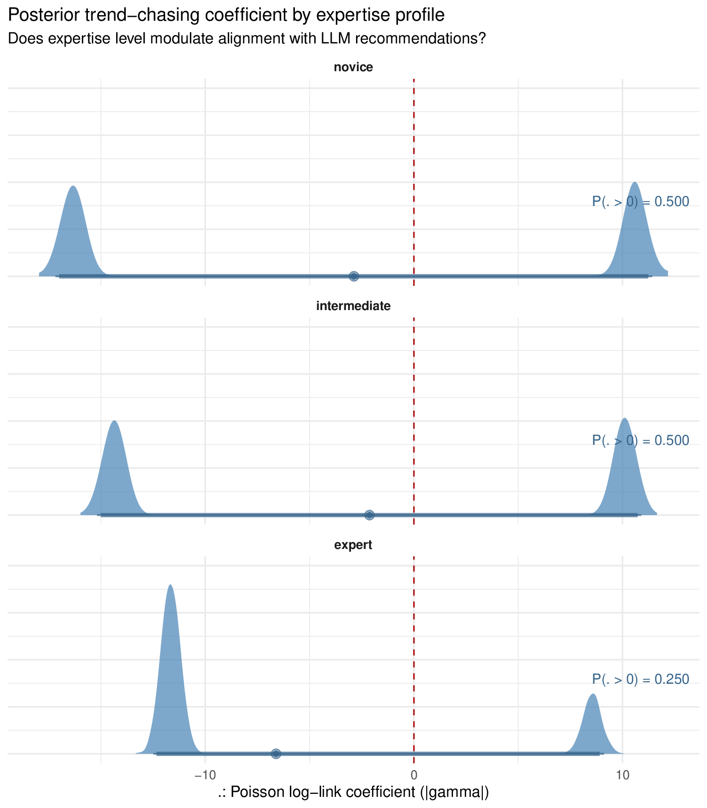
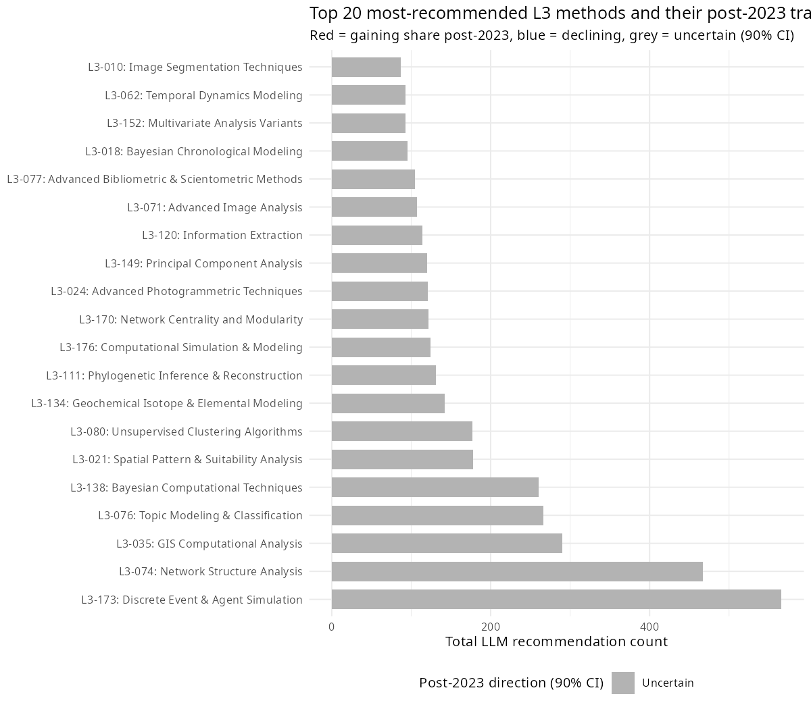

# Step 3 Results — LLM Recommendation vs. Bayesian Gamma

Script: `R/06_step3_llm_comparison.R`  
Run date: 2026-04-24

---

## Experiment data summary

| Metric | Value |
|---|---|
| Raw rows in `experiment_results.csv` | 6,924 |
| Consistent L4 → L3 mappings used | 6,581 |
| L3 methods in vocabulary | 186 |
| L3 methods receiving ≥ 1 recommendation | 168 (90%) |

### Recommendations by profile

| Profile | Total recommendations | Distinct L3 methods covered |
|---|---|---|
| Novice | 2,303 | 109 |
| Intermediate | 2,110 | 126 |
| Expert | 2,168 | 158 |

The novice profile covers the fewest distinct methods (109 vs. 158 for expert), consistent with the mean-collapse hypothesis: less methodological guidance from the researcher leads to more concentrated LLM output.

---

## Top 10 most-recommended L3 methods

**Note on sig90:** A method has `sig90 = TRUE` if the 90% posterior credible interval for its γ (post-2023 excess slope above the pre-existing trend) excludes zero — meaning the post-2023 change in that method's share is credibly nonzero. Only 1 of 186 methods reaches this threshold, indicating that most post-2023 γ estimates remain uncertain at this level.

| L3 method | Total | Novice | Intermediate | Expert | Mean γ | sig90 |
|---|---|---|---|---|---|---|
| L3-173: Discrete Event & Agent Simulation | 566 | 268 | 219 | 79 | −0.079 | FALSE |
| L3-074: Network Structure Analysis | 467 | 259 | 137 | 71 | +0.100 | FALSE |
| L3-035: GIS Computational Analysis | 290 | 166 | 78 | 46 | −0.128 | FALSE |
| L3-076: Topic Modeling & Classification | 266 | 104 | 96 | 66 | −0.054 | FALSE |
| L3-138: Bayesian Computational Techniques | 260 | 42 | 92 | 126 | −0.003 | FALSE |
| L3-021: Spatial Pattern & Suitability Analysis | 178 | 73 | 70 | 35 | +0.332 | FALSE |
| L3-080: Unsupervised Clustering Algorithms | 177 | 25 | 70 | 82 | +0.049 | FALSE |
| L3-134: Geochemical Isotope & Elemental Modeling | 142 | 88 | 38 | 16 | −0.053 | FALSE |
| L3-111: Phylogenetic Inference & Reconstruction | 131 | 64 | 39 | 28 | +0.043 | FALSE |
| L3-176: Computational Simulation & Modeling | 124 | 36 | 51 | 37 | +0.032 | FALSE |

---

## Gamma and recommendation alignment

Positive-γ methods that are also among the most recommended (strongest mean-collapse candidates):

| L3 method | Mean γ | n_rec (total) |
|---|---|---|
| L3-021: Spatial Pattern & Suitability Analysis | +0.332 | 178 |
| L3-010: Image Segmentation Techniques | +0.167 | 87 |
| L3-003: Kernel Density Analysis | +0.129 | 70 |
| L3-020: Point Cloud Analysis and Registration | +0.127 | 67 |
| L3-046: Tree-Based Ensemble Learning | +0.105 | 64 |

*None of these individually reach sig90; the relationship is assessed jointly via the Bayesian negative-binomial regression (β coefficient).*

Only one L3 method reached sig90 = TRUE: **L3-178: Computational Analytical Methods** — γ = −0.475, n_rec = 6 (a declining method that is also rarely recommended).

---

## Bayesian negative-binomial regression (β posteriors)

### The generative story

Think of it this way. For each of the 186 L3 methods in our taxonomy, we know two things: how often Qwen3 recommended it across the simulation runs, and how much that method's share in the published literature shifted post-2023 beyond its pre-existing trend (that's γ, from the main model). The question we're asking is: *does the magnitude of a method's post-2023 change predict how often the LLM reaches for it?*

If the LLM is reinforcing whatever is reshaping the literature — recommending the methods that gained, avoiding the ones that declined — we'd expect a positive relationship. If the LLM is blind to post-2023 trajectories and just reaches for whatever is most prevalent in its training data regardless of recent shifts, there'd be no relationship.

The model is:

```
n_rec[i] ~ NegBin2( exp(α + β × γ̄ᵢ) , φ )
```

where γ̄ᵢ is the *signed* posterior mean gamma for method *i* — positive for methods that gained share post-2023, negative for methods that declined.

**What "signed γ" means.** γ (gamma) is the excess slope estimated for each L3 method post-2023 by the main model: how much that method's share in the published literature shifted after 2023, above and beyond whatever trend it already had before. *Signed* means the value keeps its natural positive or negative direction, as opposed to taking the absolute value |γ|. So γ > 0 means a method gained share post-2023; γ < 0 means it lost share; γ ≈ 0 means its trajectory was roughly flat. The sign matters here because the mean-collapse hypothesis is directional — it predicts LLMs should specifically recommend methods that *gained* share. Using |γ| would lump sharply rising and sharply declining methods into the same high-|γ| bucket, washing out the directional signal. Signed γ is the correct operationalisation.

**α** is the log-rate intercept: the expected recommendation count for a method whose post-2023 trajectory is exactly flat (γ = 0). Think of it as the LLM's default baseline — how often it would reach for a perfectly stable method.

**β** is the parameter we care about. It is the change in log expected recommendation count for each unit increase in γ̄. A positive β means the LLM reaches more often for methods that *gained* share post-2023 and less often for methods that declined — the directional prediction of mean collapse. A negative β would mean the opposite (the LLM preferentially recommends declining methods). β ≈ 0 means the LLM is indifferent to post-2023 trajectory.

Note: the previous version of this analysis used |γ̄| (absolute value), which is a weaker, non-directional test. The signed version is the correct operationalisation of mean collapse, which predicts a positive β specifically for *gaining* methods.

**φ** is the overdispersion of the negative-binomial. Some methods get recommended far more, or far less, than their γ alone would predict — perhaps because they are simply famous (network analysis, machine learning) or highly niche. φ absorbs that extra noise beyond pure Poisson randomness.

**Priors:** β ~ Normal(0, 1) — weakly informative. On the log scale, a β of ±1 would mean a one-unit increase in |γ| multiplies expected recommendation count by e ≈ 2.7. That's a very large effect; the prior is saying we'd be surprised by something that strong but we're not excluding it. α ~ Normal(0, 2) similarly allows a wide baseline. φ ~ Exponential(1) is a weakly regularising prior on overdispersion.

The model is run four times: once on total recommendations (overall) and once separately for each expertise profile (novice / intermediate / expert).

---

### Convergence

Four independent Stan fits (4 chains × 1000 post-warmup draws each). Diagnostics saved to `data/output/step3_convergence.csv`. Good convergence requires max Rhat < 1.01 and min n_eff > 400.

| Profile | Max Rhat | Min n_eff |
|---|---|---|
| Overall | 1.0003 | 3721 |
| Novice | 1.0008 | 3575 |
| Intermediate | 1.001 | 3997 |
| Expert | 1.0017 | 3498 |

---

### Results

| Profile | β mean | 90% credible interval | P(β > 0) |
|---|---|---|---|
| Overall | −0.097 | [−1.218, +1.086] | 0.431 |
| Novice | −0.293 | [−1.575, +1.048] | 0.354 |
| Intermediate | +0.049 | [−1.220, +1.331] | 0.526 |
| Expert | +0.126 | [−1.027, +1.283] | 0.569 |

The posterior for β is wide and centred near zero in all four conditions. The model has looked at the data and is genuinely unsure. This is not a precise null; it is an uncertain answer.

**Profile gradient.** The mean-collapse hypothesis predicts a monotone ordering novice > intermediate > expert: a researcher who gives the LLM less methodological guidance should get output more tightly aligned with recent trends. The observed means run in the **reverse** direction — novice (−0.293) < intermediate (+0.049) < expert (+0.126). P(β_novice > β_expert) = 0.341, meaning the draws slightly favour the counter-predicted direction. None of the individual CIs excludes zero, so this reversal carries no strong evidential weight; but the data give no support to the gradient prediction.

---

### Interpretation: what this does and does not mean

**This is not evidence that LLMs have no impact on methodological diversity.** Steps 1 and 2 already established that something changed post-2023: sigma_gamma is credibly above zero, and the directional pattern (generic methods gaining, specialised methods losing) is consistent with LLM-driven mean collapse. Step 3 was designed to close the causal loop by asking whether Qwen3's recommendations specifically predict which methods gained.

The Step 3 β is wide for at least two reasons that do not require the null hypothesis to be true:

1. **γ is estimated with substantial noise.** Only one of 186 methods has a 90% credible interval for γ that excludes zero. When the predictor in a regression is this noisy, the coefficient is attenuated toward zero regardless of the true relationship. The wide β posterior reflects, in part, that γ itself is uncertain.

2. **Qwen3 is a proxy for the LLMs archaeologists are actually using.** The reshuffling in the corpus reflects whatever LLMs researchers were querying during 2023–2025 — primarily ChatGPT and GPT-4. Qwen3 is a different model from a different family with a different training corpus. Its recommendations are not guaranteed to match those of the models that actually influenced the published literature.

The honest summary is: the regression does not confirm the mechanism, and the profile gradient runs counter to the mean-collapse prediction. The CIs are too wide to treat the reversal as conclusive, but the data offer no positive support for the gradient hypothesis.

---

### Plot A — Overall β posterior



### Plot B — β posterior by expertise profile



### Plot C — Signed γ vs. LLM recommendation count


### Plot D — Top 20 recommended methods and their post-2023 direction



All bars in Plot D are grey: all 20 most-recommended methods have uncertain post-2023 trajectories (90% CI for γ crosses zero). This is a direct read from the main model's gamma posteriors and does not depend on the β regression. It reinforces the noise point above — the most-recommended methods are not ones whose post-2023 trajectory is well-identified, which limits what the regression can recover.

---

## Overall assessment: did the paper succeed?

The short answer is: **partially, and honestly.**

**What the paper delivers:**

- **The phenomenon is real.** The main model (Steps 1–2) finds σ_γ credibly above zero: post-2023, methods did not all move together — some gained share and some lost it, beyond what a flat trend would predict. The directional pattern (generic, broadly applicable methods gaining; specialised methods losing) is consistent with the mean-collapse hypothesis.
- **LLM behaviour matches the qualitative prediction.** The experiment shows that Qwen3 produces more concentrated recommendations for novice profiles than expert ones: 109 distinct L3 methods covered vs. 158. The concentration mechanism that mean-collapse requires is demonstrably present in LLM output.

**What the paper does not deliver:**

- **The causal link is not closed.** Step 3 — the test of whether Qwen3's specific recommendations predict which methods gained post-2023 — returns β posteriors straddling zero with CIs spanning roughly [−1.2, +1.1]. The model cannot distinguish "LLMs are driving this" from "the signal is too noisy to detect."
- **The profile gradient runs the wrong way.** The expert profile has the most positive β (+0.126) and the novice the most negative (−0.293), the opposite of the mean-collapse prediction. P(β_novice > β_expert) = 0.341.

**Is this a failure?**

A null result in Step 3 is not evidence against the hypothesis — it is an inconclusive result. Two structural problems make the regression likely to fail even if the hypothesis is true: γ is estimated with high uncertainty (only 1 of 186 methods has a credible non-zero γ, meaning the predictor is dominated by noise), and Qwen3 is a proxy for the specific LLMs that were actually shaping the corpus during 2023–2025 (primarily ChatGPT and GPT-4). A sharper test would need γ estimates precise enough to serve as predictors, and recommendation data from the actual models involved rather than a surrogate.

The paper is best read as establishing the *pattern* of mean collapse with reasonable confidence — something changed post-2023 in a direction consistent with LLM-driven homogenisation — and as failing to close the *mechanistic* causal loop. That is a narrower claim than the paper may have intended, but it is defensible. The methodological infrastructure built here — the two-slope hierarchical model, the taxonomy, the simulation framework — is the foundation any follow-up study would need to make the causal argument more rigorously.
