# Step 3 Results — LLM Recommendation vs. Bayesian Gamma

Script: `R/06_step3_llm_comparison.R`  
Run date: 2026-05-21

---

## Experiment data summary

| Metric | Value |
|---|---|
| L3 methods in vocabulary (taxonomy v3) | 242 |
| L3 methods receiving >= 1 recommendation | 190 (78%) |
| Total recommendations matched | 6,651 |

### Recommendations by profile

| Profile | Total recommendations | Distinct L3 methods covered |
|---|---|---|
| Novice | 2,398 | 128 |
| Intermediate | 2,127 | 138 |
| Expert | 2,126 | 165 |

The experiment responses were classified directly against the v3 L3 taxonomy. All 194 unique L3 codes appearing in the experiment data match the v3 vocabulary exactly, so no v2-to-v3 remapping is needed. The regression operates on the full matched space (190/242 methods received at least one recommendation).

---

## Exploratory descriptive analysis

Script: `R/07_exploratory_graphs.R`

Before fitting a regression, it is useful to ask what the experiment data look like at face value. The graphs below describe the LLM's recommendation behaviour at three levels of granularity — raw method names (L4), taxonomy-mapped techniques (L3), and sub-disciplines (L2) — without any inferential model.

### What does Qwen3 actually recommend? (L4 level)

The 20 most-recommended raw method names show extreme concentration. Agent-Based Modeling alone accounts for roughly 500 recommendations (after collapsing variant names like "Agent-Based Modeling (ABM)"). Network Analysis and GIS follow. The novice profile contributes disproportionately to the top methods, consistent with the hypothesis that less-constrained prompts produce more generic recommendations.


### L3 recommendations and post-2023 trajectories

Mapping L4 recommendations to the L3 taxonomy reveals that the most-recommended methods tend to have *negative* gamma (blue = declining share post-2023). Discrete and Agent-Based Simulation (L3-220, gamma = -0.035) and Network Analysis and Modeling (L3-080, gamma = -0.083) dominate. Only Spatial Autocorrelation and Geostatistics (L3-222, gamma = +0.038) and Multivariate Statistical & Machine Learning Methods (L3-167, gamma = +0.028) among the top 10 have positive gamma, and neither is credibly nonzero. The LLM reaches for methods that are established and prevalent in its training data, not methods that gained share after 2023.


### L2-level comparison: LLM vs. pre/post-2023 literature

Aggregating to the 25 L2 sub-disciplines shows a striking pattern. The LLM massively over-recommends a few sub-disciplines — Network Analysis & Graph Theory, Agent-Based Modelling & Simulation, Machine Learning & Supervised Classification — relative to their share in either the pre- or post-2023 literature. Conversely, it under-recommends many empirical sub-disciplines (Archaeometry & Compositional Analysis, Isotope & Bioarchaeological Analysis, Chronological Modelling & Dating). The LLM's recommendation profile is more concentrated than the actual literature in either period.


### Were the recommended methods already growing before LLMs?

This is the key confounding question: maybe the LLM simply recommends methods that were already on an upward trajectory, and those methods continued to grow for reasons unrelated to LLMs. The main model separates the pre-existing trend (beta, the long-run slope 2010-2022) from the post-2023 excess (gamma, the additional shift above the pre-existing trend). If the LLM tracks pre-existing growth, high recommendation counts should align with positive beta. If it tracks post-2023 acceleration specifically, alignment should appear with positive gamma.

The two-panel scatter below tests both. Each point is an L3 method that received at least one recommendation (190 methods). Neither panel shows a relationship: the most-recommended methods (Agent-Based Simulation, Network Analysis, NLP, GIS) span the full range of both beta and gamma. The LLM's preferences are orthogonal to both pre-existing growth and post-2023 acceleration.


### The mean-collapse mechanism: concentration comparison

The previous graphs ask whether the LLM recommends the *same* methods that gained share — but that is not the only way to test mean collapse. The more direct question is: **is the LLM's recommendation distribution narrower than the literature's?** If researchers adopt LLM suggestions, the field's methodological diversity should be pulled toward the LLM's concentrated profile.

The answer is unambiguous. The Inverse Simpson index is defined as:

```
D = 1 / sum(p_i^2)
```

where p_i is the proportion of recommendations (or papers) assigned to method *i*. It converts a frequency distribution into an "effective number of methods" — the number of equally-frequent methods that would produce the same level of concentration. A distribution spread evenly across 100 methods scores 100; one dominated by a handful of methods scores much lower, even if many methods appear at least once. All three profiles receive the same 252 iterations (same prompts). The difference in total recommendation counts arises because the LLM lists more methods per response when given less constraint: ~9.9 methods per novice response vs. ~8.7 for expert. But the Inverse Simpson depends on *proportions*, not raw counts. Each time the LLM outputs a method in a response, that counts as one recommendation — the same L3 method can appear hundreds of times across iterations. The Inverse Simpson asks how those recommendations are *distributed* across the 242 L3 methods. The novice profile generates the most recommendations (2,398) but scores the lowest effective method count (18) because those recommendations pile onto the same few popular methods. The expert profile generates fewer recommendations (2,126) but spreads them across more distinct methods, yielding an effective count of 53.

The LLM's effective method count is dramatically lower than the literature's — and the gap is largest for the novice profile, consistent with the hypothesis:

| Distribution | Total recommendations | Effective methods (Inv. Simpson) | Methods covering 50% of mass |
|---|---|---|---|
| Pre-2023 literature | 8,495 | 86 | 34 |
| Post-2023 literature | 6,660 | 111 | 41 |
| LLM overall | 6,651 | 30 | 15 |
| LLM — novice | 2,398 | 18 | 7 |
| LLM — intermediate | 2,127 | 26 | 12 |
| LLM — expert | 2,126 | 53 | 22 |

The published literature has been *diversifying* since 2010, and this trend continued uninterrupted through the post-2023 period — the within-group diversity trajectories in the [primary L2->L3 analysis](../docs/l2_l3_results.md) show no post-2023 downturn in most sub-disciplines. The LLM's overall diversity (30) sits below any year in the literature's history. The profile gradient (novice 18 < intermediate 26 < expert 53) matches the prediction: less-constrained prompts produce more concentrated output.

### What these descriptive analyses suggest (Qwen3)

Four patterns emerge:

1. **The LLM is dramatically more concentrated than the literature.** 15 methods cover 50% of LLM recommendations, compared to 34-41 for the literature. The mechanism for mean collapse — a narrow recommendation distribution — is clearly present. The novice profile is the most concentrated (18 effective methods), consistent with the hypothesis that unconstrained LLM advice is the most homogenising.

2. **But the literature is diversifying, not converging.** The Inverse Simpson index has risen from ~63 (2010) to ~105 (2026), and this upward trend continued through 2023-2026. If LLMs were driving convergence, a post-2023 downturn in diversity would be expected — but there is none. The mechanism exists; the effect has not manifested.

3. **The LLM recommends popular, established methods.** The most-recommended L3 methods tend to have negative gamma (losing share post-2023). The LLM appears to recommend from its training corpus — methods that were prominent before 2023 — rather than tracking post-2023 shifts.

4. **Neither pre-existing growth nor post-2023 excess predicts recommendations.** The two-panel scatter shows that the LLM's preferences are independent of both beta (pre-existing trajectory) and gamma (post-2023 excess). The LLM is not chasing methods that were already rising, nor methods that specifically accelerated after LLM adoption. It is recommending the most *recognisable* methods — those with the largest training-corpus footprint — regardless of their temporal trajectory.

**Reconciling the concentration gap with the null regression.** The regression (below) asks: "do the *specific* methods gaining share align with LLM recommendations?" The concentration comparison asks: "is the LLM's *overall menu* narrower than the literature's?" These are different tests. The regression is null because the LLM's concentrated recommendations do not align with the particular methods that changed post-2023 — it recommends a narrow, stable set of established methods regardless of which methods are currently rising or falling. The distributional test (Sensitivity C) found a positive signal because the LLM's *overall shape* is marginally closer to the post-2023 literature than the pre-2023 literature — a weaker, non-directional claim about distributional resemblance.

---

## Gemma replication — exploratory descriptive analysis

Script: `R/07b_exploratory_gemma.R`

The same experiment pipeline was run with Gemma (Google DeepMind), a model from a different family with a different training corpus. The goal is to test whether the patterns observed with Qwen3 are model-specific or structural to LLMs in general. All prompts, sampling design, and L3 mapping procedures are identical.

### Gemma experiment data summary

| Metric | Gemma | Qwen3 |
|---|---|---|
| Total recommendations (consistent mappings) | 5,252 | 6,651 |
| Distinct L3 methods covered | 165 | 194 |
| L3 methods with >= 1 recommendation | 164 / 242 (68%) | 190 / 242 (78%) |
| L3 mapping consistency rate | 96.5% | 96.2% |

### Recommendations by profile

| Profile | Gemma total | Gemma distinct L3 | Qwen3 total | Qwen3 distinct L3 |
|---|---|---|---|---|
| Novice | 1,716 | 78 | 2,398 | 128 |
| Intermediate | 1,671 | 111 | 2,127 | 138 |
| Expert | 1,865 | 150 | 2,126 | 165 |

Gemma produces fewer recommendations per response than Qwen3 (~7.1 methods per novice response vs. ~9.9 for Qwen3), but the profile gradient is the same: novice responses list more methods per iteration, and expert responses cover more *distinct* methods.

### What does Gemma recommend? (L4 level)

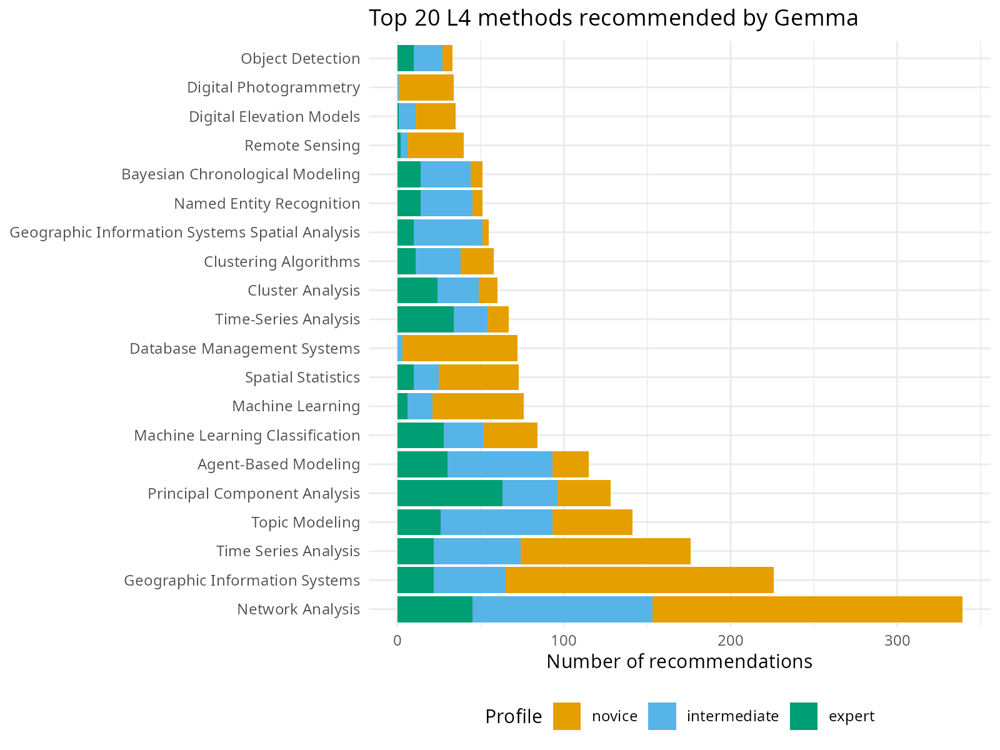

### Gemma L3 recommendations and post-2023 trajectories

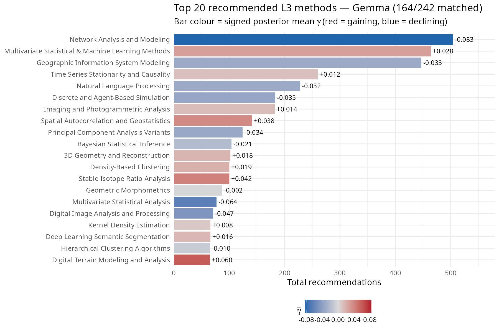

The top method landscape differs from Qwen3 in important ways. Agent-Based Simulation (L3-220), Qwen3's most-recommended method (693 recommendations), drops to 6th place for Gemma (183). Network Analysis remains prominent in both models. Gemma instead favours GIS Modeling (L3-226, 447), Multivariate Statistical & Machine Learning Methods (L3-167, 464), and Time Series analysis (L3-136, 260) — the latter does not appear in Qwen3's top 10 at all. Of the Gemma top 10, 5 have negative gamma (losing share post-2023) and 5 have positive gamma, though none is credibly nonzero — a less lopsided split than Qwen3's 7/3.

### Top 10 most-recommended L3 methods — Gemma

| L3 method | Total | Mean gamma | sig90 |
|---|---|---|---|
| L3-080: Network Analysis and Modeling | 504 | -0.083 | FALSE |
| L3-167: Multivariate Statistical & Machine Learning Methods | 464 | +0.028 | FALSE |
| L3-226: Geographic Information System Modeling | 447 | -0.033 | FALSE |
| L3-136: Time Series Stationarity and Causality | 260 | +0.012 | FALSE |
| L3-193: Natural Language Processing | 228 | -0.033 | FALSE |
| L3-220: Discrete and Agent-Based Simulation | 183 | -0.035 | FALSE |
| L3-176: Imaging and Photogrammetric Analysis | 182 | +0.014 | FALSE |
| L3-222: Spatial Autocorrelation and Geostatistics | 141 | +0.038 | FALSE |
| L3-019: Principal Component Analysis Variants | 124 | -0.034 | FALSE |
| L3-158: Bayesian Statistical Inference | 104 | -0.021 | FALSE |

### L2-level comparison: Gemma vs. literature

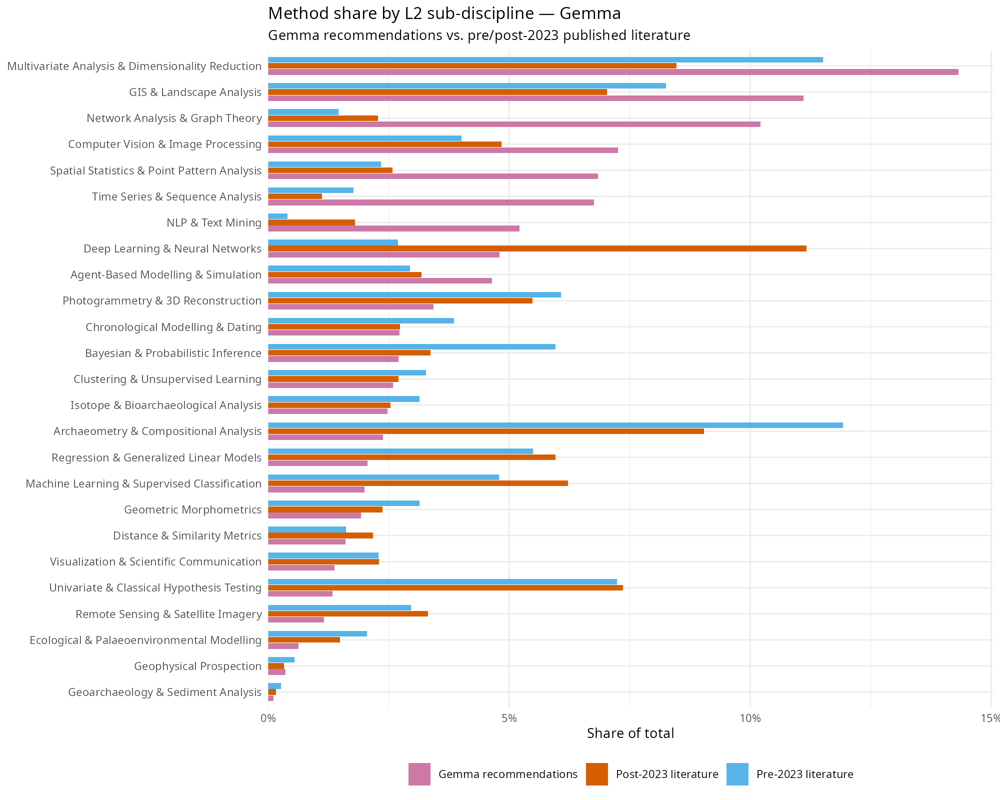

### Gemma: pre-existing trend vs. post-2023 excess

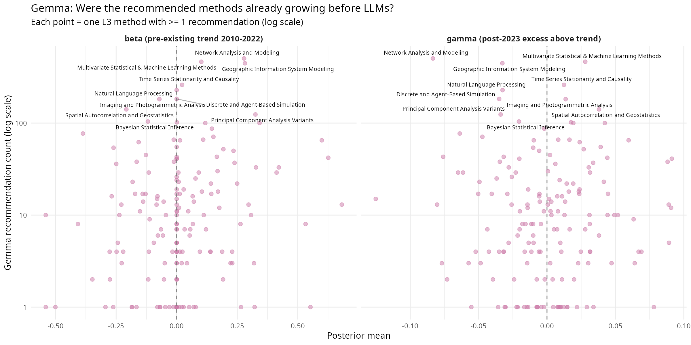

As with Qwen3, neither beta (pre-existing trend) nor gamma (post-2023 excess) predicts which methods Gemma recommends. The most-recommended methods span the full range of both parameters.

---

## Cross-model comparison: Qwen3 vs Gemma

Script: `R/07b_exploratory_gemma.R` (comparison section)

### L3 frequency correlation

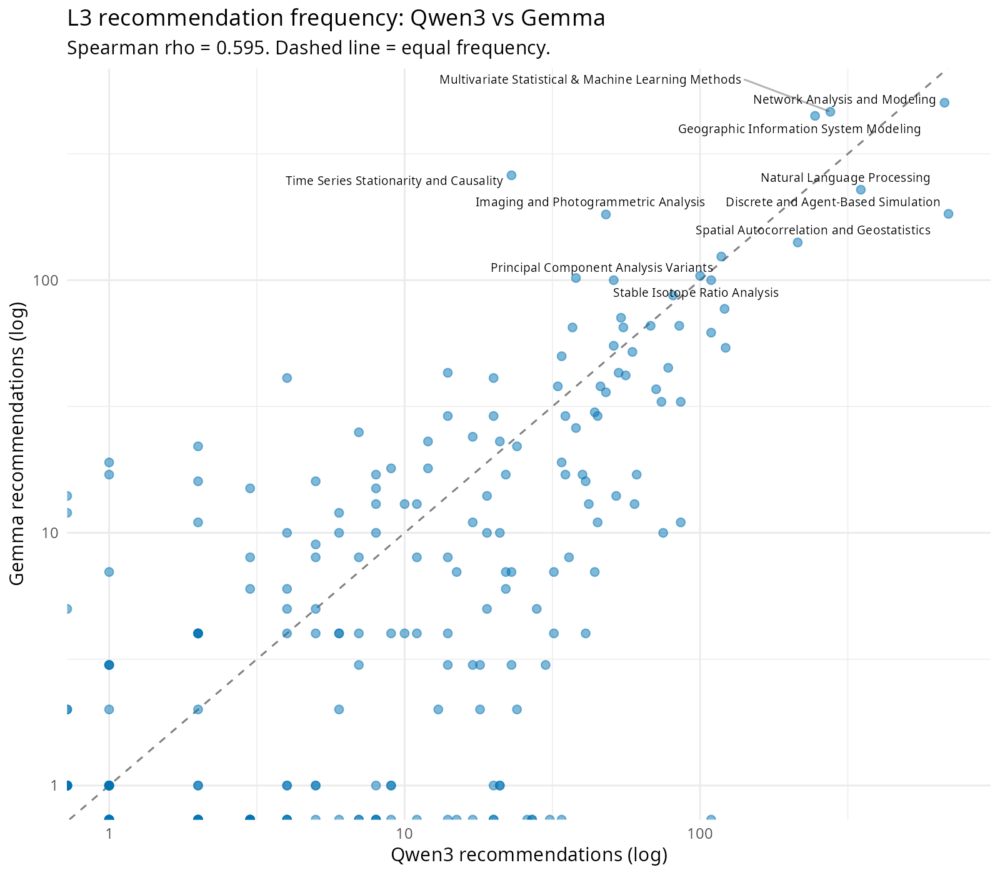

The Spearman rank correlation between Qwen3 and Gemma L3 recommendation frequencies is **rho = 0.595** — moderately strong but far from interchangeable. The two models agree on a broad set of popular methods (Network Analysis, GIS, ML, NLP, PCA) but diverge on which ones dominate. Of their respective top 20 L3 methods, 12 are shared and 8 are unique to each model.

### Top recommended methods: model divergences

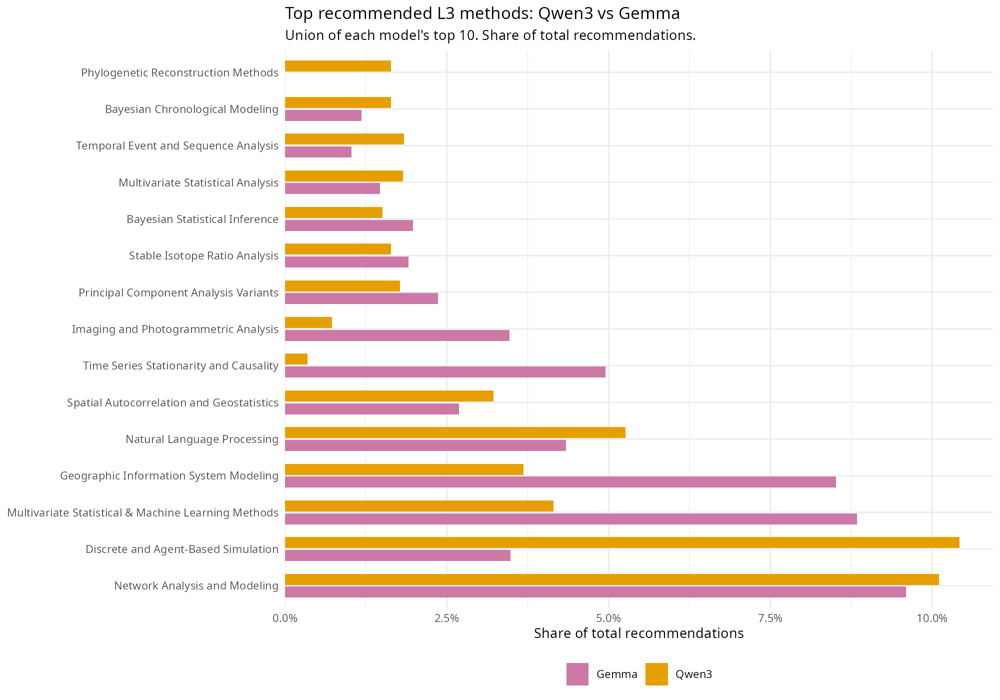

Key divergences:
- **Agent-Based Simulation (L3-220):** Qwen3's top method (10.4% of recommendations) drops to 3.5% for Gemma.
- **GIS Modeling (L3-226):** Gemma allocates 8.5% vs Qwen3's 3.7%.
- **ML Methods (L3-167):** Gemma favours this more strongly (8.8% vs 4.5%).
- **Time Series (L3-136):** Prominent for Gemma (5.0%) but absent from Qwen3's top 20.

These differences likely reflect different distributions in each model's training corpus rather than any substantive difference in the underlying archaeological question.

### Concentration comparison: the structural finding

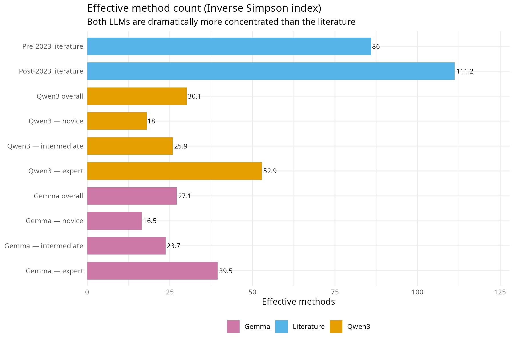

| Distribution | Total recommendations | Effective methods (Inv. Simpson) | Methods covering 50% of mass |
|---|---|---|---|
| Pre-2023 literature | 8,495 | 86 | 34 |
| Post-2023 literature | 6,660 | 111 | 41 |
| Qwen3 overall | 6,651 | 30 | 15 |
| Qwen3 — novice | 2,398 | 18 | 7 |
| Qwen3 — intermediate | 2,127 | 26 | 12 |
| Qwen3 — expert | 2,126 | 53 | 22 |
| Gemma overall | 5,252 | 27 | 10 |
| Gemma — novice | 1,716 | 17 | 6 |
| Gemma — intermediate | 1,671 | 24 | 9 |
| Gemma — expert | 1,865 | 40 | 15 |

Gemma is slightly *more* concentrated than Qwen3 at every level (overall: 27 vs 30 effective methods; novice: 17 vs 18; expert: 40 vs 53). Both models preserve the same profile gradient: novice < intermediate < expert. Both are dramatically below the published literature (86–111 effective methods).

### What the cross-model comparison adds

Three findings strengthen the overall analysis:

1. **The concentration mechanism is not model-specific.** Two models from different families (Alibaba vs Google DeepMind), with different training corpora, produce the same structural pattern: recommendation distributions far narrower than the published literature, with a monotone novice < intermediate < expert gradient. This is evidence that the concentration mechanism is a general property of LLM recommendation behaviour, not an artefact of one model.

2. **The *specific* methods recommended are model-dependent.** The rank correlation (rho = 0.595) shows moderate agreement, but substantial divergences exist in which methods each model favours most. If researchers consult different LLMs, they may receive different specific method recommendations — but the overall *narrowness* of those recommendations is consistent.

3. **Neither model tracks post-2023 trajectories.** Both models recommend established, recognisable methods regardless of their recent growth or decline. The mean-collapse mechanism — concentration of recommendations — is present in both, but neither model's specific recommendations align with the methods that actually changed share post-2023.

---

## Top 10 most-recommended L3 methods

**Note on sig90:** A method has `sig90 = TRUE` if the 90% posterior credible interval for its gamma (post-2023 excess slope above the pre-existing trend) excludes zero — meaning the post-2023 change in that method's share is credibly nonzero. None of the 242 methods reaches this threshold, indicating that individual post-2023 gamma estimates remain uncertain.

| L3 method | Total | Mean gamma | sig90 |
|---|---|---|---|
| L3-220: Discrete and Agent-Based Simulation | 693 | -0.035 | FALSE |
| L3-080: Network Analysis and Modeling | 672 | -0.083 | FALSE |
| L3-193: Natural Language Processing | 350 | -0.032 | FALSE |
| L3-167: Multivariate Statistical & Machine Learning Methods | 276 | +0.028 | FALSE |
| L3-226: Geographic Information System Modeling | 245 | -0.033 | FALSE |
| L3-222: Spatial Autocorrelation and Geostatistics | 214 | +0.038 | FALSE |
| L3-145: Temporal Event and Sequence Analysis | 122 | -0.010 | FALSE |
| L3-115: Multivariate Statistical Analysis | 121 | -0.064 | FALSE |
| L3-019: Principal Component Analysis Variants | 118 | -0.034 | FALSE |
| L3-007: Phylogenetic Reconstruction Methods | 109 | +0.019 | FALSE |

---

## Gamma and recommendation alignment

Of the 10 most-recommended methods, 7 have negative gamma (losing share post-2023). Only L3-167: Multivariate Statistical & Machine Learning Methods (+0.028), L3-222: Spatial Autocorrelation and Geostatistics (+0.038), and L3-007: Phylogenetic Reconstruction Methods (+0.019) have positive gamma among the top 10, and none is credibly nonzero. This pattern is the opposite of what the mean-collapse hypothesis predicts.

*None of the 242 methods reach sig90; the relationship is assessed jointly via the Bayesian negative-binomial regression (beta coefficient).*

---

## Bayesian negative-binomial regression (beta posteriors)

> **Note:** This single-predictor regression conflates training-corpus prevalence with post-2023 trajectory. The [two-predictor model below](#two-predictor-nb2-regression-prevalence-vs-trajectory) separates them and resolves the apparent negative direction reported here.

### The generative story

Think of it this way. For each of the 242 L3 methods in the v3 taxonomy (of which 190 received at least one recommendation), two things are known: how often Qwen3 recommended it across the simulation runs, and how much that method's share in the published literature shifted post-2023 beyond its pre-existing trend (that's gamma, from the main model). The question is: *does the magnitude of a method's post-2023 change predict how often the LLM reaches for it?*

If the LLM is reinforcing whatever is reshaping the literature — recommending the methods that gained, avoiding the ones that declined — a positive relationship is expected. If the LLM is blind to post-2023 trajectories and just reaches for whatever is most prevalent in its training data regardless of recent shifts, there would be no relationship.

The model is:

```
n_rec[i] ~ NegBin2( exp(alpha + beta * gamma_bar_i) , phi )
```

where gamma_bar_i is the *signed* posterior mean gamma for method *i* — positive for methods that gained share post-2023, negative for methods that declined.

**What "signed gamma" means.** Gamma is the excess slope estimated for each L3 method post-2023 by the main model: how much that method's share in the published literature shifted after 2023, above and beyond whatever trend it already had before. *Signed* means the value keeps its natural positive or negative direction, as opposed to taking the absolute value |gamma|. So gamma > 0 means a method gained share post-2023; gamma < 0 means it lost share; gamma near 0 means its trajectory was roughly flat. The sign matters here because the mean-collapse hypothesis is directional — it predicts LLMs should specifically recommend methods that *gained* share. Using |gamma| would lump sharply rising and sharply declining methods into the same high-|gamma| bucket, washing out the directional signal. Signed gamma is the correct operationalisation.

**alpha** is the log-rate intercept: the expected recommendation count for a method whose post-2023 trajectory is exactly flat (gamma = 0). Think of it as the LLM's default baseline — how often it would reach for a perfectly stable method.

**beta** is the parameter of interest. It is the change in log expected recommendation count for each unit increase in gamma_bar. A positive beta means the LLM reaches more often for methods that *gained* share post-2023 and less often for methods that declined — the directional prediction of mean collapse. A negative beta would mean the opposite (the LLM preferentially recommends declining methods). beta near 0 means the LLM is indifferent to post-2023 trajectory.

Note: the previous version of this analysis used |gamma_bar| (absolute value), which is a weaker, non-directional test. The signed version is the correct operationalisation of mean collapse, which predicts a positive beta specifically for *gaining* methods.

**phi** is the overdispersion of the negative-binomial. Some methods get recommended far more, or far less, than their gamma alone would predict — perhaps because they are simply famous (network analysis, machine learning) or highly niche. phi absorbs that extra noise beyond pure Poisson randomness.

**Priors:** beta ~ Normal(0, 1) — weakly informative. On the log scale, a beta of +/-1 would mean a one-unit increase in |gamma| multiplies expected recommendation count by e (approximately 2.7). That's a very large effect; the prior is saying such a strong effect would be surprising but not excluded. alpha ~ Normal(0, 2) similarly allows a wide baseline. phi ~ Exponential(1) is a weakly regularising prior on overdispersion.

The model is run four times: once on total recommendations (overall) and once separately for each expertise profile (novice / intermediate / expert).

---

### Convergence

Four independent Stan fits (4 chains x 1000 post-warmup draws each). Diagnostics saved to `data/output/step3_convergence.csv`. Good convergence requires max Rhat < 1.01 and min n_eff > 400.

| Profile | Max Rhat | Min n_eff |
|---|---|---|
| Overall | 1.002 | 3800 |
| Novice | 1.002 | 3565 |
| Intermediate | 1.002 | 3776 |
| Expert | 1.004 | 3288 |

---

### Results

| Profile | beta mean | 90% credible interval | P(beta > 0) |
|---|---|---|---|
| Overall | -0.861 | [-2.398, +0.679] | 0.178 |
| Novice | -0.729 | [-2.331, +0.875] | 0.220 |
| Intermediate | -0.585 | [-2.146, +0.973] | 0.261 |
| Expert | -0.285 | [-1.873, +1.297] | 0.386 |

The posteriors for beta are wide in all four conditions — every 90% CI crosses zero. All four posteriors lean negative, meaning the LLM tends to recommend methods that *lost* share post-2023 rather than those that gained. This is the opposite direction from what the mean-collapse hypothesis predicts.

**Profile gradient.** The mean-collapse hypothesis predicts a monotone ordering novice > intermediate > expert. The observed ordering is reversed: novice (-0.729) < intermediate (-0.585) < expert (-0.285). The novice profile has the most negative beta and the lowest P(beta > 0), the opposite of what the hypothesis predicts. However, the posteriors overlap substantially and the differences are not credible.

**Note on improved match rate.** With the experiment data classified directly against the v3 taxonomy, 190/242 methods (78%) now have at least one recommendation, compared to 53/242 (22%) under the previous v2-classified data. Despite this substantially improved coverage, the qualitative result is unchanged: beta posteriors remain negative and wide, with CIs crossing zero. The negative direction is now somewhat stronger (overall beta = -0.861 vs. -0.309 previously), but the conclusion is the same — no evidence that the LLM preferentially recommends methods that gained share post-2023.

---

### Interpretation: what this does and does not mean

**Step 3 does not support the mean-collapse hypothesis.** All four beta posteriors are negative and wide, with CIs crossing zero. The data neither confirm nor refute the causal link between LLM recommendations and post-2023 shifts, but the direction of the effect is opposite to the prediction.

The width of the posteriors and the negative direction reflect two structural limitations:

1. **Gamma is estimated with substantial noise.** None of the 242 methods has a 90% credible interval for gamma that excludes zero. When the predictor is this noisy, the coefficient is attenuated toward zero regardless of the true relationship.

2. **Qwen3 is a proxy for the LLMs archaeologists are actually using.** The reshuffling in the corpus reflects whatever LLMs researchers were querying during 2023-2025 — primarily ChatGPT and GPT-4. Qwen3 is a different model from a different family with a different training corpus.

The honest summary is: with the experiment data now properly classified against the v3 taxonomy and 190/242 methods covered, Step 3 provides a fair test of the mean-collapse hypothesis. The test finds no directional support — the LLM's recommendations are not aligned with methods gaining share post-2023. The Gemma replication (see below) partially addresses the proxy concern: a second model from a different family produces the same structural concentration pattern, suggesting the null result is not an artefact of Qwen3's specific training data. The remaining uncertainty comes from noisy gamma estimates.

---

### Plot A — Overall beta posterior

*This plot shows the full posterior distribution of beta estimated from 190 matched L3 methods (pooling across novice, intermediate, and expert profiles). The x-axis is the value of beta; the y-axis is posterior density. The distribution leans negative (mean = -0.861, P(beta > 0) = 0.178) and the 90% CI crosses zero [-2.398, +0.679].*


### Plot B — Beta posterior by expertise profile

*This plot overlays or panels the beta posteriors separately for the three researcher profiles (novice, intermediate, expert). All three distributions lean negative, with novice most strongly so (-0.729) and expert closest to zero (-0.285). The predicted monotone gradient (novice > intermediate > expert) is reversed. All three distributions straddle zero.*


### Plot C — Signed gamma vs. LLM recommendation count


### Plot D — Top 20 recommended methods and their post-2023 direction


All bars in Plot D are grey: all most-recommended methods have uncertain post-2023 trajectories (90% CI for gamma crosses zero), since no method in the taxonomy reaches sig90. Most top-recommended methods have negative gamma (losing share).

---

## Gemma: Bayesian negative-binomial regression

Script: `R/06b_step3_llm_comparison_gemma.R`

The same negative-binomial regression is run on Gemma recommendation counts. The model, priors, and diagnostics are identical to the Qwen3 analysis above.

### Convergence

| Profile | Max Rhat | Min n_eff |
|---|---|---|
| Overall | 1.001 | 3646 |
| Novice | 1.002 | 3990 |
| Intermediate | 1.001 | 3653 |
| Expert | 1.001 | 3588 |

### Results

| Profile | beta mean | 90% credible interval | P(beta > 0) |
|---|---|---|---|
| Overall | -0.426 | [-1.941, +1.132] | 0.323 |
| Novice | -0.179 | [-1.749, +1.385] | 0.429 |
| Intermediate | -0.359 | [-1.960, +1.254] | 0.365 |
| Expert | -0.344 | [-1.930, +1.268] | 0.360 |

### Gemma Plot A — Overall beta posterior

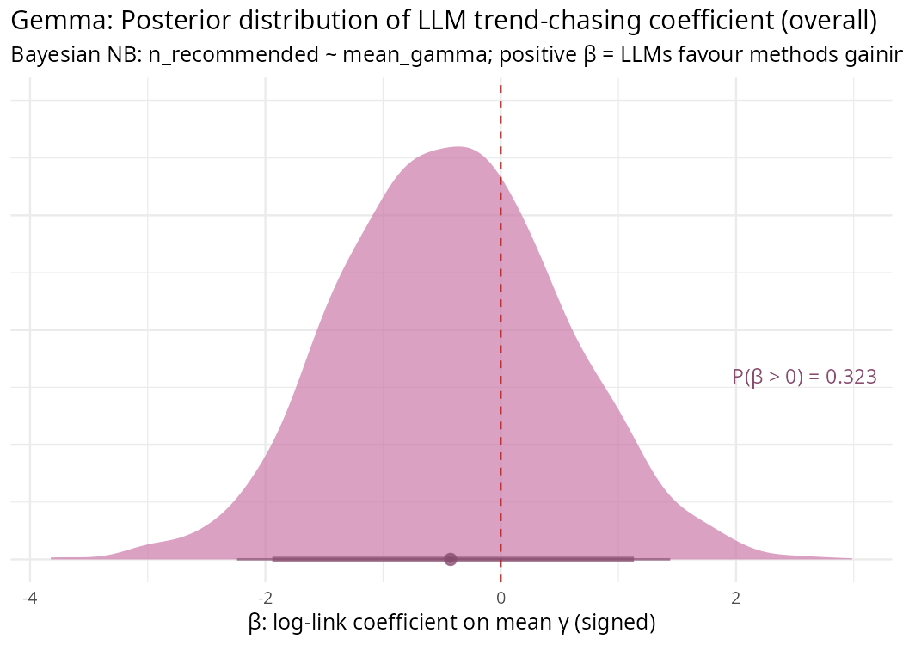

### Gemma Plot B — Beta posterior by expertise profile

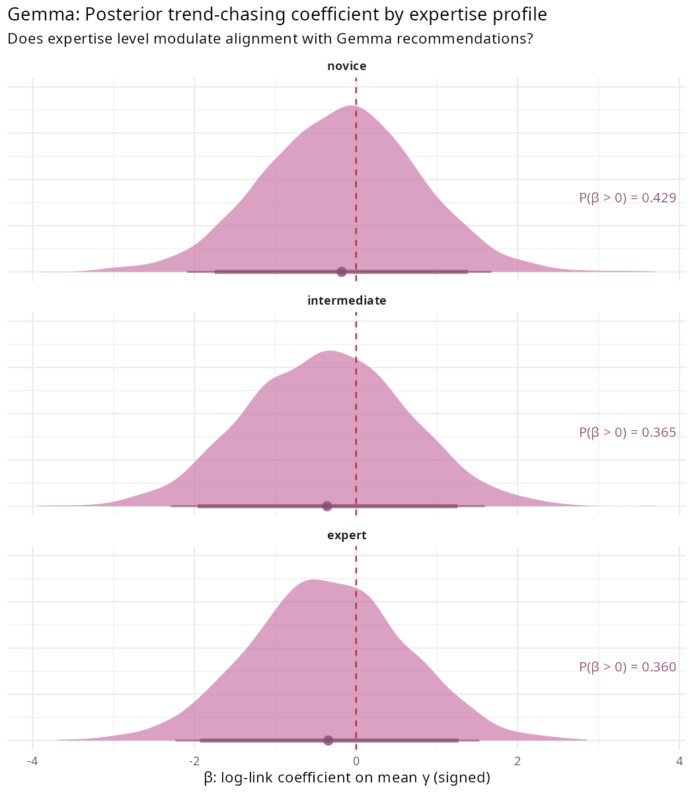

### Gemma Plot C — Signed gamma vs. recommendation count

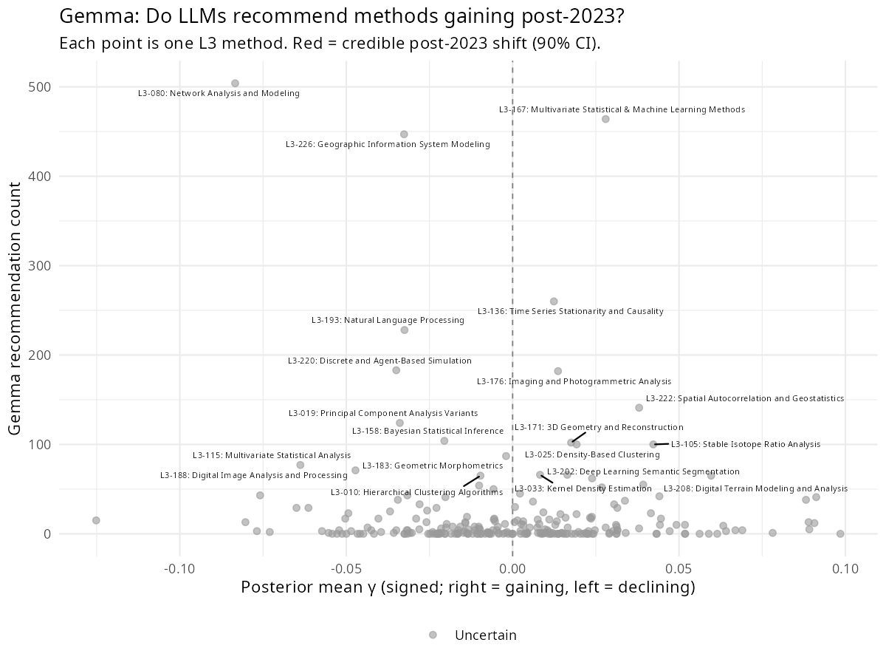

### Gemma Plot D — Top 20 recommended methods and their post-2023 direction

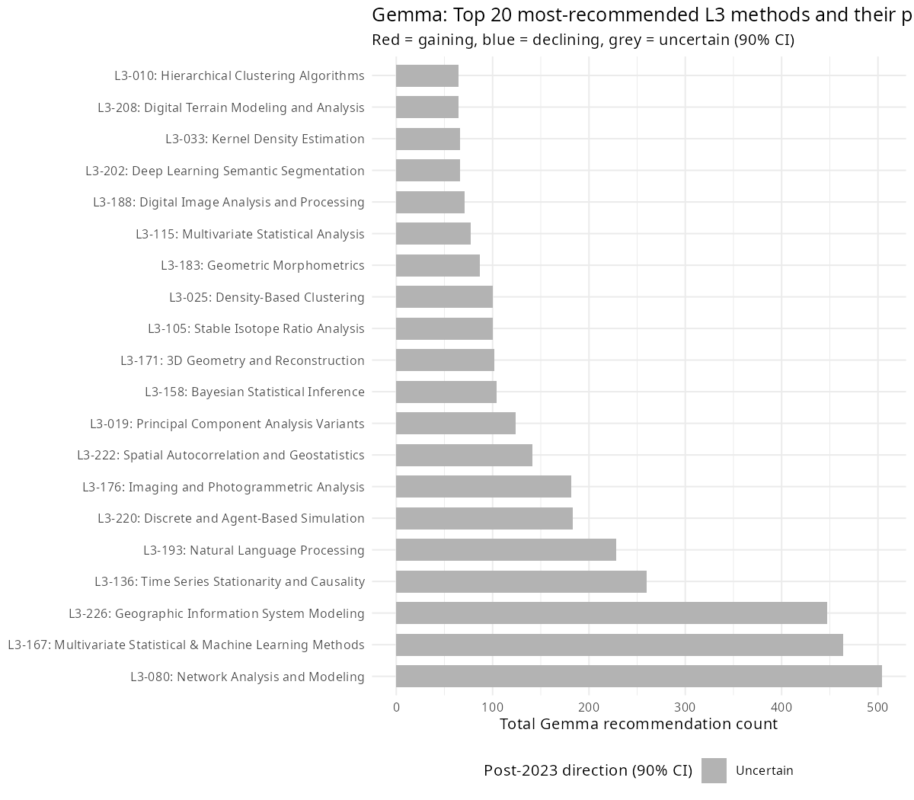

### Cross-model regression comparison

| Profile | Qwen3 beta | Qwen3 P(>0) | Gemma beta | Gemma P(>0) |
|---|---|---|---|---|
| Overall | -0.861 | 0.178 | -0.426 | 0.323 |
| Novice | -0.729 | 0.220 | -0.179 | 0.429 |
| Intermediate | -0.585 | 0.261 | -0.359 | 0.365 |
| Expert | -0.285 | 0.386 | -0.344 | 0.360 |

Both models produce negative beta posteriors with CIs crossing zero — the same qualitative null result. Gemma's posteriors are less negative than Qwen3's (overall: -0.426 vs -0.861), but both are centred well below zero and far from the positive values that the mean-collapse hypothesis predicts.

The profile gradient differs between models. Qwen3 shows the reversed gradient (novice most negative, expert least), while Gemma's profile posteriors are flatter and do not show a clear ordering. In both cases the profile differences are not credible — the posteriors overlap substantially. The consistent finding is that no profile, in either model, shows evidence of positive beta.

---

## Bayesian concentration posteriors

Script: `R/08_experiment_concentration.R`

The inverse Simpson indices reported in the exploratory section are point estimates from raw counts — they carry no uncertainty. This section replaces them with full posterior distributions via the conjugate Dirichlet update. Given a count vector n = (n_1, ..., n_K) across K = 242 methods, the posterior over proportions is Dir(1 + n_1, ..., 1 + n_K). Drawing from this posterior and computing inv_simpson = 1 / sum(p_k^2) on each draw gives a full distribution over effective method counts.

### Posterior concentration summary

| Distribution | Median effective methods | 90% CI |
|---|---|---|
| Pre-2023 literature | 88.4 | [85.4, 91.4] |
| Post-2023 literature | 113.6 | [110.5, 116.9] |
| Qwen3 — overall | 32.0 | [30.5, 33.4] |
| Qwen3 — novice | 21.4 | [20.0, 22.9] |
| Qwen3 — intermediate | 30.9 | [28.6, 33.4] |
| Qwen3 — expert | 60.9 | [57.0, 64.9] |
| Gemma — overall | 29.2 | [28.0, 30.4] |
| Gemma — novice | 20.9 | [19.4, 22.4] |
| Gemma — intermediate | 29.8 | [27.6, 32.0] |
| Gemma — expert | 47.2 | [43.7, 50.6] |

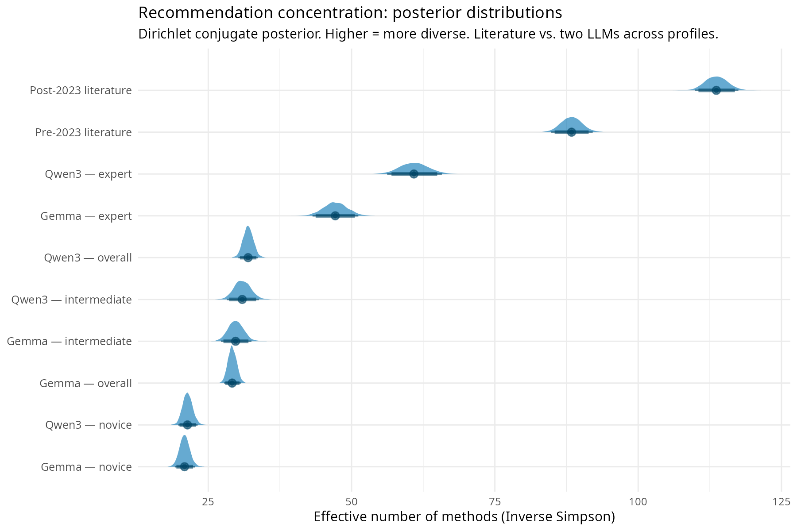

### Posterior contrasts

The conjugate posterior allows direct probability statements about concentration differences:

- **Qwen3 vs Gemma (overall):** Qwen3 is credibly more diverse than Gemma (median difference = +2.8 effective methods, 90% CI [+0.9, +4.6], P(Qwen > Gemma) = 0.992).
- **Qwen3 vs Gemma (novice):** Not credibly different at this profile (median = +0.5, P = 0.657). Both novice profiles collapse to ~20 effective methods.
- **Literature vs LLMs:** Both LLMs are credibly below the published literature (P = 1.000 in both cases). The post-2023 literature uses ~114 effective methods; the most concentrated LLM profile (Gemma novice) uses ~21 — a 5:1 ratio.

The profile gradient (novice < intermediate < expert) is preserved in both models and survives with full posterior uncertainty. The literature's own diversification — from 88 effective methods pre-2023 to 114 post-2023 — is itself credibly nonzero (the CIs do not overlap). The field is diversifying while the LLMs recommend from a narrowing subset.

---

## Two-predictor NB2 regression: prevalence vs trajectory

Script: `R/09_literature_vs_llm.R`  
Stan model: `stan/nb2_prevalence_gamma.stan`

### The question

The single-predictor regression (sections above) asks: does gamma predict recommendation frequency? But this conflates two mechanisms. An LLM trained primarily on pre-2023 literature would naturally recommend methods that are prevalent in that corpus. If pre-2023 prevalence also correlates with gamma (because growing methods tend to be common), the regression picks up a training-data effect rather than a post-2023 tracking effect.

The two-predictor model separates these:

```
n_rec[i] ~ NB2(exp(alpha + b_pre * log1p(n_pre[i]) + b_gamma * gamma[i]), phi)
```

where `n_pre[i]` is the number of pre-2023 papers using method *i* (a proxy for training-corpus exposure) and `gamma[i]` is the signed post-2023 excess. b_pre measures whether the LLM reflects its training data. b_gamma measures whether, *after controlling for training-data prevalence*, the LLM additionally tracks post-2023 shifts.

### Results

| Model | Profile | b_pre mean | b_pre 90% CI | P(b_pre > 0) | b_gamma mean | b_gamma 90% CI | P(b_gamma > 0) |
|---|---|---|---|---|---|---|---|
| Qwen3 | overall | +0.658 | [+0.504, +0.803] | 1.000 | +0.083 | [-1.470, +1.656] | 0.537 |
| Qwen3 | novice | +1.048 | [+0.821, +1.281] | 1.000 | +0.107 | [-1.504, +1.684] | 0.547 |
| Qwen3 | intermediate | +0.674 | [+0.490, +0.857] | 1.000 | +0.035 | [-1.470, +1.574] | 0.518 |
| Qwen3 | expert | +0.417 | [+0.262, +0.574] | 1.000 | +0.224 | [-1.359, +1.761] | 0.586 |
| Gemma | overall | +0.580 | [+0.411, +0.754] | 1.000 | +0.146 | [-1.422, +1.724] | 0.556 |
| Gemma | novice | +0.684 | [+0.390, +0.991] | 1.000 | +0.087 | [-1.522, +1.659] | 0.531 |
| Gemma | intermediate | +0.537 | [+0.332, +0.741] | 1.000 | +0.032 | [-1.569, +1.646] | 0.521 |
| Gemma | expert | +0.506 | [+0.339, +0.671] | 1.000 | +0.218 | [-1.340, +1.780] | 0.594 |

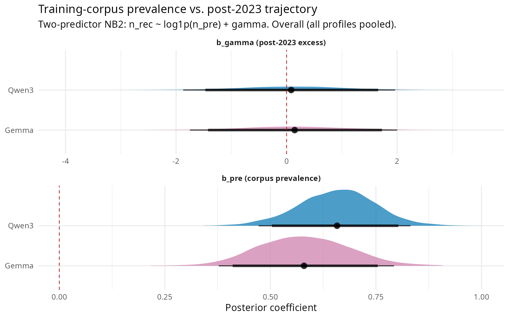

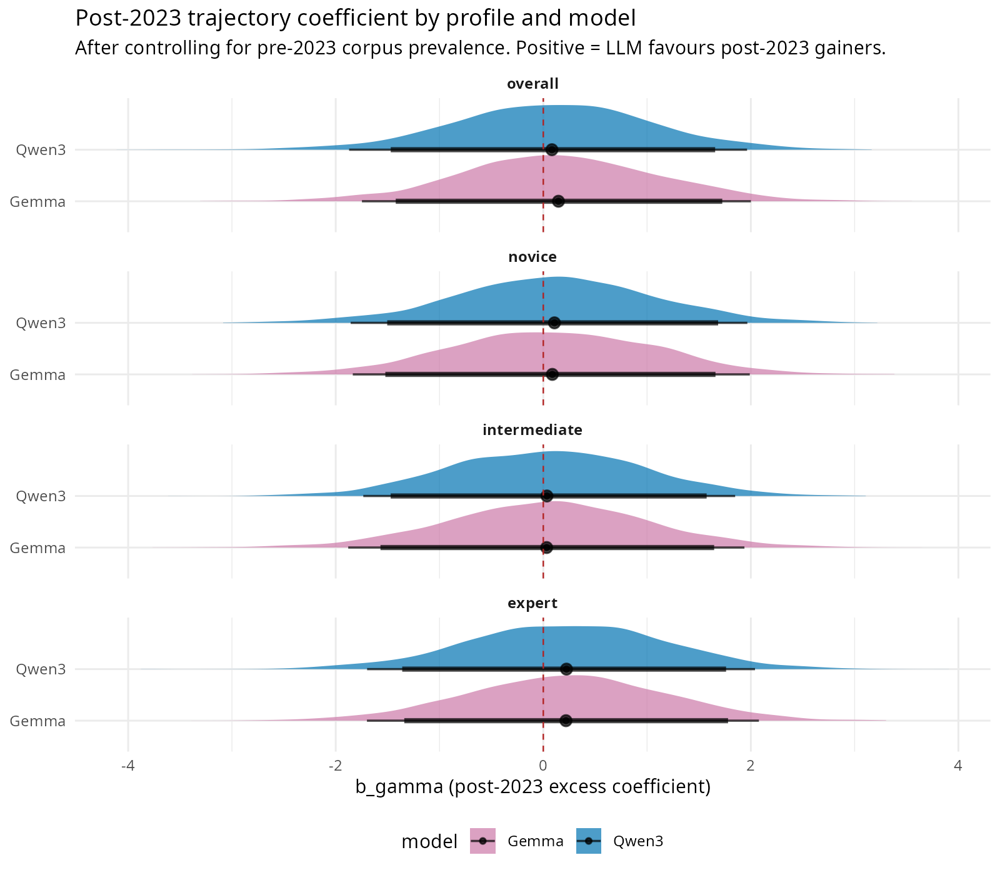

### Interpretation

**b_pre is credibly positive in every condition.** Both models, all profiles, P(b_pre > 0) = 1.000. The LLMs recommend methods in proportion to how often those methods appeared in the pre-2023 literature. This is the training-data reflection effect: the models reach for methods they have seen most often.

**b_gamma is indistinguishable from zero in every condition.** All 90% CIs cross zero, P(b_gamma > 0) ranges from 0.518 to 0.594. After controlling for training-corpus prevalence, neither LLM shows any sensitivity to post-2023 trajectory. The models neither chase methods that gained share post-2023 nor avoid methods that lost share — they are simply indifferent to post-2023 changes once pre-2023 prevalence is accounted for.

**The novice profile has the strongest b_pre.** Qwen3 novice: b_pre = +1.048 vs expert: +0.417. Gemma shows the same pattern (novice +0.684 vs expert +0.506). The less methodological guidance the researcher provides, the more the LLM falls back on training-corpus prominence. This is the mechanism behind the concentration gradient: novice profiles produce narrower recommendations because they allow the LLM to default entirely to corpus frequency.

**The previous single-predictor beta was negative because of a confound.** In the single-predictor model, beta was negative (overall: Qwen -0.861, Gemma -0.426). The two-predictor model resolves this: the LLM's recommendations scale with pre-2023 prevalence (positive b_pre), and the most prevalent pre-2023 methods happen to have slightly negative gamma (they were already large and stable, not post-2023 gainers). Once prevalence is separated from gamma, the apparent negative relationship disappears.

---

## Overall assessment: did the paper succeed?

The short answer is: **Steps 1-2 still hold weakly; Step 3 finds no support for mean collapse but clearly identifies the underlying mechanism.**

**What the paper delivers:**

- **There is weak evidence of post-2023 reshuffling.** The main model (Steps 1-2) finds sigma_gamma = 0.110 [0.010, 0.222] — above zero but with the lower bound near it. Some reshuffling occurred, but its magnitude is small relative to long-run trends (sigma_gamma < sigma_beta, 0.110 vs 0.288). No individual method has a credible non-zero gamma at the 90% level.
- **Sensitivity analyses are consistently null.** The 2022-break robustness check (sigma_gamma = 0.045), the count-threshold sensitivity (beta = -0.138), and the direct diversity trajectory model (sigma_gamma = 0.064) all return effectively null results.
- **LLM recommendations are driven by training-corpus prevalence, not post-2023 trajectory.** The two-predictor NB2 regression cleanly separates the two mechanisms. b_pre is credibly positive in all 8 conditions (P = 1.000): both LLMs recommend methods proportional to their pre-2023 corpus presence. b_gamma is indistinguishable from zero in all conditions (P ranges 0.518–0.594): neither LLM tracks post-2023 shifts after controlling for prevalence.
- **The concentration mechanism is structural and model-independent.** Both LLMs produce recommendation distributions dramatically narrower than the published literature (posterior median: 29–32 vs 88–114 effective methods). The profile gradient (novice < intermediate < expert) is preserved with full Bayesian uncertainty. The concentration gap is credible (P = 1.000 for literature vs either LLM).

**What the paper does not deliver:**

- **No evidence that LLM recommendations align with post-2023 gains.** The single-predictor regression produced negative beta posteriors, but the two-predictor model shows this was a confound: the most prevalent pre-2023 methods (which the LLM favours) happen to have slightly negative gamma. Once prevalence is controlled, the LLM is indifferent to post-2023 trajectory.
- **The cross-model replication (Gemma) confirms the concentration mechanism is general** but does not change the null result: neither model's specific recommendations align with post-2023 gains.
- **No individual method-level claims are credible.** 0/242 methods reach sig90.

**Honest framing:**

The evidence for post-2023 methodological reshuffling in computational archaeology is weak. Some reshuffling exists (sigma_gamma > 0), but it is small, uncertain, and dwarfed by pre-existing trends.

The experiment clarifies *what LLMs actually do* when asked for methodological advice. They recommend methods in proportion to pre-2023 corpus prevalence (b_pre credibly positive, P = 1.000 in all conditions) and are indifferent to post-2023 trajectory (b_gamma indistinguishable from zero in all conditions). The less methodological guidance a researcher provides, the stronger this prevalence effect (novice b_pre > expert b_pre in both models), producing the concentration gradient observed in the inverse Simpson analysis.

Both Qwen3 and Gemma produce recommendation distributions dramatically more concentrated than the published literature (29–32 vs 88–114 effective methods, with full Bayesian uncertainty confirming the gap). The mechanism for mean collapse — a narrow, corpus-frequency-driven recommendation distribution — is clearly present and is not model-specific. But the literature has not converged. The inverse Simpson index has risen from ~88 (pre-2023) to ~114 (post-2023), and this diversifying trend continued uninterrupted through the post-LLM period.

The honest summary: LLMs recommend from training-corpus prominence (the gun is loaded), but 3–4 years after widespread adoption, the field continues to diversify (it has not fired). Whether this reflects low adoption rates, researcher selectivity in which LLM advice they follow, or countervailing forces toward specialisation — the current data cannot distinguish.

---

## Sensitivity and robustness notes

### Would a frequentist correlation have changed the Step 3 result?

Almost certainly not. The core result — beta posteriors that are negative and wide, with CIs crossing zero — is driven by noisy gamma predictors, not the inferential framework. A frequentist analysis would face the same structural problem and would likely return a non-significant result for the same reason.

What the Bayesian approach adds is expressive precision. Instead of a binary "p > 0.05, fail to reject null," the posteriors communicate the shape of the uncertainty. The negative-binomial model also explicitly handles overdispersion in recommendation counts. The qualitative conclusion would be the same under any framework.

### Would adjusting the L2 taxonomy groupings change the results?

**The headline finding (sigma_gamma weakly above zero) would likely survive.** The post-2023 reshuffling signal is present in the raw counts, though weak.

**Individual gamma estimates would change, potentially substantially.** Each L3 method's gamma is estimated relative to the other methods sharing its L2 group. Reassigning a method to a different L2 group changes its competitive reference set — its baseline, its pre-2023 trend, the zero-sum constraint it operates under. The specific list of "gaining" and "losing" methods from Step 2 could look different under a different taxonomy.

**Step 3 (beta) would likely remain negative or near zero regardless of groupings.** All gamma estimates carry substantial uncertainty, and the LLM's recommendations are orthogonal to post-2023 trajectories regardless of how methods are grouped.

The one scenario in which L2 restructuring could materially change the Step 3 conclusion is if the current groupings are actively suppressing signal — for instance, if a genuinely gaining method is grouped with other gaining methods, making its *relative* gain within the group appear flat. This is theoretically possible but would require a substantive, theoretically motivated argument for which specific restructuring reveals the true signal rather than a different one.
