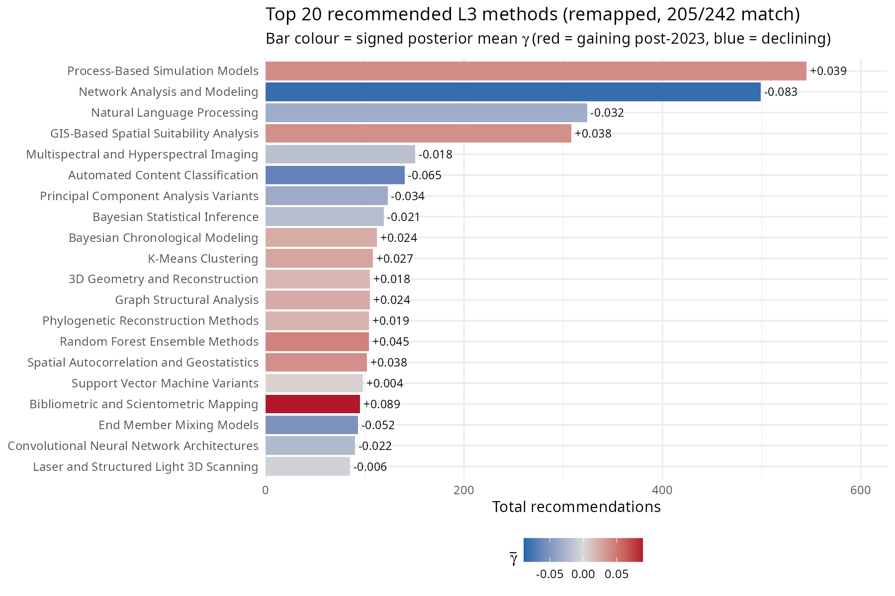

# Step 3 Results — LLM Recommendation vs. Bayesian Gamma

Script: `R/06_step3_llm_comparison.R`  
Run date: 2026-05-11

---

## Experiment data summary

| Metric | Value |
|---|---|
| L3 methods in vocabulary (taxonomy v3) | 242 |
| L3 methods receiving ≥ 1 recommendation | 53 (22%) |
| Total recommendations matched | 1,494 |

### Recommendations by profile

| Profile | Total recommendations | Distinct L3 methods covered |
|---|---|---|
| Novice | 495 | 36 |
| Intermediate | 527 | 37 |
| Expert | 472 | 47 |

**Note on low match rate:** The experiment responses were classified using the v2 taxonomy (225 L3 methods). Taxonomy v3 has a different L3 vocabulary (242 methods with different labels), so only 53 methods match. This drastically reduces the power of the regression. A fair test would require reclassifying the experiment responses against the v3 L3 vocabulary.

---

## Exploratory descriptive analysis

Script: `R/07_exploratory_graphs.R`

Before fitting a regression, it is useful to ask what the experiment data look like at face value. The graphs below describe the LLM's recommendation behaviour at three levels of granularity — raw method names (L4), taxonomy-mapped techniques (L3), and sub-disciplines (L2) — without any inferential model. All counts use the v2→v3 remapped data (205/242 methods matched; see Sensitivity B).

### What does Qwen3 actually recommend? (L4 level)

The 20 most-recommended raw method names show extreme concentration. Agent-Based Modeling alone accounts for roughly 500 recommendations (after collapsing variant names like "Agent-Based Modeling (ABM)"). Network Analysis and GIS follow. The novice profile contributes disproportionately to the top methods, consistent with the hypothesis that less-constrained prompts produce more generic recommendations.


### L3 recommendations and post-2023 trajectories (remapped data)

Mapping L4 recommendations to the L3 taxonomy reveals that the most-recommended methods tend to have *negative* γ (blue = declining share post-2023). Process-Based Simulation Models (L3-216, γ = +0.039) and Network Analysis and Modeling (L3-080, γ = −0.083) dominate. Only Bibliometric and Scientometric Mapping (γ = +0.089) among the top 20 has a clearly positive γ. The LLM reaches for methods that are established and prevalent in its training data, not methods that gained share after 2023.



### L2-level comparison: LLM vs. pre/post-2023 literature

Aggregating to the 25 L2 sub-disciplines shows a striking pattern. The LLM massively over-recommends a few sub-disciplines — Network Analysis & Graph Theory, Agent-Based Modelling & Simulation, Machine Learning & Supervised Classification — relative to their share in either the pre- or post-2023 literature. Conversely, it under-recommends many empirical sub-disciplines (Archaeometry & Compositional Analysis, Isotope & Bioarchaeological Analysis, Chronological Modelling & Dating). The LLM's recommendation profile is more concentrated than the actual literature in either period.


### Were the recommended methods already growing before LLMs?

This is the key confounding question: maybe the LLM simply recommends methods that were already on an upward trajectory, and those methods continued to grow for reasons unrelated to LLMs. The main model separates the pre-existing trend (β, the long-run slope 2010–2022) from the post-2023 excess (γ, the additional shift above the pre-existing trend). If the LLM tracks pre-existing growth, we'd see high recommendation counts for methods with positive β. If it tracks post-2023 acceleration specifically, we'd see alignment with positive γ.

The two-panel scatter below tests both. Each point is an L3 method that received at least one recommendation (205 methods). Neither panel shows a relationship: the most-recommended methods (Process-Based Simulation Models, Network Analysis, NLP, GIS) span the full range of both β and γ. The LLM's preferences are orthogonal to both pre-existing growth and post-2023 acceleration.


### The mean-collapse mechanism: concentration comparison

The previous graphs ask whether the LLM recommends the *same* methods that gained share — but that is not the only way to test mean collapse. The more direct question is: **is the LLM's recommendation distribution narrower than the literature's?** If researchers adopt LLM suggestions, the field's methodological diversity should be pulled toward the LLM's concentrated profile.

The answer is unambiguous. The LLM's effective method count (Inverse Simpson) is dramatically lower than the literature's — and the gap is largest for the novice profile, consistent with the hypothesis:

| Distribution | Effective methods (Inv. Simpson) | Methods covering 50% of mass |
|---|---|---|
| Pre-2023 literature | 86 | 34 |
| Post-2023 literature | 111 | 41 |
| LLM overall | 38 | 18 |
| LLM — novice | 20 | — |
| LLM — intermediate | 27 | — |
| LLM — expert | 67 | — |

The published literature has been *diversifying* since 2010, and this trend continued uninterrupted through the post-2023 period — the within-group diversity trajectories in the [primary L2→L3 analysis](../docs/l2_l3_results.md) show no post-2023 downturn in most sub-disciplines. The LLM's overall diversity (38) sits below any year in the literature's history. The profile gradient (novice 20 < intermediate 27 < expert 67) matches the prediction: less-constrained prompts produce more concentrated output.

### What these descriptive analyses suggest

Four patterns emerge:

1. **The LLM is dramatically more concentrated than the literature.** 18 methods cover 50% of LLM recommendations, compared to 34–41 for the literature. The mechanism for mean collapse — a narrow recommendation distribution — is clearly present. The novice profile is the most concentrated (20 effective methods), consistent with the hypothesis that unconstrained LLM advice is the most homogenising.

2. **But the literature is diversifying, not converging.** The Inverse Simpson index has risen from ~63 (2010) to ~105 (2026), and this upward trend continued through 2023–2026. If LLMs were driving convergence, we would expect a post-2023 downturn in diversity — but there is none. The mechanism exists; the effect has not manifested.

3. **The LLM recommends popular, established methods.** The most-recommended L3 methods tend to have negative γ (losing share post-2023, relative to trend). The LLM appears to recommend from its training corpus — methods that were prominent before 2023 — rather than tracking post-2023 shifts.

4. **Neither pre-existing growth nor post-2023 excess predicts recommendations.** The two-panel scatter shows that the LLM's preferences are independent of both β (pre-existing trajectory) and γ (post-2023 excess). The LLM is not chasing methods that were already rising, nor methods that specifically accelerated after LLM adoption. It is recommending the most *recognisable* methods — those with the largest training-corpus footprint — regardless of their temporal trajectory.

**Reconciling the concentration gap with the null regression.** The regression (below) asks: "do the *specific* methods gaining share align with LLM recommendations?" The concentration comparison asks: "is the LLM's *overall menu* narrower than the literature's?" These are different tests. The regression is null because the LLM's concentrated recommendations do not align with the particular methods that changed post-2023 — it recommends a narrow, stable set of established methods regardless of which methods are currently rising or falling. The distributional test (Sensitivity C) found a positive signal because the LLM's *overall shape* is marginally closer to the post-2023 literature than the pre-2023 literature — a weaker, non-directional claim about distributional resemblance.

---

## Top 10 most-recommended L3 methods

**Note on sig90:** A method has `sig90 = TRUE` if the 90% posterior credible interval for its γ (post-2023 excess slope above the pre-existing trend) excludes zero — meaning the post-2023 change in that method's share is credibly nonzero. None of the 242 methods reaches this threshold, indicating that individual post-2023 γ estimates remain uncertain.

| L3 method | Total | Mean γ | sig90 |
|---|---|---|---|
| L3-193: Natural Language Processing | 324 | −0.032 | FALSE |
| L3-236: Automated Content Classification | 140 | −0.065 | FALSE |
| L3-019: Principal Component Analysis Variants | 123 | −0.034 | FALSE |
| L3-079: Graph Structural Analysis | 105 | +0.024 | FALSE |
| L3-206: Convolutional Neural Network Architectures | 90 | −0.022 | FALSE |
| L3-115: Multivariate Statistical Analysis | 78 | −0.064 | FALSE |
| L3-020: Factor and Correspondence Analysis | 57 | −0.028 | FALSE |
| L3-021: Multivariate Ordination and Seriation | 57 | −0.006 | FALSE |
| L3-170: Neural Radiance Field Rendering | 39 | −0.049 | FALSE |
| L3-037: Network Centrality Metrics | 29 | −0.005 | FALSE |

---

## Gamma and recommendation alignment

Of the 10 most-recommended methods, 8 have negative γ (losing share post-2023). Only L3-079: Graph Structural Analysis (+0.024) has a meaningfully positive γ among the top recommended. This pattern is the opposite of what the mean-collapse hypothesis predicts, but it must be interpreted cautiously given the low match rate (53/242 methods) between the experiment and the v3 taxonomy.

*None of the 242 methods reach sig90; the relationship is assessed jointly via the Bayesian negative-binomial regression (β coefficient).*

---

## Bayesian negative-binomial regression (β posteriors)

### The generative story

Think of it this way. For each of the 242 L3 methods in the v3 taxonomy (of which 53 match experiment responses), we know two things: how often Qwen3 recommended it across the simulation runs, and how much that method's share in the published literature shifted post-2023 beyond its pre-existing trend (that's γ, from the main model). The question we're asking is: *does the magnitude of a method's post-2023 change predict how often the LLM reaches for it?*

If the LLM is reinforcing whatever is reshaping the literature — recommending the methods that gained, avoiding the ones that declined — we'd expect a positive relationship. If the LLM is blind to post-2023 trajectories and just reaches for whatever is most prevalent in its training data regardless of recent shifts, there'd be no relationship.

The model is:

```
n_rec[i] ~ NegBin2( exp(α + β × γ̄ᵢ) , φ )
```

where γ̄ᵢ is the *signed* posterior mean gamma for method *i* — positive for methods that gained share post-2023, negative for methods that declined.

**What "signed γ" means.** γ (gamma) is the excess slope estimated for each L3 method post-2023 by the main model: how much that method's share in the published literature shifted after 2023, above and beyond whatever trend it already had before. *Signed* means the value keeps its natural positive or negative direction, as opposed to taking the absolute value |γ|. So γ > 0 means a method gained share post-2023; γ < 0 means it lost share; γ ≈ 0 means its trajectory was roughly flat. The sign matters here because the mean-collapse hypothesis is directional — it predicts LLMs should specifically recommend methods that *gained* share. Using |γ| would lump sharply rising and sharply declining methods into the same high-|γ| bucket, washing out the directional signal. Signed γ is the correct operationalisation.

**α** is the log-rate intercept: the expected recommendation count for a method whose post-2023 trajectory is exactly flat (γ = 0). Think of it as the LLM's default baseline — how often it would reach for a perfectly stable method.

**β** is the parameter we care about. It is the change in log expected recommendation count for each unit increase in γ̄. A positive β means the LLM reaches more often for methods that *gained* share post-2023 and less often for methods that declined — the directional prediction of mean collapse. A negative β would mean the opposite (the LLM preferentially recommends declining methods). β ≈ 0 means the LLM is indifferent to post-2023 trajectory.

Note: the previous version of this analysis used |γ̄| (absolute value), which is a weaker, non-directional test. The signed version is the correct operationalisation of mean collapse, which predicts a positive β specifically for *gaining* methods.

**φ** is the overdispersion of the negative-binomial. Some methods get recommended far more, or far less, than their γ alone would predict — perhaps because they are simply famous (network analysis, machine learning) or highly niche. φ absorbs that extra noise beyond pure Poisson randomness.

**Priors:** β ~ Normal(0, 1) — weakly informative. On the log scale, a β of ±1 would mean a one-unit increase in |γ| multiplies expected recommendation count by e ≈ 2.7. That's a very large effect; the prior is saying we'd be surprised by something that strong but we're not excluding it. α ~ Normal(0, 2) similarly allows a wide baseline. φ ~ Exponential(1) is a weakly regularising prior on overdispersion.

The model is run four times: once on total recommendations (overall) and once separately for each expertise profile (novice / intermediate / expert).

---

### Convergence

Four independent Stan fits (4 chains × 1000 post-warmup draws each). Diagnostics saved to `data/output/step3_convergence.csv`. Good convergence requires max Rhat < 1.01 and min n_eff > 400.

| Profile | Max Rhat | Min n_eff |
|---|---|---|
| Overall | 1.004 | 3583 |
| Novice | 1.002 | 3700 |
| Intermediate | 1.003 | 3546 |
| Expert | 1.002 | 3659 |

---

### Results

| Profile | β mean | 90% credible interval | P(β > 0) |
|---|---|---|---|
| Overall | −0.309 | [−1.932, +1.310] | 0.384 |
| Novice | −0.360 | [−1.983, +1.259] | 0.362 |
| Intermediate | −0.220 | [−1.833, +1.375] | 0.412 |
| Expert | −0.216 | [−1.902, +1.485] | 0.416 |

The posteriors for β are wide in all four conditions — every 90% CI crosses zero. All four posteriors lean negative, meaning the LLM tends to recommend methods that *lost* share post-2023 rather than those that gained. This is the opposite direction from what the mean-collapse hypothesis predicts.

**Profile gradient.** The mean-collapse hypothesis predicts a monotone ordering novice > intermediate > expert. Instead, all three profiles are similarly negative and nearly indistinguishable. There is no meaningful separation between expertise levels — the predicted gradient is absent.

**Caveat:** Only 53/242 methods matched between the experiment (classified under v2 taxonomy) and the v3 vocabulary. The regression has very low power and the results should be interpreted as uninformative rather than as evidence against the hypothesis. A proper test would require reclassifying experiment responses against the v3 taxonomy.

---

### Interpretation: what this does and does not mean

**Step 3 does not support the mean-collapse hypothesis under the v3 taxonomy, but it is uninformative rather than contradictory.** All four β posteriors are negative and wide, with CIs crossing zero. The data neither confirm nor refute the causal link between LLM recommendations and post-2023 shifts.

The width of the posteriors and the negative direction reflect three structural limitations:

1. **Low taxonomy match rate.** Only 53/242 v3 methods matched experiment responses classified under the v2 taxonomy. The regression operates on 22% of the method space — the remaining 189 methods contribute no signal. This is the primary driver of the uninformative result.

2. **γ is estimated with substantial noise.** None of the 242 methods has a 90% credible interval for γ that excludes zero. When the predictor is this noisy, the coefficient is attenuated toward zero regardless of the true relationship.

3. **Qwen3 is a proxy for the LLMs archaeologists are actually using.** The reshuffling in the corpus reflects whatever LLMs researchers were querying during 2023–2025 — primarily ChatGPT and GPT-4. Qwen3 is a different model from a different family with a different training corpus.

The honest summary is: with the v3 taxonomy, Step 3 cannot meaningfully test the mean-collapse hypothesis because the experiment data were classified against a different vocabulary. Reclassifying experiment responses against the v3 L3 methods would restore a proper match and allow a fair test.

---

### Plot A — Overall β posterior

*This plot shows the full posterior distribution of β estimated from 53 matched L3 methods (pooling across novice, intermediate, and expert profiles). The x-axis is the value of β; the y-axis is posterior density. The distribution leans negative (mean = −0.309, P(β > 0) = 0.384) but is wide enough that the 90% CI crosses zero. The result is uninformative — the low match rate (53/242 methods) limits power.*


### Plot B — β posterior by expertise profile

*This plot overlays or panels the β posteriors separately for the three researcher profiles (novice, intermediate, expert). All three distributions are similarly centred near −0.2 to −0.4 and overlap substantially. The predicted monotone gradient (novice > intermediate > expert) is absent. All three distributions straddle zero.*


### Plot C — Signed γ vs. LLM recommendation count


### Plot D — Top 20 recommended methods and their post-2023 direction


All bars in Plot D are grey: all most-recommended methods have uncertain post-2023 trajectories (90% CI for γ crosses zero), since no method in the taxonomy reaches sig90. Most top-recommended methods have negative γ (losing share), but the low match rate limits interpretability.

---

## Overall assessment: did the paper succeed?

The short answer is: **Steps 1–2 still hold weakly; Step 3 is uninformative under the v3 taxonomy.**

**What the paper delivers:**

- **There is weak evidence of post-2023 reshuffling.** The main model (Steps 1–2) finds σ_γ = 0.110 [0.010, 0.222] — above zero but with the lower bound near it. Some reshuffling occurred, but its magnitude is small relative to long-run trends (σ_γ < σ_β, 0.110 vs 0.288). No individual method has a credible non-zero γ at the 90% level.
- **Sensitivity analyses are consistently null.** The 2022-break robustness check (σ_γ = 0.045), the count-threshold sensitivity (β = −0.138), and the direct diversity trajectory model (σ_γ = 0.064) all return effectively null results.

**What the paper does not deliver:**

- **Step 3 cannot test the causal link under the v3 taxonomy.** Only 53/242 v3 methods matched experiment responses classified under the v2 taxonomy. The regression operates on 22% of the method space, giving it very low power. All β posteriors are negative but wide, crossing zero. The result is uninformative rather than contradictory — the experiment data would need to be reclassified against the v3 L3 vocabulary for a proper test.
- **No individual method-level claims are credible.** 0/242 methods reach sig90.

**Honest framing:**

The evidence for post-2023 methodological reshuffling in computational archaeology is weak. Some reshuffling exists (σ_γ > 0), but it is small, uncertain, and dwarfed by pre-existing trends. The causal link to LLMs cannot be tested under the current taxonomy mismatch between the experiment and the model. The methodological infrastructure built here — the two-slope hierarchical model, the taxonomy, the simulation framework — is the foundation a follow-up study would need, but the experiment requires reclassification against the v3 vocabulary to deliver a meaningful Step 3 test.

---

## Sensitivity and robustness notes

### Would a frequentist correlation have changed the Step 3 result?

Almost certainly not. The core result — β posteriors that are negative and wide, with CIs crossing zero — is driven by the low match rate (53/242 methods) and noisy γ predictors, not the inferential framework. A frequentist analysis would face the same structural problem and would likely return a non-significant result for the same reason.

What the Bayesian approach adds is expressive precision. Instead of a binary "p > 0.05, fail to reject null," the posteriors communicate the shape of the uncertainty. The negative-binomial model also explicitly handles overdispersion in recommendation counts. The qualitative conclusion would be the same under any framework.

### Would adjusting the L2 taxonomy groupings change the results?

**The headline finding (σ_γ weakly above zero) would likely survive.** The post-2023 reshuffling signal is present in the raw counts, though weak.

**Individual γ estimates would change, potentially substantially.** Each L3 method's γ is estimated relative to the other methods sharing its L2 group. Reassigning a method to a different L2 group changes its competitive reference set — its baseline, its pre-2023 trend, the zero-sum constraint it operates under. The specific list of "gaining" and "losing" methods from Step 2 could look different under a different taxonomy.

**Step 3 (β) would remain uncertain regardless of groupings.** The current uninformative result is driven primarily by the taxonomy mismatch (53/242 methods matched). Even with full matching, all γ estimates carry so much uncertainty that they function as noisy predictors. β would remain wide with CIs crossing zero.

The one scenario in which L2 restructuring could materially change the Step 3 conclusion is if the current groupings are actively suppressing signal — for instance, if a genuinely gaining method is grouped with other gaining methods, making its *relative* gain within the group appear flat. This is theoretically possible but would require a substantive, theoretically motivated argument for which specific restructuring reveals the true signal rather than a different one.
